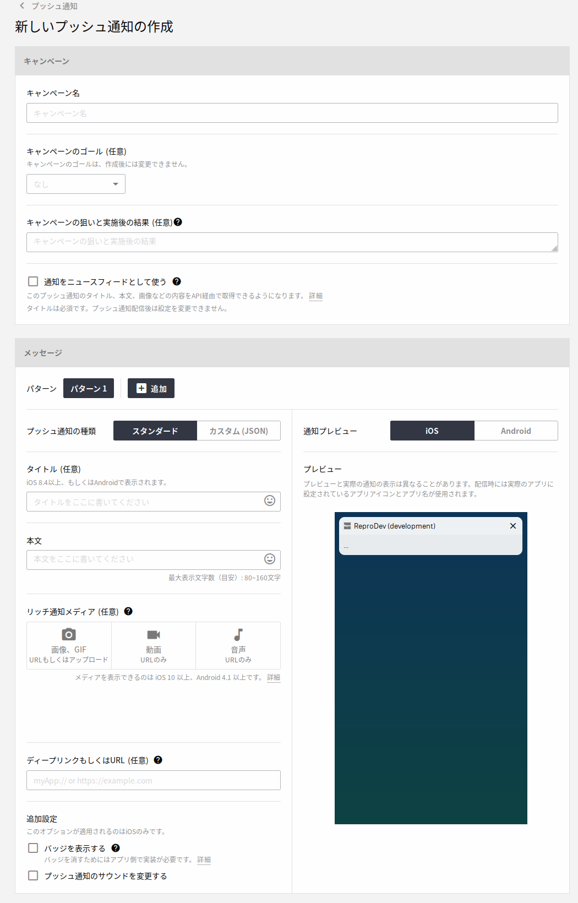
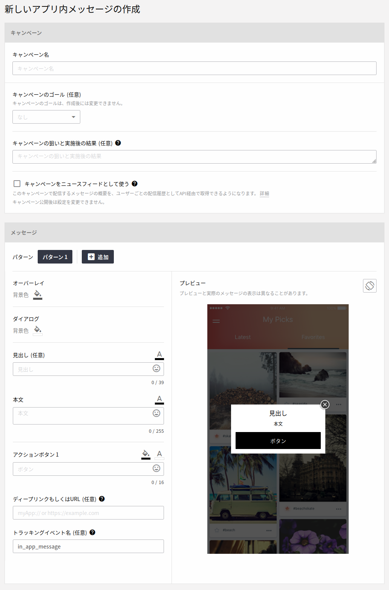
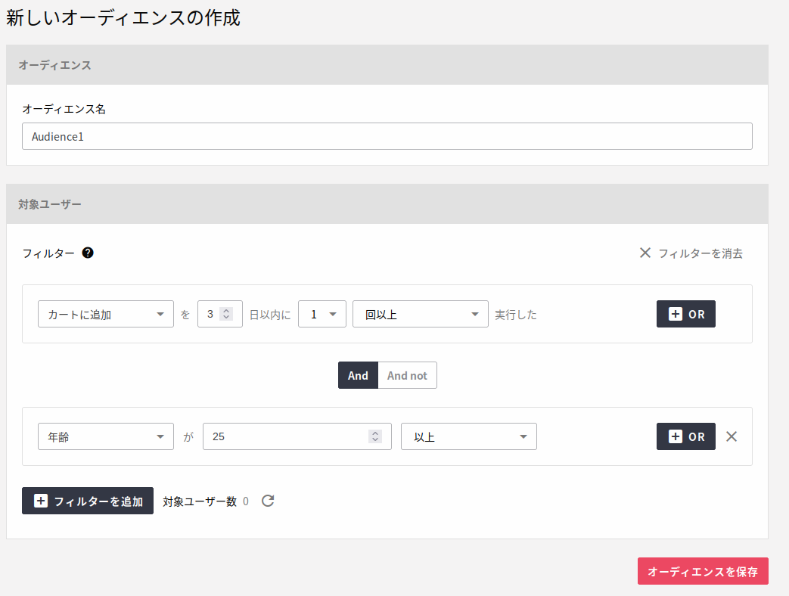
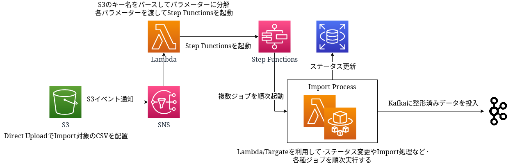
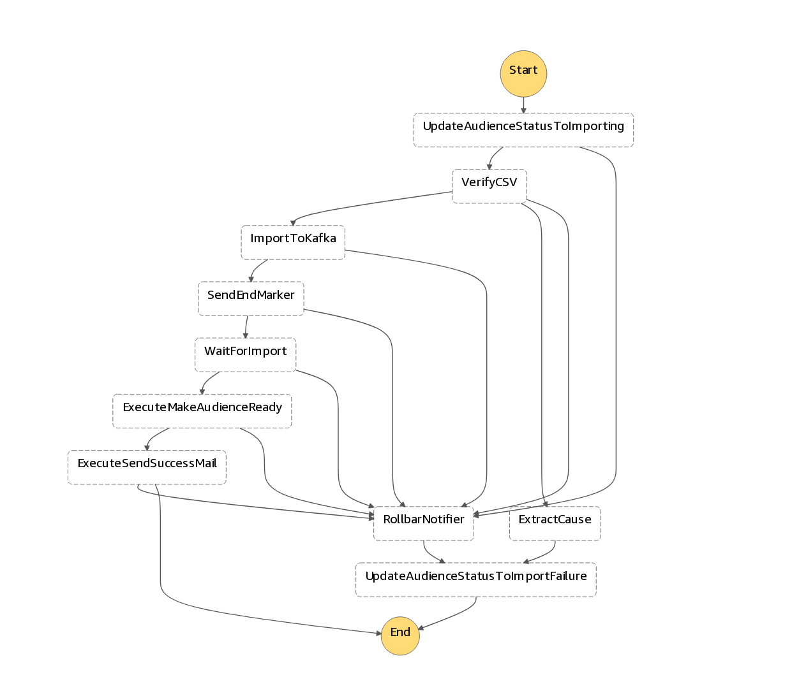

# ReproのImport/Exportを支える<br>サーバーレスアーキテクチャ

Repro株式会社 橋立友宏 (@joker1007)

---
<!--
footer: 
-->

# Agenda

- コンテナ/サーバーレスの利点
- Reproというサービスの特性
- システム構成、アーキテクチャ紹介
- Amazon ECSとAWS Lambdaの使い分け
- AWS AWS Step Functionsの利点
- 今後の展望

---

# はじめに

## そもそも、コンテナ/サーバーレスの何が嬉しいのか

---

# コンテナの大きな利点

## 環境自体のパッケージング
- 環境の再現性が高い
- ポータブル
- ミドルウェアを含めたアプリケーションセット自体をデプロイ

---

# サーバーレスコンポーネントの大きな利点

- 構築の手間が少ない
- 運用負荷が少ない
- **リソースコントロールが柔軟**

今回は特にリソースコントロールに注目する。

---

# 自己紹介

- 橋立 友宏
- Repro株式会社 執行役員 Chief Architect
- id: @joker1007
- パーフェクトRuby, パーフェクトRailsなどを共著
- 最近の仕事はデータエンジニアリング、Kafka、Kafka Streams

---

# Reproのサービスと特性の紹介


## デジタルマーケティングを総合的に支援する<br>マーケティングオートメーションサービス。

---

## Push Notification



---

## Popup Message


---

## 柔軟なユーザーオーディエンスの抽出



---

# Import/Export処理の特性

数千万～数億規模のユーザー情報を任意のタイミングでImport/Exportできる。

- パターン化できない負荷
- それなりのデータ量と実行時間
- 任意のタイミングで並列実行

言い換えると

- 突発的に高い負荷がかかる
- 理論上のピークは非常に高くスケーラビリティが必要
- 負荷が無い時は全く無い

**計算資源の柔軟なコントロールが重要**

---

# システム構成



---

# AWS Step Functions詳細

実際のシステムを省略して主要な処理のみを記載しています



---

# AWS Fargateによるリソースコントロール

AWS Fargateで必要な時にだけembulkを実行するリソースを確保することで、リクエストが無い時のコストを0にしつつ素早くジョブを実行できる。

注意点として、AWS Fargateの起動には1分～2分程プロビジョニングにかかるオーバーヘッドが発生する。

今回の要件では、そもそも実行時間が数分から数十分かかるので、起動時のオーバーヘッドは許容できるレベル。

---

# AWS Lambdaとの棲み分け

- 実行時間が15分を越える可能性がある場合
- マルチスレッドを活用するCPUバウンドな処理を含む場合
- ディスクI/Oを伴う場合 (特にI/Oが多い場合はAmazon EC2ベースを利用)

こういったケースではAWS Lambdaを利用できない、もしくは推奨できない。

ECSでは、AWS Fargateの上限を越える様なリソースが欲しい場合は、Capacity ProviderとAuto Scalingの組み合わせに切り替えることで、同一の基盤を利用しつつスケールアップにも対応できる。

---

# AWS Lambdaのコンテナイメージサポート

2020年末頃に追加されたAWS Lambdaの新機能により、コンテナイメージをアップロードしてそのまま実行できる様に。

- 最大10GBまでと十分なサイズのイメージをサポート
- デプロイに一定の準備時間がかかるが、その後の起動は早い
- **コンテナと同一の基盤でコード管理が出来る**
- **ライブラリのバージョンを含めた複雑な環境をコントロールできる**

---

# 複雑なアプリケーションの現実

アプリケーションの一機能をAWS Lambdaで構成する時、以前の環境ではコードベースが共有できないケースが多かった。

特にLambda関数実行時のシステム構成が隠蔽されていたので、RDBに接続するだけでもライブラリのバージョンや配置方法で一捻り必要だった。

コンテナイメージをそのまま利用できる様になったので、複雑なアプリケーションフレームワークの環境を丸ごとAWS Lambdaで動かせる様になった。

---

# Ruby on Rails on AWS Lambda

Railsのアプリケーションコードを通常のWebサービスのコードベースのままAWS Lambdaで動作させ、アプリケーションドメインのロジックの完全な共通化を実現。

といってもWebリクエストを受けている訳ではなく、Railsにおけるバックグラウンド処理の実行基盤としてAWS Lambdaが活用できる様になったということ。

デプロイが完了した後は、実行のオーバーヘッドはコールドスタートでも数秒以下でAWS Fargateの起動より圧倒的に高速。

過去の登壇資料: https://speakerdeck.com/joker1007/ruby-on-rails-on-lambda


---

# AWS Step Functionsによる統合

JSONでシンプルに記述できて、AWSの複数のサービスを柔軟に実行コントロールできる。
AWS Step Functionsという名前以上に様々なサービスに対応している。

今回のシステムでは、AWS FargateとAWS Lambdaを特性に合わせて切り替えつつ、実行プロセスのステップごとにエラーを可視化することに活用している。

---

# AWS Step Functionsの記述例 1

State定義の中のLambdaタスクを抜粋したもの。
本来はエラーハンドリング等を含むため、もう少し記述が多い。

```json
  "UpdateAudienceStatusToImporting": {
    "Type": "Task",
    "Resource": "arn:aws:states:::lambda:invoke",
    "Parameters": {
      "FunctionName": "rake-handler",
      "Payload": {
        "TASK_NAME": "imported_audience:update_status",
        "RAKE_ENV_USER_SEGMENTATION_ID.$": "$.user_segmentation_id",
        "RAKE_ENV_UPDATE_STATE_EVENT": "start_importing",
        "RAKE_ENV_ASSUMED_AFTER_STATE": "import_audience_importing",
        "RAKE_ENV_STEP_FUNCTION_EXECUTION_ARN.$": "$$.Execution.Id"
      }
    },
    "Next": "ImportToKafka"
  }
```

---

# AWS Step Functionsの記述例 2

同様にECSタスクを抜粋したもの。

```json
  "ImportToKafka": {
    "Type": "Task",
    "Resource": "arn:aws:states:::ecs:runTask.sync",
    "Parameters": {
      "LaunchType": "FARGATE",
      "Cluster": "batch-worker",
      "TaskDefinition": "embulk",
      "Overrides": {
        "ContainerOverrides": [
          {
            "Name": "embulk",
            "Environment": [
              {"Name": "INSIGHT_ID", "Value.$": "$.insight_id"},
              {"Name": "USER_SEGMENTATION_ID", "Value.$": "$.user_segmentation_id"},
              {"Name": "S3_BUCKET", "Value.$": "$.s3_bucket"},
              {"Name": "S3_KEY", "Value.$": "$.s3_key"}
            ],
            "Command": ["./wrap.sh", "embulk", "run", "-b", ".", "configs/send_audience_to_kafka.yml.liquid"]
          }
        ]
      },
      "NetworkConfiguration": {
        "AwsvpcConfiguration": {
          "Subnets": ["subnet-xxxxxxx"],
          "SecurityGroups": ["sg-xxxxxxxx"]
        }
      }
    },
    "Next": "SendEndMarker"
  },
```

---

# マイクロサービスとAWS Step Functions

単機能の簡単な同期処理を複数組み合わせて、複雑なことを実現する。
それを支援する基盤としてAWS Step Functionsは最適。
羃等性を上手く考慮できれば、リトライやエラーハンドリングも非常に簡単。

---

# まとめ

- AWS FargateとAWS Lambdaをコンテナイメージという同一のパッケージで構成できる様になった
- それぞれの特性に合わせて実行基盤を切り替える
- 一つ一つのジョブは出来るだけシンプルな同期処理として実装する
- AWS Step Functionsを使ってシステムの実行フローを統合する

---

# 今後の展望

- Amazon EventBridgeからAWS Step Functionsが直接起動できる様になったので活用したい
  - Amazon S3からAmazon EventBridgeも可能になったので、Amazon S3 -> Amazon EventBridge -> AWS Step Functionsが可能
- AWS App Runnerが活用できる範囲があるか検討

---

# お知らせ

Reproは今日紹介した様に、大規模なサービス事業にも対応できるマーケティングオートメーションサービスを提供しています。サービスの詳細は以下のURLをご覧ください。
https://repro.io/


またRepro社では、フロントエンドエンジニアから分散処理基盤を扱うデータエンジニアまで様々な技術者を募集しています。採用情報の詳細は以下のURLをご覧ください。
https://company.repro.io/recruit/


本日はご静聴ありがとうございました。
