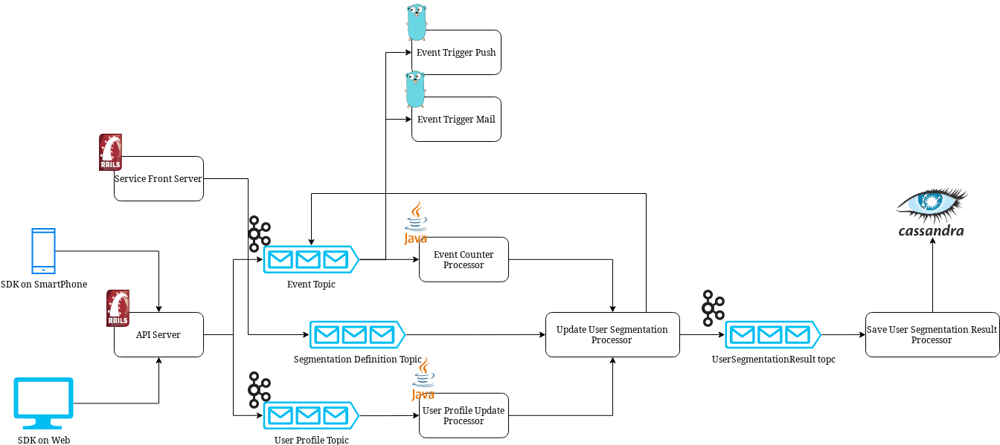
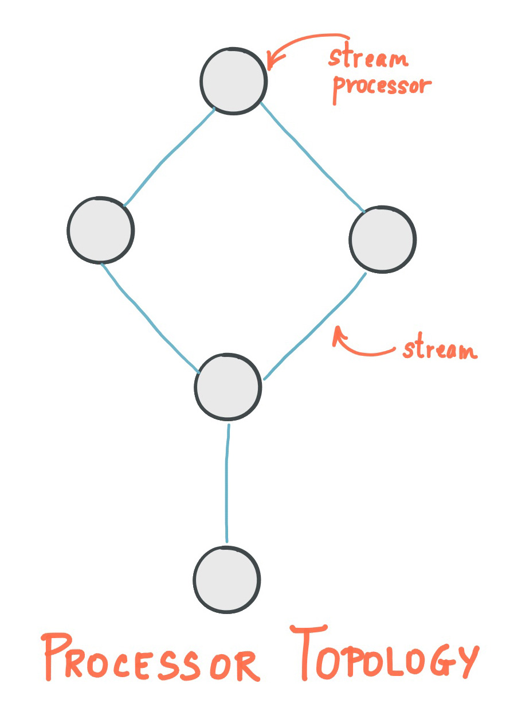
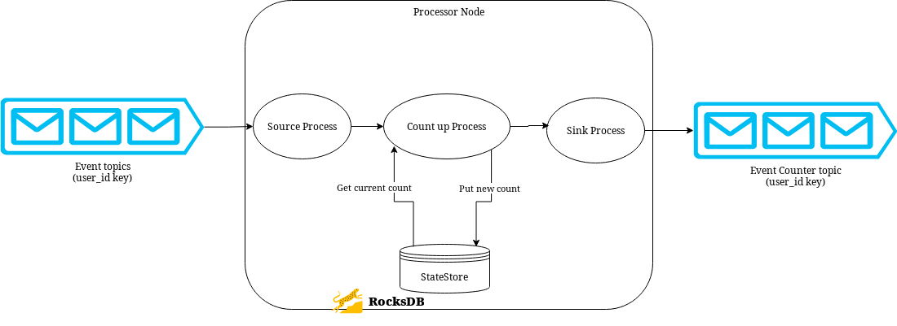
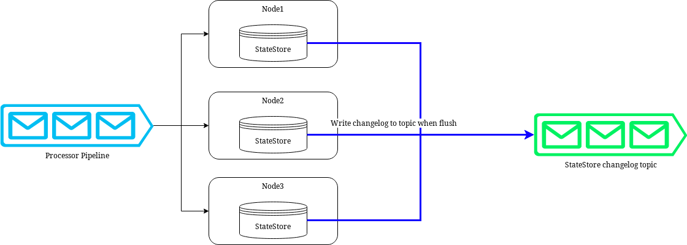
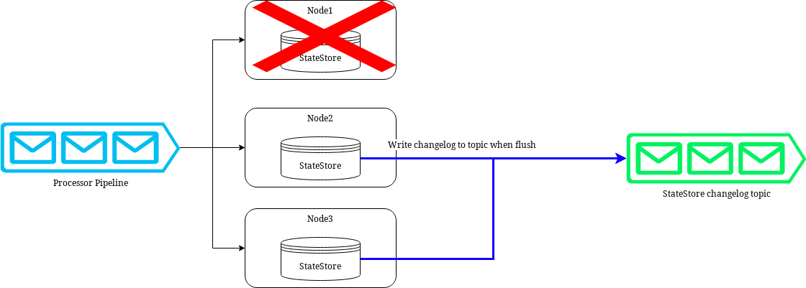
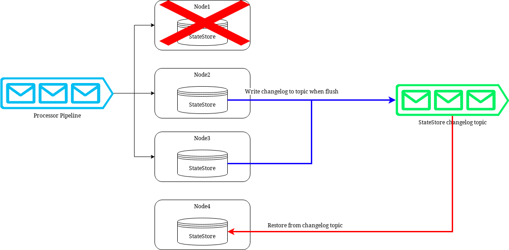

# Kafka Streamsで作る10万rpsを支えるイベント駆動マイクロサービス

## CNDT 2023 Pre
## Repro株式会社 橋立友宏 (@joker1007)

---
<!--
footer: 
-->


# 自己紹介

- 橋立友宏 (@joker1007)
- Repro inc. チーフアーキテクト
- 人生における大事なことは
ジョジョから学んだ
- 日本酒とクラフトビールが好き


---

# Reproのプロダクト


Reproはマーケティングソリューションを提供する会社で、
マーケティングオートメーションのための同名のサービスを提供している。
つまり、デジタルマーケティングを支援するツールが主なプロダクト。

---

# マーケティングの基本要素
あくまで私見ですが、マーケティングとは

1. 適切な顧客および顧客の集団に
2. 適切なタイミングで
3. 適切なコンテンツ or クリエイティブを提供する

---

# デジタルマーケティングに求められるもの

システムに求められる特性に言い換えると

1. エンドユーザーの状況を素早く反映できる
    - 行動ログやプロフィール情報、サービス利用ステータスなど
1. 任意のタイミングでユーザーの集合を抽出できる (ユーザーセグメンテーション)
1. 柔軟な配信チャネルに対応している

これらを大量のユーザー規模で提供する。
弊社では延べ数で数億ユーザーを越える。
スケーラビリティとサービス追加の容易さが重要。

---

# ストリームベースへの転換

元々は、BigQueryやPrestoを利用して、一定間隔のバッチでユーザーセグメントを定期更新していた。
しかし、このままでは一定以上の迅速さでユーザーの情報を反映できない。

**スケーラビリティと情報反映のレイテンシ短縮のためにストリームベースのアーキテクチャに転換**。
データパイプラインの基盤としてKafkaを採用し、システムを組み直した。

---

# Kafkaとは

分散ストリームバッファを提供するミドルウェア。
キューとは異なり、一定期間もしくは永続的にメッセージを保持するストレージとしての側面もある。
クライアントがどこまでメッセージを処理したかは、クライアントごとにconsumer groupという単位で管理・記録し、メッセージ自体には影響を与えない。

---

# 現在のアーキテクチャの簡易的な図



---

# Fire and Forgetによる疎結合化

メッセージバスでサービス間を連携する時に大事なことは、**サービス同士がお互いの存在すら知る必要が無い、という状態を維持する**こと。
イベントやメッセージを送信したら、後は受け取る側の責任で発信者は感知しない。
この形を**Fire and Forget**と表現することもある。

この形を維持することで、サービス間の依存関係を無くし、特定箇所が全体の可用性に与える影響を小さくできる。
また一つ一つのサービスは自分のやることだけに関心を持てばいいので、小さく認知負荷の低いサービスを構築しやすい。

---

# サービス追加の容易さ

Kafkaの特性により、発行済みのイベントやメッセージは一定期間Kafkaのtopic上に維持される。
また、キューやファンアウト式のメッセージパッシングと異なり、メッセージバス自体は各サービスのことを事前に知らなくて良いという利点がある。

同じイベントを元にして駆動できるサービスであれば、後から容易に追加可能。
必要なデータの形状が異なるなら加工用のパイプラインを追加することもそこまで難しくない。

この特性により、配信チャネルの追加を容易にし、それに伴う認知負荷上昇を抑える狙いがある。

---

# スキーマによるサービス間の連携

疎結合化を目指すとはいえ、サービスを協調させるためには規約が必要。

そのためには、スキーマフルなデータ構造が必須。
弊社では現状Avroフォーマットを利用している。

また、スキーマの集中管理を行うためのスキーマレジストリを活用する。
- 各サービスにスキーマ情報を持たせなくて良くなる。
- スキーマの変更パターンから後方互換性や前方互換性について検証した上で安全にスキーマを変更できる。

see. https://docs.confluent.io/platform/current/schema-registry/index.html

---

# イベント駆動マイクロサービスのトレードオフ

メリットは実感しているが、もちろんトレードオフとしてマイナス面もある。

- Kafkaの可用性とスケーラビリティに大きく依存している
  - クラスタを簡単に止められない
  - Kafka自体はスケーラブルだがtopicのパーティション数を後から変えるのが困難
- エラーハンドリング、デバッグが難しい
- 同期的に別サービスの終了を待ち受ける必要があると複雑さが激増する
- 根本的に新しい機能を追加する場合は、パイプラインの広い範囲で修正が必要な場合もある
- パイプラインの重要コンポーネントが壊れると、結局顧客まで価値が届かない

マイナス面を減らすための工夫が継続的な課題。

---

# ストリームプロセッシングの詳細

---

# Kafka Streams概要

Java向けのストリームプロセッサを書くためのフレームワーク。
Apache Kafkaプロジェクトの中でメンテされており、Kafka Broker以外に追加で必要なものが無いのが特徴。

DSLとローレベルなProcessor APIを組み合わせて、ストリームプロセッサが書ける。

基本的な動きとしては、Kafkaのtopicからデータを取得し、レコード単位で加工したり集計処理を行なって、結果を再度Kafkaのtopicに書き出すという動作を組み合わせて処理を組み上げていく。

---

# ストリームアプリケーションのTopology

Kafka Streamsではアプリケーション内の処理一つ一つをノードとしたDAGとしてアプリケーションを表現する。
この処理グラフをTopologyと呼ぶ。



---

# ストリームアプリケーション開発の実践

Kafka Streamsの細かい解説をすると時間が足りないので、
今回は実践的な開発に役立つ構成要素や考え方を中心に話をする。

---

# ストリームアプリケーションを書く上で大事なこと

大量のデータを1件単位で処理することになるので、とにかく処理のレイテンシに気を配る必要がある。
**ネットワーク通信は可能な限り避けるべき。**
処理内容に依るが1レコード処理するのに1msは遅過ぎる。
ノードを分けて分散処理できるとはいえ、処理スループットに直結する。
処理レイテンシはしっかりモニタリングして気を配ることが大事。

---

# re-partitionの回避

Kafka Streamsで状態を利用した処理、つまりあるキーでグルーピングして集計したり、レコードを結合してデータエンリッチを行いたい場合、同一のパーティションにレコードが届いている必要がある。

**もし、これが異なるキーでいくつも必要になると、その度にキーを振り直して再度re-partition topicにデータを送り直す必要がある。**
DSLではこれを自動で行ってくれる機能があるが、キーによるパーティションを意識せずに多用すると、ネットワーク負荷とストレージ消費量の増大、レイテンシの増加によりパフォーマンスの低下に繋がる。

---

# StateStore

ストリームアプリケーションにおいて集計を行うためには、以前のレコードの処理結果の蓄積(状態)を保持しておく必要がある。

Redisなどの外部ストアに蓄積することは可能だが、前述した様にネットワーク通信のオーバーヘッドはストリームアプリケーションにおいて致命的になる。
**Kafka StreamsではStateStoreという仕組みで各ノードのローカルなストアに状態を保持する。**

実態はバイト順でソートされたキーバリューストアで、in-memoryストアとRocksDBをバックエンドにしたpersistentストアがある。

DSLによって提供されるcount処理やレコード同士のjoinの仕組みの裏側もStateStoreで実装されている。

---

# StateStoreのイメージ図



---

# Processor API

Processor APIというローレベルのAPIを利用することでStateStoreを直接操作することができる。

任意のデータをStateStoreに書き込むことができるし、バイト順にソートされることを利用してRange探索を行うこともできる。
DSLでは利用できない1:Nのjoinを実現したり、レコードキーと違う値をキーにして値を書き込むことや、レコードごとに異なるタイムウインドウで集計処理を実装することも可能。

また、通常のJavaのコードとして表現できることは実現できるので、Processor APIを処理の終端として利用し、外部のデータストアに書き込む処理を行ったりもする。
例えば、集計後や加工後のデータをCassandraに書き込んだりできる。

---

# Processor APIの簡単なサンプル

```java
public class WordCountProcessor implements Processor<String, String, String, String> {
    private KeyValueStore<String, Integer> kvStore;

    @Override
    public void init(final ProcessorContext<String, String> context) {
        kvStore = context.getStateStore("Counts");
    }

    @Override
    public void process(final Record<String, String> record) {
        final String[] words = record.value().toLowerCase(Locale.getDefault()).split("\\W+");

        for (final String word : words) {
            final Integer oldValue = kvStore.get(word);

            if (oldValue == null) {
                kvStore.put(word, 1);
            } else {
                kvStore.put(word, oldValue + 1);
            }
        }
    }
}
```

---

1:Nのjoinの実装例とか載せたかったんですが、
スライドで表現するには長くなってしまうので、
気になる方は懇親時間に質問していただければと思います。

---

# 保持しているデータの永続化

各ノードのローカルにデータを持つなら、ノードやディスクが壊れた時はどうするのかという疑問が出てくる。
persistentなStateStoreはデフォルトでKafkaのtopicと関連付けられており、StateStoreに書かれたものは一定間隔でtopicにflushされる。
Kafkaのtopicに書き込まれてしまえば、ブローカーのレプリケーションで耐久性が担保される。

もしノードが壊れた場合は、別ノードに処理が移り、担当ノードはKafka topicからデータ取得しローカルのStateStoreを自動的に復元する。

---

# レストア処理のイメージ



---

# レストア処理のイメージ



---

# レストア処理のイメージ



---

# RocksDBのパフォーマンスチューニング

大体どんなDBでも同じだが、処理量が大きくなるとメモリの割り当て量を増やすことが重要になる。

RocksDBはLSMツリーを基盤にしたKVSである。
memtableというメモリ上のテーブルにデータを書いて、一定期間でディスクにflushする。

**memtableへのメモリ割り当てを増やしたりスロット数を調整して書き込みパフォーマンスをチューニングし、Blockキャッシュに使えるメモリを増やして読み込みパフォーマンスのチューニングを行う。**
特にKafka Streamsではデフォルトの割り当てはかなり控え目になっており、処理が多くなるとディスクに負荷がかかりがち。

---

# RockdDBのメモリ割り当ての設定例
```java
private static final long TOTAL_OFF_HEAP_MEMORY =
    14L * 1024 * 1024 * 1024;
private static final long TOTAL_MEMTABLE_MEMORY =
    2L * 1024 * 1024 * 1024;
private static final org.rocksdb.Cache cache =
    new org.rocksdb.LRUCache(TOTAL_OFF_HEAP_MEMORY, -1, false, 0.1);
private static final org.rocksdb.WriteBufferManager writeBufferManager =
    new org.rocksdb.WriteBufferManager(TOTAL_MEMTABLE_MEMORY, cache);

private static final long MEM_TABLE_SIZE = 180 * 1024L * 1024L;

@Override
public void setConfig(
    final String storeName, final Options options, final Map<String, Object> configs) {
  BlockBasedTableConfig tableConfig = (BlockBasedTableConfig) options.tableFormatConfig();

  tableConfig.setBlockCache(cache);
  tableConfig.setCacheIndexAndFilterBlocks(true);
  options.setWriteBufferManager(writeBufferManager);
  options.setWriteBufferSize(getMemtableSize());
  options.setMaxWriteBufferNumber(4);
  options.setMinWriteBufferNumberToMerge(2);
  options.setTableFormatConfig(tableConfig);
  options.setTargetFileSizeBase(256L * 1024 * 1024);
  options.setLevel0FileNumCompactionTrigger(10);
}
```

---

# AWSにおけるノード選択

前述した様にノードやディスク破壊に対してはKafka Brokerからのレストアが可能なので、AWSでKafka Streamsを運用する場合は、高速なエフェメラルストレージと相性が良い。
例えば、**i4i**シリーズや**r7gd**などの高速なNVMeストレージが装備されているインスタンスだ。
これらのインスタンスは非常に高いIOPSを出せるストレージを低コストで利用できるし、ノードが無くなってもデータ本体はKafka Brokerに保持できるという点でKafka Streamsと相性が良い。

---

# StateStoreの問題点

StateStoreには大きな難点が一つある。
それは*データレストア中は、そのパーティションのパイプラインの処理が停止する*ということ。

もし集計結果を大量に保持しなければいけないなら、データロスト時のレストアにもそれなりに時間を要してしまう。
その間に蓄積したデータは全て処理が遅延してしまう。

現時点で万能の解決策が存在しないため、状況に合わせた工夫が必要になるかもしれない。
弊社ではStateStoreとCassandraを多段に積み重ねて、StateStoreをキャッシュ的に利用する構成にしレストアにかかる時間を短かくしている箇所がある。

---

# チューニングポイントとして重要な設定

- **max.fetch.bytes, max.partition.fetch.bytes**: consumerが一度に取得するデータ量
- **max.poll.records**: 1回のpollで処理する最大のレコード数
- **num.stream.threads**: 1ノード上の処理スレッドの数。
- **cache.max.bytes.buffering**: StateStoreに対するアプリケーションレイヤーでのキャッシュメモリ量
- **num.standby.replicas**: StateStoreのスタンバイレプリカの数


---

# 運用時に注視すべきメトリック

- **consumer_lag**: consume済みのレコードから最新のレコードまでのレコード数
- **process_latency**: 1つの処理が完了するまでの時間
- **e2e_latency**: あるアプリケーションの一連の処理が完了するまでの時間
- **commit_latency**: consumerが処理済みレコードをcommitするのにかかった時間

もちろん各種システムメトリックも必要。

---

# 今後の展望

- トレーサビリティの拡充
- Debeziumを利用したRDBとKafkaトピックの同期
- Apache Hudiへのストリーム変換により、バッチラインとの協調を強化

---

# Repro株式会社はエンジニアを募集しています


特にこういった基盤を支えるSREを強く求めています

https://company.repro.io/recruit/
