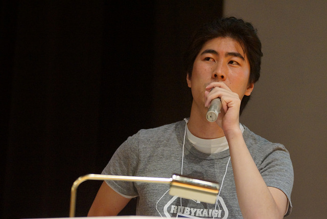
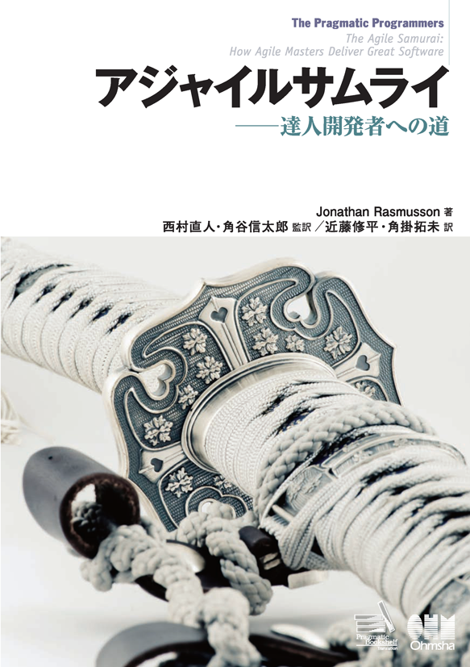
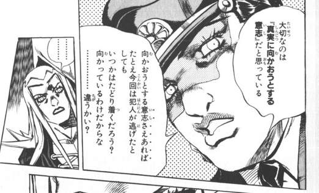
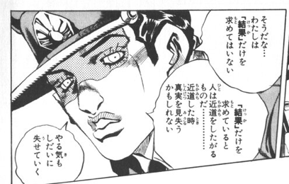

# はじめての
# バグチケット

@joker1007


### Self


joker1007

Ruby/Rails/Scala/JS/インフラ少々


## 人生に影響を与えた本









### 真実に向かっていく話をします


### ある日の発見

```ruby
class Foo
  attr_accessor :hoge

  def bar
    @bar
  end

  def initialize(val)
    @bar = val
  end
end
```


```ruby
foo = Foo.new("FOO")

trace = TracePoint.new(:return, :c_return) do |tp|
  p [tp.lineno, tp.defined_class, tp.method_id, tp.event, tp.binding, tp.return_value]
end

trace.enable do
  foo.bar
  foo.hoge = "hoge"
  foo.hoge
end
```

```
[6, Foo, :bar, :return, #<Binding:0x007fa7ca878718>, "FOO"]
```


### イベント取れてない


## 調べてみるか


```
[1] pry(main)> show-method Class#attr_accessor

From: object.c (C Method):
Owner: Module
Visibility: private
Number of lines: 10
```

```c
static VALUE
rb_mod_attr_accessor(int argc, VALUE *argv, VALUE klass)
{
    int i;

    for (i=0; i<argc; i++) {
        rb_attr(klass, id_for_attr(argv[i]), TRUE, TRUE, TRUE);
    }
    return Qnil;
}
```

rubyのソースコードディレクトリでctagsを実行

`rb_attr`の定義を探す


vm_method.c
```c
rb_attr(VALUE klass, ID id, int read, int write, int ex)
{
    VALUE attriv;

    ...

    if (read) {
	rb_add_method(klass, id, VM_METHOD_TYPE_IVAR, (void *)attriv, noex);
    }
    if (write) {
	rb_add_method(klass, rb_id_attrset(id), VM_METHOD_TYPE_ATTRSET, (void *)attriv, noex);
    }
}
```

`VM_METHOD_TYPE_IVAR`でgrep


```
% ag VM_METHOD_TYPE_IVAR
gc.c
3732:      case VM_METHOD_TYPE_IVAR:

method.h
51:    VM_METHOD_TYPE_IVAR,

proc.c
2035:      case VM_METHOD_TYPE_IVAR:
2192:    if (def->type == VM_METHOD_TYPE_ATTRSET || def->type == VM_METHOD_TYPE_IVAR) {

tags
22651:VM_METHOD_TYPE_IVAR       method.h        /^    VM_METHOD_TYPE_IVAR,$/;"  e       enum:__anon193
```


```
vm_eval.c
187:      case VM_METHOD_TYPE_IVAR:

vm_method.c
366:      case VM_METHOD_TYPE_IVAR:
482:      case VM_METHOD_TYPE_IVAR:
919:    rb_add_method(klass, id, VM_METHOD_TYPE_IVAR, (void *)attriv, noex);
1210:      case VM_METHOD_TYPE_IVAR:
1240:      case VM_METHOD_TYPE_IVAR:

vm_insnhelper.c
1812:         case VM_METHOD_TYPE_IVAR:{
```


vm_eval.c

vm_insnhelper.cを見ていく


vm_eval.c
```c
      case VM_METHOD_TYPE_CFUNC:
	ret = vm_call0_cfunc(th, ci, argv);
	goto success;
```
      case VM_METHOD_TYPE_ATTRSET:
	rb_check_arity(ci->argc, 1, 1);
	ret = rb_ivar_set(ci->recv, ci->me->def->body.attr.id, argv[0]);
	goto success;
```
      case VM_METHOD_TYPE_IVAR:
	rb_check_arity(ci->argc, 0, 0);
	ret = rb_attr_get(ci->recv, ci->me->def->body.attr.id);
```

どうも`VM_METHOD_TYPE_IVAR`は

特別扱いらしい


vm_insnhelper.c
```c
	      case VM_METHOD_TYPE_CFUNC:
		CI_SET_FASTPATH(ci, vm_call_cfunc, enable_fastpath);
		return vm_call_cfunc(th, cfp, ci);
```
```
	      case VM_METHOD_TYPE_ATTRSET:{
		rb_check_arity(ci->argc, 1, 1);
		ci->aux.index = 0;
		CI_SET_FASTPATH(ci, vm_call_attrset, enable_fastpath && !(ci->flag & VM_CALL_ARGS_SPLAT));
		return vm_call_attrset(th, cfp, ci);
	      }
```
```
	      case VM_METHOD_TYPE_IVAR:{
		rb_check_arity(ci->argc, 0, 0);
		ci->aux.index = 0;
		CI_SET_FASTPATH(ci, vm_call_ivar, enable_fastpath && !(ci->flag & VM_CALL_ARGS_SPLAT));
		return vm_call_ivar(th, cfp, ci);
```
ctagsで`vm_call_cfunc`と`vm_call_ivar`を追いかける


```c
vm_call_cfunc(rb_thread_t *th, rb_control_frame_t *reg_cfp, rb_call_info_t *ci)
{
    VALUE val;
    // ...
    RUBY_DTRACE_CMETHOD_ENTRY_HOOK(th, me->klass, me->called_id);
    EXEC_EVENT_HOOK(th, RUBY_EVENT_C_CALL, recv, me->called_id, me->klass, Qnil);
    // ...
    val = vm_call_cfunc_latter(th, reg_cfp, ci);
    // ...
    EXEC_EVENT_HOOK(th, RUBY_EVENT_C_RETURN, recv, me->called_id, me->klass, val);
    RUBY_DTRACE_CMETHOD_RETURN_HOOK(th, me->klass, me->called_id);

    return val;
}
```

```c
vm_call_ivar(rb_thread_t *th, rb_control_frame_t *cfp, rb_call_info_t *ci)
{
    VALUE val = vm_getivar(ci->recv, ci->me->def->body.attr.id, 0, ci, 1);
    cfp->sp -= 1;
    return val;
}
```


### EXEC_EVENT_HOOK !!


### そもそもHookが呼ばれてない


### 引数合わせてマクロ呼べば
### イベント取れるように見える


### 追加してコンパイルしてみた


```
[6, Foo, :bar, :return, #<Binding:0x007fe013197918>, "FOO"]
[21, Foo, :hoge=, :c_return, #<Binding:0x007fe0131975f8>, "hoge"]
[22, Foo, :hoge, :c_return, #<Binding:0x007fe013197378>, "hoge"]
```

## いけるやん！


### Go to https://bugs.ruby-lang.org/
- アカウントを登録
- ruby-coreにチケットを起票する(日本語)
- 参考資料としてパッチも添付する
- これからどうなるかは分からん


## 一応、処理系に初貢献


### 運の良さ
- 再現が簡単
- エントリポイントが分かり易い
- 他と比較しやすい


### 目的がはっきりしてれば
### それなりに追っかけられる


- 古典的な基本はやっぱり便利 (ctagsとgrep)
- 分からん所は読み飛ばす
- 目的の場所に辿り着くことを第一に
- 名前から推測して読む方向を決める


### 目的に向かう意志があれば
### 真実にいつか辿り着く
