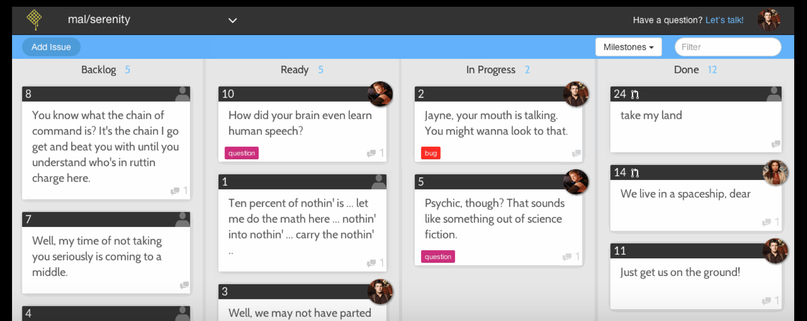
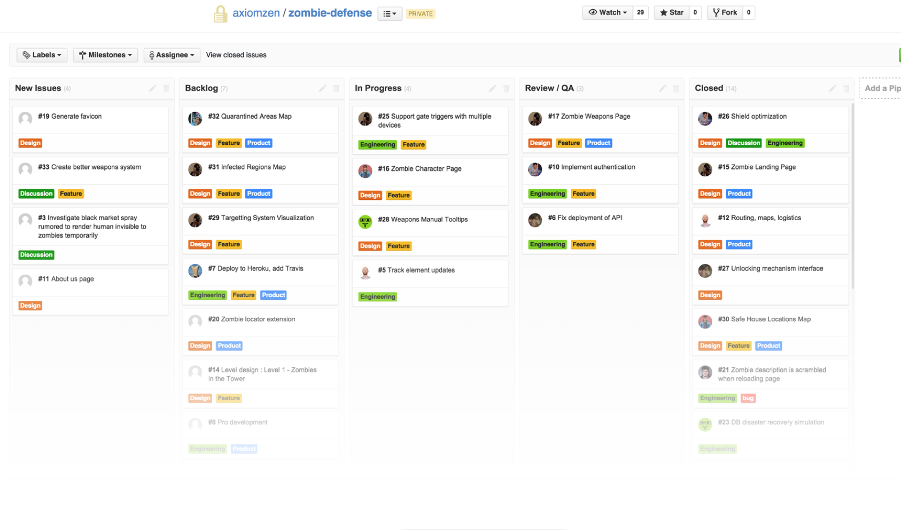
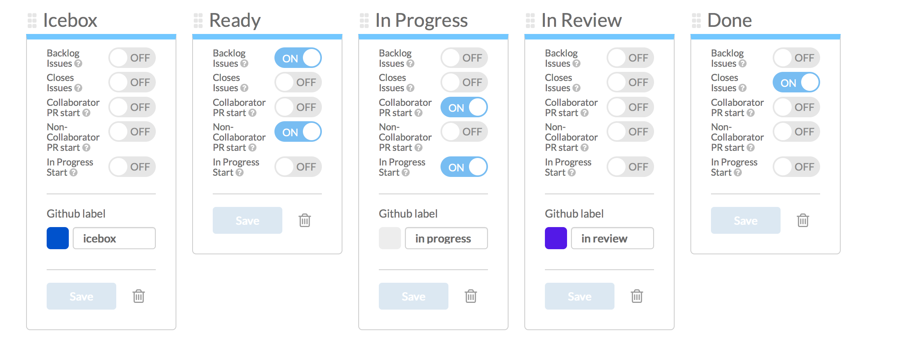

# お金が無い
# プロジェクトで
# GitHub issueを使って
# タスク管理をする話

@joker1007

## 自己紹介
- @joker1007
- Ruby/Railsを中心にした何でも屋みたいな
- パーフェクトRuby, パーフェクトRuby on Rails著者
- vimmer

## プロジェクトの性質
- 余り利益目的ではない
- チームメンバーは5～8人
- 開発者は3～5人
- 同じオフィスで開発
- 何ヶ月か毎に重いリリースがあった
- サーバーサイドの設計は基本的に俺だけ

## タスク管理ツールの変遷
1. RedMine
2. Pivotal Tracker
3. Github Issue + α

後、idobataとslackを使ってます

## 人手とお金をかけたくない

## GitHub Issue pros/cons

## pros
- 入力項目が少ない (めんどくない)
- GitHubのコミットやPRと直結
- メンテ要因不要 (人手がかからない!!)
- markdownによる表現力
- emoji :sparkle: :+1: :sushi:
- APIを利用しやすい
- 連携サービスが豊富 (idobata,slack,airbrake)

## cons
- フォーマットが無い
- 一覧性が悪い
- 機能が少ない
- 見積りがやり辛い

## 欠点を補うための外部サービス
タスクボード風にissueを表示してくれる

- [waffle.io](https://waffle.io) (use)
- [zenhub.io](https://www.zenhub.io/)

## waffle.io

## zenhub.io
Google Chromeの拡張が基本

## waffle.ioについて

昔は本当に単なるタスクボード風に見せるだけ

ちょっとづつ機能が増えて使いやすくなってきた

## waffle.ioで出来ること
- assigneeやラベルを分かりやすく表示する
- Milestone毎に表示をフィルタリングできる
- 最近ポイントの見積ができるようになった
- IssueやPRをクローズした数のチャートが見れる
- Milestoneに対するバーンアップチャート (Coming Soon)

## waffle.ioのステータス管理
- 特定のラベルで行っている
- GitHub Issue側でラベルを付け直せば反映される
- カラムとラベルの対応はカスタマイズ可能

## waffle.io Pricing
- 現時点はまだ無料！
  - でも流石にそろそろ有料化しそう
- publicなリポジトリは無料
- 将来的にはユーザー毎に7$/month
  - (実は場合によってはpivotalより高い……)
- 節約できたのはプロジェクトの時期がたまたま良かっただけかも……

## 自分の立場におけるタスク管理
自分が要件を受けとって、設計を考えて、実装して、テストまでを全部やる場合

自分が期日までにそれをやれるかやれないか、しか無い。

タスクが明確になるのは、色々考えに考えて方針が見えた後。

見易い備忘録ぐらいのものがあれば良かった。

## まとめ
- GitHubで開発してるなら、Issueで大分事足りる
- 機能が足りなければ拡張サービスを使おう
- 何が可視化できれば事足りるのかを考える
