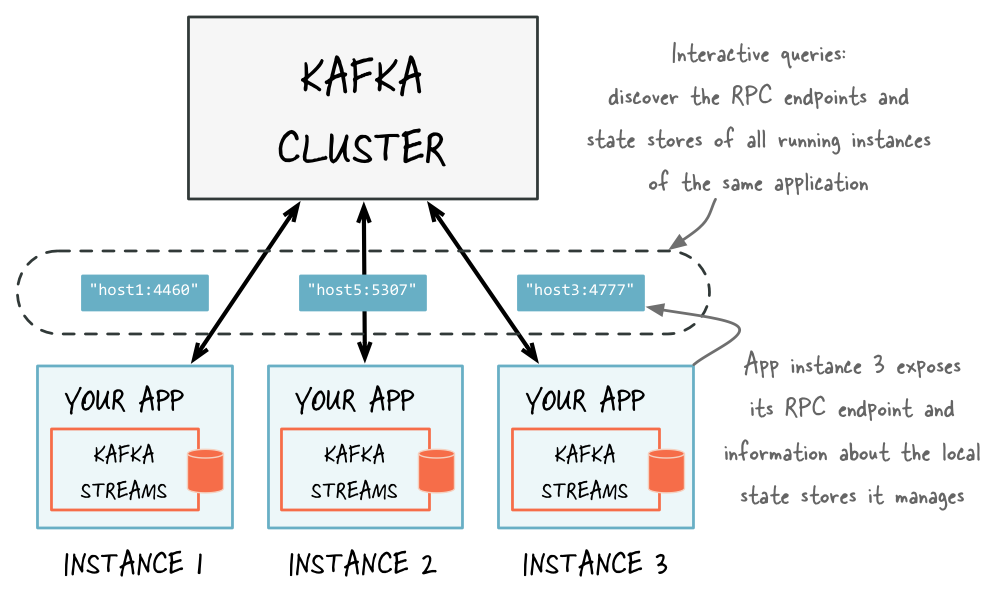

<style scoped>
h1, h2, h3 {
  color: white;
}
</style>

# Quarkusで作るInteractive Stream Application

### joker1007 (Repro株式会社)
### JJUG CCC Fall 2025

---

<!--
footer: 
-->

# 自己紹介

- 橋立友宏 (@joker1007)
- Repro株式会社 チーフアーキテクト
- 元々はRailsエンジニアだったが、最近はJavaばかり書いている
- 日本酒とクラフトビールが好き


---

# Asakusaから来ました
活動中のRubyコミュニティで日本最古
(自分は本当に浅草に住んでます)


---

# 最近の仕事

チーフアーキテクトとして、サービス全体の中長期的な技術選定、設計アドバイス、全体アーキテクチャのデザインなどをしている。

---

# Reproの事業
マーケティングオートメーションサービスを提供している。
マーケティングオートメーションとは、

- ユーザーの行動を分析・分類し
- 複数のチャネルで適切なキャンペーンを配信することで
- 顧客とエンドユーザーのコミュニケーションを支援する

SaaS事業だけでなく、サービスグロースの総合的な支援も提供しています。

(この辺まで前回のJJUG CCCの資料の流用)

---

# ReproではKafkaを積極的に活用しています

---

# 前回のJJUG CCCではKafka Streamsの実践的な開発テクニックについて話しました

---

# Streaming Applicationの基本

## Fire and Forget

出来る限り後続の処理にはタッチしない

## CQRS

結果が欲しい場合は読み取り用のDBを経由して疎結合に保つ。
しかし、書き込み完了までのインターバルやpollingのオーバーヘッドなどが発生する。

---

# RDBやKVSだけでは扱いにくいデータやサービスも存在する

- Sketch
- CRDT (Conflict-free Replicated Data Type)
- Apache Arrowの様なオンメモリ向けデータ構造

Database側で独自の拡張を持っているケースはあるが用途に合うかはケースバイケース。

---

# 大量のデータを処理しつつ、そういったデータ構造を活用したマイクロサービスを実装したい、そういう時がありますよね？

(あんま無いかも……？)

---

# Stream Application + Interactive

クエリリクエストが可能なStream Applicationという選択肢

---

<style scoped>
p.note {
  font-size: 10pt;
}
</style>

# Kafka StreamsのInteractive Queries

Kafka Streamsの各ノードが保持するStateStoreに対してクエリを可能にする機能。

StateStoreは集計などの状態を伴うアプリケーションを構築する時に必要で、各ノードのローカルディスク上に保持される。

<p class="note">画像出典: <a href="https://kafka.apache.org/10/documentation/streams/developer-guide/interactive-queries.html">https://kafka.apache.org/10/documentation/streams/developer-guide/interactive-queries.html</a></p>



---

# サンプルコード (from Official Document)

```java
Properties props = new Properties();
String rpcEndpoint = "host1:4460";
props.put(StreamsConfig.APPLICATION_SERVER_CONFIG, rpcEndpoint); // rpcのエンドポイントをconfigに登録する
// ... further settings may follow here ...

StreamsConfig config = new StreamsConfig(props);
StreamsBuilder builder = new StreamsBuilder();

KStream<String, String> textLines = builder.stream(stringSerde, stringSerde, "word-count-input");

// ... 省略 ...

KafkaStreams streams = new KafkaStreams(builder, streamsConfiguration);
streams.start();

// Kafka Streamsと一緒にRPCサービスも起動する
MyRPCService rpcService = ...;
rpcService.listenAt(rpcEndpoint);
```

---

# データ読み出しのサンプルコード

```java
KafkaStreams streams = ...;
// Find all the locations of local instances of the state store named "word-count"
Collection<StreamsMetadata> wordCountHosts = streams.allMetadataForStore("word-count");

// For illustrative purposes, we assume using an HTTP client to talk to remote app instances.
HttpClient http = ...;

// Get the word count for word (aka key) 'alice': Approach 1
//
// We first find the one app instance that manages the count for 'alice' in its local state stores.
StreamsMetadata metadata = streams.metadataForKey("word-count", "alice", Serdes.String().serializer());
// Then, we query only that single app instance for the latest count of 'alice'.
// Note: The RPC URL shown below is fictitious and only serves to illustrate the idea.  Ultimately,
// the URL (or, in general, the method of communication) will depend on the RPC layer you opted to
// implement.  Again, we provide end-to-end demo applications (such as KafkaMusicExample) that showcase
// how to implement such an RPC layer.
Long result = http.getLong("http://" + metadata.host() + ":" + metadata.port() + "/word-count/alice");
```

---
```java
// Get the word count for word (aka key) 'alice': Approach 2
//
// Alternatively, we could also choose (say) a brute-force approach where we query every app instance
// until we find the one that happens to know about 'alice'.
Optional<Long> result = streams.allMetadataForStore("word-count")
    .stream()
    .map(streamsMetadata -> {
        // Construct the (fictituous) full endpoint URL to query the current remote application instance
        String url = "http://" + streamsMetadata.host() + ":" + streamsMetadata.port() + "/word-count/alice";
        // Read and return the count for 'alice', if any.
        return http.getLong(url);
    })
    .filter(s -> s != null)
    .findFirst();
```

---

# Interactive Queriesが提供する機能とは

Kafka StreamsのInteractive Queriesが提供する機能は非常にシンプル。

- クラスタに所属しているノードがConfigに登録したIPと公開ポートの一覧を返す
- あるキーでパーティショニングした結果がどのノードに現在割り当てられているかを判別し、そのIPと公開ポートを返す

RPCのサービス自体は実装者が自分で選択して決めることができる。
言い換えれば、何も提供してくれないので自分で実装しなければならない。

---

# Interactive Queriesを活用するにはKafka Streamsのアプリケーション自体とRPCサービスのListenを同時にコントロールしなければならない。

# しかし、ボイラープレートの様な起動コードを書くのは割と面倒臭い。

---

# Quarkusを利用すれば、簡単にKafka StreamsにRPCのI/Fを追加できる

---

# Quarkusを利用するメリット

- 多様なプロトコルをサポートしていてシンプルな記述で構築できる
    - REST, gRPC, WebSocket, GraphQL
- Kafka StreamsのExtensionが公式で用意されており、QuarkusのDIフレームワークの上でKafka Streamsアプリケーションを動かせる
- Stream ApplicationとRPCサービスの起動、Listen、終了をQuarkusがコントロールしてくれる。

---

# Kafka Streams Extensionの基本的な仕組み
QuarkusのDIの仕組みの中でKafka Streamsオブジェクトを生成する。

```java
@Singleton
public class KafkaStreamsProducer {
    // ...省略...

    @Inject
    public KafkaStreamsProducer(KafkaStreamsSupport kafkaStreamsSupport, KafkaStreamsRuntimeConfig runtimeConfig,
            ExecutorService executorService,
            Instance<Topology> topology, Instance<KafkaClientSupplier> kafkaClientSupplier,
            @Identifier("default-kafka-broker") Instance<Map<String, Object>> defaultConfiguration,
            Instance<StateListener> stateListener, Instance<StateRestoreListener> globalStateRestoreListener,
            Instance<StreamsUncaughtExceptionHandler> uncaughtExceptionHandlerListener) {

        // ... 省略 ...

        this.executorService = executorService;
        this.streamsConfig = new StreamsConfig(kafkaStreamsProperties);
        this.kafkaStreams = initializeKafkaStreams(streamsConfig, topology.get(),
                kafkaClientSupplier, stateListener, globalStateRestoreListener, uncaughtExceptionHandlerListener);
        this.topologyManager = new KafkaStreamsTopologyManager(kafkaAdminClient, topology.get(), runtimeConfig);
    }
```
---

onStartupフックでアプリケーションを起動する

```java
    public void onStartup(@Observes StartupEvent event, Event<KafkaStreams> kafkaStreamsEvent) {
        if (kafkaStreams != null) {
            kafkaStreamsEvent.fire(kafkaStreams);
            executorService.execute(() -> {
                try {
                    topologyManager.waitForTopicsToBeCreated();
                } catch (InterruptedException e) {
                    Thread.currentThread().interrupt();
                    return;
                }
                if (!topologyManager.isClosed()) {
                    LOGGER.debug("Starting Kafka Streams pipeline");
                    kafkaStreams.start();
                }
            });
        }
    }
```

その他、アプリケーション操作に必要な各オブジェクトをInjectionできる様にProduceメソッドが定義されている。

---

# 実際に動作するサンプルアプリケーション

https://github.com/joker1007/jjug_ccc_2025_fall_sample

KafkaのTextsトピックに入力された文字列を単語ごとに分割してカウントし、数が多い順にソートした一覧を返すREST APIを提供する。

---

# DEMO

---

# Kafka Streamsアプリケーションの実装

```java
@ApplicationScoped
public class WordCountTopology {
  public static final String WORD_COUNT_STORE = "word-count-store";
  public static final String TEXTS_TOPIC = "Texts";

  @Produces
  public Topology buildTopology() {
    StreamsBuilder builder = new StreamsBuilder();
    builder.stream(TEXTS_TOPIC, Consumed.with(Serdes.String(), Serdes.String()))
        .flatMapValues(value -> Arrays.asList(value.toLowerCase().split("\\s+")))
        .groupBy((key, word) -> word, Grouped.with(Serdes.String(), Serdes.String()))
        .count(
            Materialized
                .<String, Long, KeyValueStore<org.apache.kafka.common.utils.Bytes, byte[]>>as(
                    WORD_COUNT_STORE)
                .withKeySerde(Serdes.String())
                .withValueSerde(Serdes.Long()));

    return builder.build();
  }
}
```

---

# RESTエントリポイントの実装

```java
@Path("/word-count-result")
@ApplicationScoped
public class WordCountResource {
  @Inject KafkaStreams kafkaStreams;

  @GET
  @Produces(MediaType.APPLICATION_JSON)
  public WordCountResult getWordCountResult() {
    ReadOnlyKeyValueStore<String, Long> store =
        kafkaStreams.store(
            StoreQueryParameters.fromNameAndType(
                WordCountTopology.WORD_COUNT_STORE, QueryableStoreTypes.keyValueStore()));

    List<WordCount> results = new ArrayList<>();

    try (KeyValueIterator<String, Long> iterator = store.all()) {
      while (iterator.hasNext()) {
        var entry = iterator.next();
        results.add(new WordCount(entry.key, entry.value));
      }
    }

    results.sort(Comparator.comparing(WordCount::count).reversed());
    return new WordCountResult(results);
  }

  public record WordCount(String word, Long count) {}

  public record WordCountResult(List<WordCount> results) {}
}
```

---

# 実装はこれで全部！
# 後はQuarkusフレームワークが面倒を見てくれる。
# 驚きのシンプルさ！

---

# Interactive Stream Applicationの活用事例
自分が在籍しているReproではどういった活用をしているのかを紹介。

---

# Theta Sketchを利用したユニークユーザーカウント

Apache DataSketcheを利用したSketch構造をオンメモリに展開しつつ、定期的にシリアライズしてStateStoreに格納。
Theta Sketchは集合同士のANDやORを計算できる。

GraphQLの口を生やして複数のユーザーセグメンテーション条件でのユニークユーザー数の概算を組み合わせてクエリできる様にした。

---

# リードタイム短縮を諦めないTemplate Rendering Server

頻繁に更新されるユーザープロフィール情報やイベント実行カウントをストリームアプリケーション上のStateStoreに蓄積し、Template Renderingサービスの口を生やして、大量の到達した情報を即時利用できる様になった。
各ノード上に処理結果がキャッシュされており、ネットワーク通信を減らしてレイテンシを短く保っている。

---

# デバッグ用途

ストリームアプリケーションは常に処理が動き続けていて、Webサービスの様なリクエストの切れ目が無いためデバッグが難しくなりがち。
内部状態をダンプするHTTPの口を生やすことで、現在の動作状況を簡単に見れる様に。

---

# まとめ

- Kafka StreamsのInteractive Queriesを利用すると、ストリームアプリケーションに対して外部からのリクエストを受け付ける仕組みを構築できる
- QuarkusはKafka Streamsのサポートがあり、RPCのサーバープロセスとKafka Streamsアプリケーションをまとめてコントロールしてくれる
- クエリ可能なストリームアプリケーションは、大量のデータ処理、短いリードタイム、複雑なユースケースを合わせ持つ様な難しい問題に対する選択肢の一つとして利用できる
