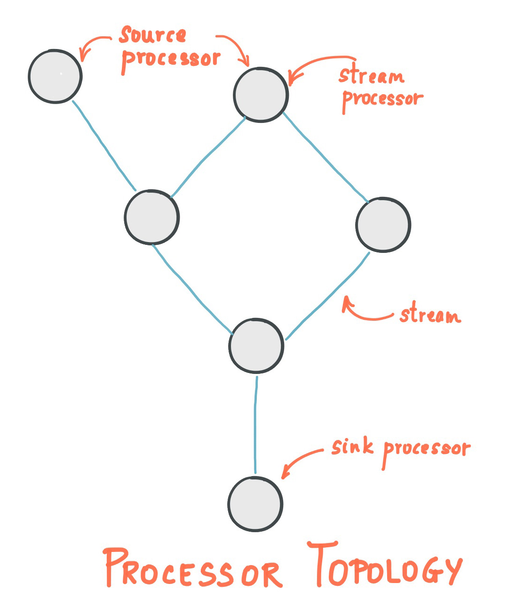
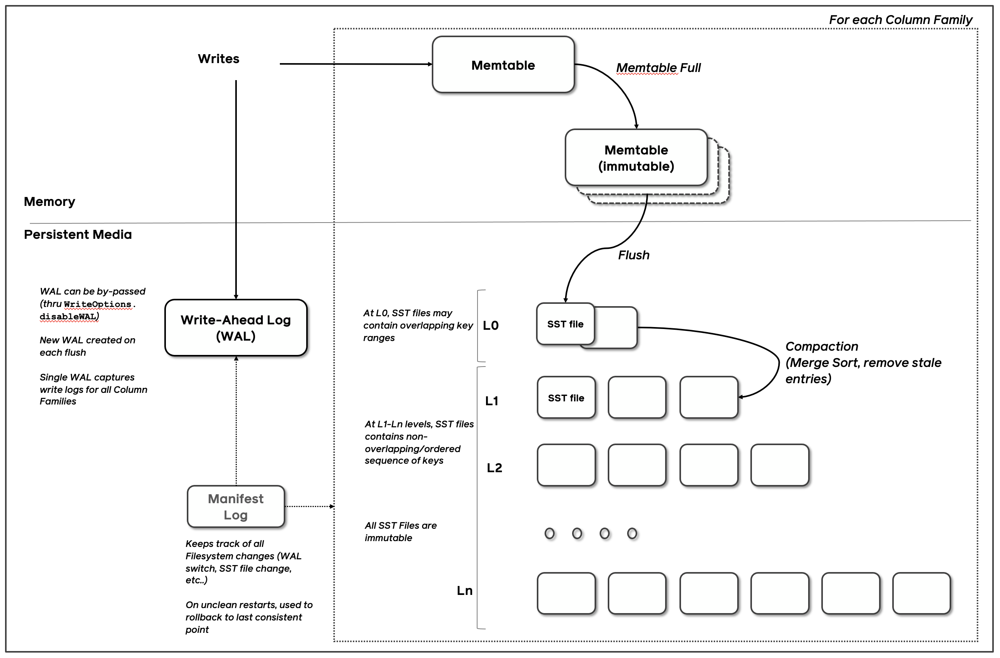

# 実践Kafka Streams
# 〜イベント駆動型アーキテクチャを添えて〜

### joker1007 (Repro株式会社)
### JJUG CCC SPRING 2025

---

<!--
footer: 
-->

# 自己紹介

- 橋立友宏 (@joker1007)
- Repro株式会社 チーフアーキテクト
- 元々はRailsエンジニアだったが、最近はJavaばかり書いている
- 日本酒とクラフトビールが好き
- Asakusa.rb メンバー
- Oxygen Not Included を再開して生活が終わりつつある


---
# Reproの事業
マーケティングオートメーションサービスを提供している。
マーケティングオートメーションとは、

- ユーザーの行動を分析・分類し
- 複数のチャネルで適切なキャンペーンを配信することで
- 顧客とエンドユーザーのコミュニケーションを支援する

SaaS事業だけでなく、サービスグロースの総合的な支援も提供しています。

---
# ReproとKafkaの親和性
Reproのサービスには以下の様な特徴がある。

- エンドユーザーの数が膨大なので、大量のトラフィックが届く
	- トラフィックの多い箇所だと、秒間6万件ぐらいは捌く必要がある
- 直接的なビジネストランザクションではないので、個別のレイテンシはシビアではない
- 一方で定期的なバッチ処理ではリードタイムが長過ぎる
- バックグラウンド通信が大半を占めるので、パイプラインの非同期処理化が容易
- エンドユーザーの一つの行動が複数の処理と変化を引き起こす

例えば……

---
# ユーザーセグメンテーションの更新
ある行動をしたユーザーが、どういったユーザーの分類に含まれるのか。

- 久しぶりにスマホアプリを起動したユーザー
- 1週間以上アプリを起動していないユーザー
- 直近で商品を購入したユーザー

ユーザーの行動ログの発生によって、これらの分類に含まれる様に変化したり、逆に条件から外れる様に変化したりする。

---
# トリガー配信
ある行動をしたユーザーに、プッシュ型の配信を送る。

- キャンペーン応募条件を満たす行動をしたユーザーに素早く案内通知を送る
- カートに入れたまま購入に至っていないユーザーにリマインド通知を送る

これらの配信は、複数のチャネルで行われる可能性がある。プッシュ通知だったりLINEのメッセージだったりメールだったりする。

---
# ユーザーの行動というイベントを起点に考える
エンドユーザーの行動をイベントして受け取り、イベントが複数のマイクロサービスを起動する。
処理結果をスケーラブルなデータストアに永続化し、必要な時に参照を行う。
読み込みと書き込みの責務が明確なら、データの整合性はコントロールできる。

---
# イベント駆動型アーキテクチャへ
イベント駆動型アーキテクチャは以下の様な特徴を持つ。

- イベントの発火点は他のサービスのことを知らなくて良い
- イベントバスに情報が集約され、各サービスはそこと自分の管轄範囲の情報だけを持つ
- イベントに関連するサービスを自由に追加可能で、イベントバスへの負荷を除いて他サービスに影響を与えない
- イベントバスに依存するが、スケーラビリティは比較的確保しやすい
- バッチ処理よりも遥かに短いリードタイム

これらの特性がReproのサービスと非常に相性が良い。

---
# イベントバスとしてのKafkaの採用
イベント駆動型アーキテクチャにおいてはイベントバスの選択が非常に重要。

Reproでは長く開発が継続しているOSSであり、各種ミドルウェアの接続サポートの多いKafkaを採用した。

---
# ストリームアプリケーションの構築
Kafkaに接続するスケーラブルなアプリケーションを構築するにはストリームアプリケーションの構築ノウハウを学ぶ必要がある。

一般的なWebアプリケーションやRPCを基本としたマイクロサービスとは異なった概念を理解しなればならない。

理屈とフレームワークの両面から理解を深めていく。

---
# Kafka Streamsフレームワーク
Apache Kafkaプロジェクト公式でメンテナンスされているストリームアプリケーションフレームワーク。
Javaで普通にCLIアプリケーションを書く様にストリームアプリケーションが書ける。

---
# Kafka Streamsの特徴
- Kafkaクライアント自体のクラスタ管理機能を利用するので、Kafka Broker以外のミドルウェアやリソースマネージャーに依存しない
- 典型的な処理を記述できるDSLとその基盤となる自由度の高いProcessor APIを持つ
- 集計処理などStatefulな処理に対応するローカルなデータストアと障害復旧機能を持つ

弊社では、こういった特徴の中でも特に基盤のシンプルさや学習コストの低さを重視してKafka Streamsを採用した。

---
# Kafka Streamsの書き方
Kafkaの1つ以上のトピックからデータをconsumeし、必要な加工や集計を行い、また別のトピックに書き出す、という処理を基本形とする。

consume、データ処理、produce、の各処理をノードと呼び、そのノードをグラフ状に繋げたトポロジーというモデルを構成することでアプリケーションを記述する。



---
# Kafka Streams DSLの基本概念

### KStream
トピックにレコードが到達し処理をしたら、それだけで完結し状態を持たないもの。

### KTable
トピックに到達したレコードはKStreamと同様にレコード単位で処理されるが、後から参照できる様にローカルのデータストアに蓄積していて、キーバリューストアのテーブルの様に扱えるもの。同一のキーを持つものは最新のものだけ参照できる。

### GlobalKTable
Tableと同様の動きをするが、全てのConsumerが同じ内容を読み込む。トピックパーティションが複数ある場合は全てのパーティションをそれぞれのConsumerが読み込むことになる

---
# DSLのサンプルを軽く紹介

---

# KStream, KTableの作成

```java
StreamsBuilder builder = new StreamsBuilder();

KStream<String, Long> wordCounts = builder.stream(
    "word-counts-input-topic", /* input topic */
    Consumed.with(
      Serdes.String(), /* key serde */
      Serdes.Long()   /* value serde */
    );
KTable<String, Long> wordCounts = builder.table(
    "word-counts-input-topic", /* input topic */
    Materialized.<String, Long, KeyValueStore<Bytes, byte[]>>as(
      "word-counts-store" /* table/store name */)
      .withKeySerde(Serdes.String()) /* key serde */
      .withValueSerde(Serdes.Long()) /* value serde */
    );

```

---
# 値のフィルタ・加工
```java
KStream<String, Long> onlyPositives = stream.filter((key, value) -> value > 0);
```

```java
KStream<String, Integer> transformed = stream.map(
    (key, value) -> KeyValue.pair(value.toLowerCase(), value.length()));

// キーを変更するとrepartition flagが立つ
```

```java
KStream<byte[], String> uppercased = stream.mapValues(value -> value.toUpperCase());
```

---
# 処理の分岐と結合
```java
Map<String, KStream<String, Long>> branches =
    stream.split(Named.as("Branch-"))
        .branch((key, value) -> key.startsWith("A"),  /* first predicate  */
             Branched.as("A"))
        .branch((key, value) -> key.startsWith("B"),  /* second predicate */
             Branched.as("B"))
        .defaultBranch(Branched.as("C"))              /* default branch */
);
```

```java
KStream<byte[], String> merged = stream1.merge(stream2);
```

---
# ワードカウントを題材とした集約の例
```java
KStream<String, Long> wordCounts = textLines
    .flatMapValues(value -> Arrays.asList(value.toLowerCase().split("\\W+")))
    .groupBy((key, word) -> word)
    // Count the occurrences of each word (record key).
    //
    // This will change the stream type from `KGroupedStream<String, String>` to
    // `KTable<String, Long>` (word -> count).
    .count()
    // Convert the `KTable<String, Long>` into a `KStream<String, Long>`.
    .toStream();
```

---
# 別トピックへの書き出し
```java
stream.to("my-stream-output-topic", Produced.with(Serdes.String(), Serdes.Long());
```

---
# DSLの裏側
単純に値を変換するmapValuesの実装

```java
class KStreamMapValues<KIn, VIn, VOut> implements FixedKeyProcessorSupplier<KIn, VIn, VOut> {

    private final ValueMapperWithKey<KIn, VIn, VOut> mapper;

    public KStreamMapValues(final ValueMapperWithKey<KIn, VIn, VOut> mapper) {
        this.mapper = mapper;
    }

    @Override
    public FixedKeyProcessor<KIn, VIn, VOut> get() {
        return new KStreamMapProcessor();
    }

    private class KStreamMapProcessor extends ContextualFixedKeyProcessor<KIn, VIn, VOut> {
        @Override
        public void process(final FixedKeyRecord<KIn, VIn> record) {
            final VOut newValue = mapper.apply(record.key(), record.value());
            context().forward(record.withValue(newValue));
        }
    }
}
```

---
# 低レベルAPIとしてのProcessor API
Kafka Streamsはプログラマーが細かな制御を行うためのAPIとしてProcessor APIというものを提供している。
see. https://kafka.apache.org/20/documentation/streams/developer-guide/processor-api

フレームワークが提供しているDSL自体も、Processor APIによって実装されており実装はそれ程複雑ではない。

自分でProcessor APIを利用する時の参考にもなるので、ソースコードは読んでおくと良い。

---
# Processor APIのInterface
```java
public interface Processor<KIn, VIn, KOut, VOut> {

    default void init(final ProcessorContext<KOut, VOut> context) {}

    void process(Record<KIn, VIn> record);

    default void close() {}
}
```

この様に非常にシンプルであり、基本的にやりたい処理をprocessメソッドに実装するだけ。
後続の処理に流したい場合は、`ProcessorContext#forward`を呼ぶ。

---
# Statefulな処理の実装方法
以下は、汎用的なAggregateを行うDSLの実装を抜粋したもの。

```java
            final ValueAndTimestamp<VAgg> oldAggAndTimestamp = store.get(record.key());
            VAgg oldAgg = getValueOrNull(oldAggAndTimestamp);

            final VAgg newAgg;
            final long newTimestamp;

            if (oldAgg == null) {
                oldAgg = initializer.apply();
                newTimestamp = record.timestamp();
            } else {
                oldAgg = oldAggAndTimestamp.value();
                newTimestamp = Math.max(record.timestamp(), oldAggAndTimestamp.timestamp());
            }

            newAgg = aggregator.apply(record.key(), record.value(), oldAgg);

            final long putReturnCode = store.put(record.key(), newAgg, newTimestamp);

```

---

# 集計処理の処理イメージ

---
# Processor APIとRocksDB
Kafka StreamsはStatefulな処理を実装するためのバックエンドとしてRocksDBをフレームワーク内に組み込んでいる。
RocksDBはLSM Treeをベースとした高速なKVS。

処理レコードのキーをRocksDBのキーとしてシリアライズした値を格納しておき、後続に同一キーのレコードが到達したらRocksDBから値をfetch、値を加工してから再度RocksDBにputする。

Statefulな処理は基本的にこの様に実装される。

複雑な処理を実装する場合は、このRocksDBの使い方と性質の理解が重要である。

---
# Kafka Streams 応用編

---
# ストリームアプリケーションのパフォーマンス
Kafkaを利用した分散ストリームアプリケーションを実装する際に、特に重要なことは以下の3つ。

1. レイテンシ
2. パーティションキーの選択
3. 処理データ量の見積りとパーティションサイズの決定

この中でも特にレイテンシに関してはシビアな感覚を持った方がいいと感じている。

---

# ストリームアプリケーションにおけるレイテンシの重要性
そもそもこういったアプリケーションを実装したい理由は、短いリードタイムで大量のデータを処理するスケーラブルかつハイパフォーマンスなパイプラインを構築したいから。

そして、KafkaとKafka Streamsはその特性上、スケーラビリティはトピックのパーティション数によって担保され、基本的に個別のパーティションのレコードはシーケンシャルに処理される。
特に処理順番が重要なシステムではそうしなければならない。

そのため、1レコードを捌くのにかかる時間とパーティション数で一定時間辺りのスループットの上限が決まってしまう。

---

# ストリームアプリケーションのレイテンシ基準
現状のReproのレイテンシ基準は概ね以下の通り。

- シンプルな処理なら0.1msec以下
- 複雑な処理でも1〜2msec以下

1msecはかなり遅い部類で、これだと1パーティションのレコードは秒間1000件しか処理できない。
100パーティションあっても秒間10万件程度で頭打ちになる。
現状のReproの基準だと余裕があるとは言えない。

---
# レイテンシを短縮するには
とにかくできるだけI/Oをしない、ネットワーク通信を減らすことを意識する。
具体的には……

- 外部のDBと通信してはいけない、RDBだけでなくRedisなども
- re-partitionの回避
- RocksDBのチューニング

---

# 外部DBに依存しないペイロード設計
クラウド上で構成したアプリケーションでは、Redisなどと通信するだけで1msecぐらいのレイテンシがある。(遅い)

ペイロードサイズとのバランスは考える必要があるが、レコードは圧縮も可能なので基本的には処理に必要な情報は1レコードに全てまとめた方が処理効率は良い。

どうしてもRDBにおけるJOINの様な動作が必要な場合、同一のパーティションキーとパーティション数にコントロールしたトピック同士なら、安全に一つのノードに集約できるので低レイテンシで処理できる。

---

# パーティションキーの設計
JOINやグルーピングしての集約において、パーティションキーが異なっていると中間トピックを噛まして再分散させる必要が出てきてパフォーマンスに悪影響を及ぼす。

こういった再分散(re-paritioning)を避けるために、一緒に扱いたい情報同士のパーティションキーは事前に揃えておく必要がある。

集約処理を実装した後にKafkaトピックのパーティションを変更するのは非常に難しい。

Reproの場合は大抵はエンドユーザーごとに一意になるユニークIDを選択している。

ちなみに、Kafkaにおいてレコードの一意性を表すレコードキーとパーティションキーは独立していて、それぞれ個別に設定できる。


---

# RocksDBのパフォーマンス

RocksDBはオンメモリのmemtableとbuffer cacheを活用し、高速な書き込みとルックアップを実現している
1msec以下のレイテンシを基本にしつつ集約処理を行うには、こういった組込み型の高速なKVSを活用する必要があるため、フレームワークがサポートしてくれている。

Reproでの主なチューニングポイントは以下の通り。

- memtableのサイズやbuffer cacheサイズ
- コンパクションタイミング
- indexとbloom filterをメモリ上にpin止め

---

# RocksDBのアーキテクチャ概要


---

# RocksDBのコンフィグ例

```java
      BlockBasedTableConfig tableConfig = (BlockBasedTableConfig) options.tableFormatConfig();

      tableConfig.setBlockCache(cache);
      tableConfig.setCacheIndexAndFilterBlocks(true);
      options.setWriteBufferManager(writeBufferManager);

      tableConfig.setCacheIndexAndFilterBlocksWithHighPriority(true);
      tableConfig.setPinTopLevelIndexAndFilter(true);

      tableConfig.setBlockSize(4 * 1024L);
      tableConfig.setFilterPolicy(filter);

      options.setWriteBufferSize(getMemtableSize());
      options.setMaxWriteBufferNumber(4);
      options.setMinWriteBufferNumberToMerge(2);
      options.setTableFormatConfig(tableConfig);
      options.setTargetFileSizeBase(256L * 1024 * 1024);
      options.setLevel0FileNumCompactionTrigger(10);
```

---

# Processor APIによるRocksDBの高度な活用法
DSLのバックエンドとしてRocksDBが活用されているが、開発者自身でProcessor APIを利用すればより細かな制御が可能になる。

---

# レコードキーと異なるキーの利用

DSLバックエンドとしてのRocksDBは基本的にはレコードのキーをそのままキーとして利用する。
一方でProcessor APIでは何をキーにしてRocksDBに格納するかは完全に自由である。
また当然のことだが、シリアライズ可能なものであれば何でも格納できる。

これを利用すると、エンドユーザーIDごとに分散されたノード上で、顧客ID毎に中間集約を行い、それを最終的な集約トピックにまとめることで、データの再配置を削減する、などの細かな制御が可能になる。

---

# その他のRocksDBの活用例

- セカンダリキーを利用した1:NのJOIN (昔は出来なかったが、今はDSLでもサポートした)
- 確率的データ構造(sketch)と組み合わせたユニークカウントの近似値計算
- キャンセル可能な処理を対象にした遅延キューイング

---

# RocksDBのデータロスト対策
RocksDBは各処理ノード上のローカルストレージに保持されているので、ノードのterminateに対応できる様にデータロスト対策が必要になる。

Kafka Streamsではchangelogトピックというフレームワーク管理のtopicがRocksDBとセットで生成され、RocksDBに書き込んだ内容がflushされると同時にKafkaトピックにも同じ内容のレコードが書き込まれる様になっている。

RocksDB消失時には、フレームワークが自動的にchangelogトピックからデータを取得しなおし、そのレコードを利用してRocksDBをレストアする処理が走る。

---

# レストアによるStop the world
フレームワークによるレストア処理は非常に便利だが、一方で無視できない問題も発生する。

**それは、レストア処理実行中は、そのパーティションのストリーム処理がストップしてしまうことだ。**

例えばエンドユーザー毎に集計したデータ量が膨大であれば、1パーティションのレストアにもかなりの時間を要する。その間処理が停止していると無視できない処理遅延に繋がってしまう。

---

# ストレージティアリング

Reproではこの問題に対処するためにストレージティアリングの概念を導入している。

先に説明した様に外部のデータベースを利用するのは慎重になるべきだが、リクエストが常に発生しないのであればある程度は許容できる。方針は以下の通り。

- ノードローカルのRocksDBを直近のホットデータに限定したキャッシュに近いデータとして扱う
- 古いデータは外部のDB (Cassandraなど) に保存しておいて、必要に応じて取得する
- また再利用に備えて外部DBから取得した値もRocksDBに書き込んでおく

---
# イベント駆動アーキテクチャのトレードオフ

Kafka Streamsの特性以外にも、アーキテクチャのトレードオフとして抱え込んだ課題も存在する。

- システム全体での複雑さは根本的には解消できていないし、サービス間を跨ぐテストや全体像の把握はモノリシックなアプリケーションよりは確実にやり辛い。
- 一部には同期リクエストからそういったストリーム処理を前提に構築されたコンポーネントを利用したいケースも残っており、逆に工夫が必要になる箇所も存在している。
- 処理レイテンシにかなりフォーカスしたシステム分割構成になっているので、サービスごとの責任範囲が直感的ではない

等々、難しい問題は多く残っている。

---

# アーキテクチャ転換の所感

Kafka Streamsとストリームアプリケーションの知見の蓄積、イベント駆動アーキテクチャの採用によって一定の成果は出せたと感じている。

チャネルの追加や新しい機能を作る上で、高いスケーラビリティが求められる箇所を上手く隠蔽しつつ、既存のシステムに影響を与えずに新しいコンポーネントを開発できる様になったし、多くのコンポーネントを開発してきて、Reproというサービスとの相性は十分に良い選択だったと評価している。

全体像の把握し辛さなども、OpenTelemetryを利用した分散トレーシングによるシステム構成の可視化など対策が進みつつある。

---

# Reproは開発者を募集中です

ハイトラフィックをスピーディに捌くストリームアプリケーションに興味がある方。
大量の活きたデータを支えるデータストアのR&Dや技術選定に関わってみたい方。
新しいアーキテクチャの評価・選定に関わってみたい方。

是非Reproに話を聞きにきてください！

ご清聴ありがとうございました。
