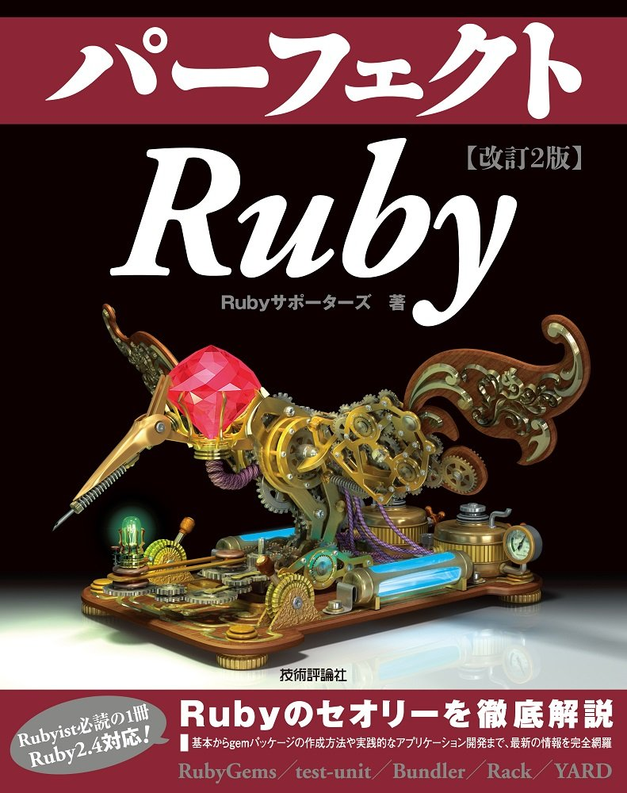
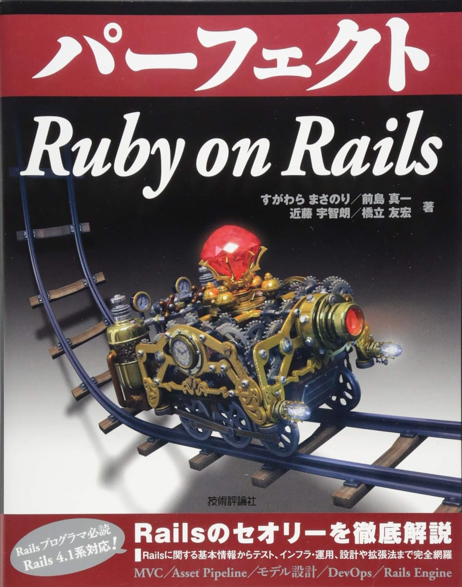

# 今改めてServiceクラスについて考える
# 〜あるRails開発者の10年〜

### joker1007 (Repro株式会社)
### Kaigi on Rails 2025

---

<!--
footer: 
-->

# 自己紹介

- Tomohiro Hashidate
- id: joker1007
- Repro株式会社 チーフアーキテクト
- 元々はRailsエンジニアだったが、最近はJavaばかり書いている
- スティール・ボール・ランのアニメ化が楽しみで生きている
- パーフェクトRuby及びパーフェクトRuby on Railsの著者の一人

---

# Reproから来ました

日々大量のデータを扱い、デジタルマーケティングを支援してます。

---

---
# パーフェクトRuby on Railsの第1版
# 2014/6/6 発売

11年前、ざっくり10年以上経った。
(思えば遠くに来たもんだ)

---

# 9章の6 サービスクラス

ここを書いたのが俺。

---

# そしてもう一つ

# 「俺が悪かった。素直に間違いを認めるから、もうサービスクラスとか作るのは止めてくれ」 at Qiita
https://qiita.com/joker1007/items/25de535cd8bb2857a685

これを書いたのが2016年末。パRailsを書いてから2年半後ぐらい。

2年半で言ってること変わってんじゃん！と言いたくなるかもしれない。自分でもそう思う。

---

# 最初のパRailsから大体10年後のこと……

---

# 2024/09/07 福岡Rubyist会議04 懇親会にて

 @junk0612 「サービスクラスってどう思います？」

 @joker1007,   @onk 「オッ！サービスクラスの話？」

みたいな感じになりまして、
ちょうど近くに座っていた 
@snoozer05 さんとビアバーに流れて議論する機会があった。
これを機にちょっと話をしたいなーと思っていたら、この前の関西Ruby会議08でもサービスクラスへの言及があって、話すなら今だなと思った。

---

# この時は、実際の仕事の現場では出来る限り使わない方が良い、という意見で概ね合意があったと思う
(それなりに飲んでたので記憶違いだったらごめんなさい。:bow: 訂正歓迎。)

---

# 何故使わない方がいいのか

# 「開発統制の困難さを上回るメリットが得られない」

もう少し具体的な話をする前に過去を振り返っておきたい。
ちなみに、ここから文字がめっちゃ多いです。
1日の最後に眠い話になるかもしれませんが、お付き合いください。

---

# そもそもサービスクラスとは何だったのか
# 当時俺はどの様に書いていたのか
# 過去の文献や資料、そして自分が書いた文章を読み返してみた

---

# 2011年4月 エリック・エヴァンスのドメイン駆動設計発売 (原著は2003年発売)

日本でサービスクラスという名前が語られることが増えた背景に、DDD本の影響があったことは無視できない。
この発表にも内容への言及がいくつか出てくるが、DDDという手法を採用する・しないに関わらず、自分達が解決したい業務ドメインに対する理解を深めることは、どんなソフトウェアを開発する上でも重要な営みだと考えているため。

Railsのバージョンとしては3.1〜3.2ぐらいの時期で、ActiveRecordが今も残る形に変更され、Sprocketsが入り、多くのスタートアップで使われる様になってきた時代。
ちょうど自分もRailsで仕事が出来る様になった頃で、個人的には一番熱かったかも。

---

# Fat Modelに対する問題意識
Railsがビジネスの現場で使われることが多くなった結果、あちこちでFat Modelが問題として顕在化し始めた。

ActiveRecordの特性上、システム自体が複雑になると色々な箇所から参照される基盤となるクラスに多くの処理が記述され、複雑度が爆発し依存関係がとっ散らかって管理しきれなくなる、という問題がしばしば発生する。

それに対処するために、モデルを整理するテクニックがあちこちで語られる様になりました。Rails fat modelでググると2010年頃からそういうテクニックについて語られている記事が増えているのが分かります。
この頃からサービスクラスについての言及も多く出てきます。

---

# DDD本におけるサービスとは (要約)

ソフトウェアのビジネスドメインから生まれる概念の中で、エンティティや値オブジェクトに責務を持たせるとそれらの定義を歪めたり不自然なオブジェクトが生まれる場合がある。そういった時に振舞いに着目して何が実行できるかという観点から命名し責務を定義するもの。
そして、その**命名と操作名はユビキタス言語に由来していなければならない**。

ユビキタス言語についての簡単な説明: ビジネスドメインについて議論・設計を行う際に実際の業務で表現される語彙とコード上の語彙を統一して、ドメイン理解とコード上の表現の相互のやり取りの基盤となるもの。我々が何を作ろうとしているのかを突き詰めていく際のコミュニケーションの基盤となるもの。

---

# パーフェクトRailsにおけるサービスクラス (要約)

コントローラーとモデルの中間に立つもので、コントローラーはHTTPリクエストをハンドリングするインターフェースであり、サービスはモデルが行う処理を取り纏めるインターフェースである。
サービスクラスは処理そのものをカプセル化したものであり、かつ業務知識と実装のメンタルモデルを一致させることが重要な役割の一つである。
業務知識と照らし合わせて自然な形でアプリケーションを設計するための手段の一つ。
**適切な名前付けが出来ないならサービスクラスを利用する対象として不適切な可能性がある**。

---

# 意外とちゃんと書いてある
(自分相手だと、いくらでも上から目線になれますね :innocent:)

乱用は危ないから考えて使おうね、とも書いてある。
実際書いた時もDDD本は大いに参考にしたし、先達の記事も一杯読んだ。

余談だが、パーフェクトRailsはこういう現場でコードを書いている目線からの知見を大事にしたいと思って書いていた。

しかし……。

---

# この時に分かってなかったこと

- 「乱用は危ないから考えてから使う」の度合いが人によってバラバラだということ
- ビジネスドメインの語彙に対する理解度が人によってバラバラだということ
	- 単にややこしい処理に安易に名前付けて良い訳じゃないってこと
- ある機能の振舞いとActiveRecordのデータ操作を適切に分離することの難しさ

自社開発の会社で役職を得て人の開発を監督する責務を負う様になり、ちょっとづつ分かってきた。

---

# チーム開発における共通認識の重要さ

Railsを活用した事業が増え、2、3人のすぐに話が伝わるレベルでは収まらない開発が普通になった。自分もゼロからのスタート時点で関わっていない仕事が増えた。こういう世界で継続的に開発のペースを維持するためには、チーム全体の水準と共通認識が重要になる。

一貫性を伴ってコードを書いてないと、少し時間が経っただけで何がどうなってるかすぐ分からなくなる。
人はすぐに物事を忘れるし、自分が書いたコードがいつの間にか謎の拡張をされていたりするのは日常茶飯事なので、大事なのは「**ちゃんと想像が付く**」こと。

---

# 想像が付くとはどういうことか

- 機能のエントリポイントから戻り値を返すところまでの全体像を把握しやすいこと
- どのディレクトリに何が入っているか分かること
- クラス名・メソッド名で処理内容がイメージできて、副作用の有無が分かること

ソースコードそのものに対しては「リーダブルコード」という良い本がある。
これを構造レベルで実践すると考えて欲しい。

---

# サービスクラスの基準の作りにくさ
一つのモデルに収まらない複雑な処理を表す振舞いに考えて名前を付けろ、では現実的に基準にならない。
想像が付く様にするためには、もっと明確で覚え易いルールが必要になる。

単純なルールを決めたとして、本当に常にそうあるべきか？仮にそうだとして、裏側にActiveRecordのモデルが居る訳で、モデルに書く処理とサービスクラスに書く処理のメソッドレベルでの境界はどこにあるのか？その書き方の理由を説明が出来るか？

[朝のキーノート](https://kaigionrails.org/2025/talks/moro/#day1)でメール送信コードどこに書く？というテーマでmoroさんが考え方を示してくれましたが、そもそもコードの配置を適切に行う時点でかなり考える力が要る。

---

# Railsのレイヤー分類はよく出来ている

Railsの基本的なレイヤーはController, Model, Viewだけだ。Jobは非同期処理向けのControllerと言える。

- Controller: ユーザーからのリクエストをハンドリングし、モデルの処理結果を表示するviewを選択する
- Model: RDB操作とビジネスロジック全部
- View: 処理結果の表示

これをきっちり守るだけで大体どこに何があるか想像が付く。
人間が簡単に覚えて共通認識を作れるのはこの程度だという割り切りが見える。
こういう**共通認識の力こそがフレームワークを活用する利点**。
逆に言えば共通認識を破壊するとフレームワークの利点が失われる。

---

# サービスクラスを使っても問題ないケース

- 一人、または少人数で開発していてすぐにコミュニケーションが取れる
- チームの大半が対象業務を十分に理解しており、読み易いコードを維持することについての水準が高い

こういう場合なら使っても問題ないし、見通しが良くなるケースもあると思う。個人開発なら基本的に問題ない。

最低でも一人はここまで話した様なことが自分で説明できて、コードレビューに時間が割けることが必要。

今日のトークの入門FormObject冒頭でFormObject説明できる人～って聞いてて、あまり手が上がらなかったですね。
この説明の難しさがチームで書くコードのクオリティを保つ難しさでもある。

---

# じゃあ、Fat Modelはそのままで良いのか？

# もちろんそんな訳はない

---

# Formクラスってどうなん？

---

# 現実的な折衷案としてのFormクラス

ServiceクラスとFormクラスはActiveRecordの単体クラスの責務とするのが難しい問題の置き所としては同じものだが、**扱う文脈の限定度合いが違う**。

Formクラスの方がより限定的な問題に対処するもので、それが名前にも表れている。
だからこそ、現実的な折衷案として機能する。

---

# Formクラスの責務 (これも諸説あると思うが……)

Webアプリケーションにおける重要な処理の大半は、HTMLフォームもしくはそれに準ずるインターフェースによってまとめられたパラメーターのPOST/PUTによって発生する。

つまり、**パラメーターハンドリングとトランザクションコントロールを扱うレイヤー**があれば、大半の複雑な問題を扱える、そういう割り切りの元に存在している。

昨今のWebアプリケーションは入力パラメーター自体がそもそも複雑なので、ここがなんとかなれば良い。

---

# サービスクラスとの違い

- Formクラスは画面やユースケース(つまり大体アクション)と紐付いている
- ActiveModel, ActiveRecordのインターフェースと親和性が高い
- Formという名前から想像できる具体的なイメージがある
- 元々はビューに表示するformヘルパーとの相性も考慮されていたが、昨今はJSで組み立てることが多いので、この点は重要ではなくなってきた。

単なる名前と印象の問題では？と思うかもしれないが、業務としてのソフトウェア開発においてそれは物凄く重要である。**チームメンバーが納得できる名前を付けられるかどうか**がその後の開発のしやすさに大きな影響を与える。
入門FormObjectで話をされていたのは機能的な分類だったが、自分は**名前とそこから発生する共通認識**に注目している。

---

# Formクラス、サービスクラス共通の難しさ

複数のattributeに関する操作やRDBに関する操作をまとめて、ActiveRecordのクラスのメソッドに定義したとする。

これを複数のForm、Serviceから再利用しようとすると、ActiveRecordのメソッド側から修正したくなった時に困るし、Form側からの要請でメソッドを弄って大丈夫か怪しい、みたいなことになる。

結局ActiveRecordを上手く整理することから逃げられない。
ある意味ではRailsの大きなしがらみでもある。

 JC版 ダイの大冒険22巻より

---

# 結局のところ、ServiceだのFormだのは余り重要ではない

Railsの世界で言えば全部モデルの世界をどう整理するかという話で、わざわざ別のディレクトリ区切る程なのか？
ちゃんとシンプルさを求めることから逃げてないか？

---

# まずRDBと向き合う

参考:
- [Identifying User Identity by moro](https://kaigionrails.org/2024/talks/moro/)
- [dynamic! by moro](https://kaigionrails.org/2025/talks/moro/#day1)
- [パーフェクトRails著者が解説するdeviseの現代的なユーザー認証のモデル構成について by 俺](https://joker1007.hatenablog.com/entry/2020/08/17/141621)

---

# RDBの基本

- 自然に表現できて安全なデータ構造を見出すこと
	- エンティティとイベントの区別
	- 中間表現に適切な名前を付ける
	- 正規化・SQLの表現テクニックを学ぶ
- 状態ではなく事実の有無を活用し、データベースの制約を活かす設計
- テーブルやカラムにメンバーが自然に呼称できる適切な名前を付ける

---

# まずActiveRecord、ActiveModel、SQLを使いこなす

- 外から呼ばれるメソッドか、Validationか、Callbackかを適切に選択する
- Validation, Callbackに分岐を発生させない
- テーブル設計と組み合わせて状態管理をシンプルに
	- ユニーク制約に影響を与える削除フラグを止めるとか
- STI, polymorphicは難しい、気を付けろ
- ちゃんとscope作って名前を付ける
	- joins, includes, preloadの違いを理解し、EXPLAINはすぐ確認できる様に

---

# 我々が本当に整理したかったこと

---

# 重要なのはドメインコンテキストの理解

複雑なシステムを設計する時に重要なのはコンテキストマップを作ること。DDDにおける基本にして奥義だと思う。
DDD本においては境界づけられたコンテキストと呼ばれる。

そして、その一連のコンテキストがシステム内部のどのコンポーネントに相当し、どうやって他のコンテキストと相互作用するのかを考える。
コンテキストをコードを中で自然に表現できて、コンテキスト同士は**境界を越えた先に影響を与えない様にコントロールしたい**。

---

# 境界づけられたコンテキストとは
同じユビキタス言語(語彙)が使える業務領域のこと。

例えば、Reproではスマホに対してプッシュメッセージを送ってマーケティングコンテンツを配信することと、アプリケーション内のポップアップでマーケティングコンテンツを配信することは、同じ「コンテンツ配信」だが実態としては、前者は外部の配信APIへのリクエスト送信、後者は自社のAPIに対するSDKからのリクエスト受信、とやりたいことが真逆だし、期待する配信タイミングも目的も異なる。

同じ言葉を使っても、意味や期待する動きが異なるなら同じコンテキストとして扱うのが適切ではない可能性がある。

---

# 依存関係を一方向に保つ

機能のワークフローを描く時、集約のルートとなる場所が明確になる様にデザインし、そこから依存関係の方向が逆戻りしない様に設計する。

Rubyの世界では古くはmoduleを利用した名前空間とディレクトリ構成だったが、現代における**現実的な選択肢はやはりモジュラーモノリス**になるだろう。

---

# モジュラーモノリスのやりたいこと

- 分散システムの複雑性から可能な限り距離を取りつつ、コンテキストの境界を明確にし強制する
- 認知負荷を下げる
- 開発の統制を保つ

但しRubyには同一のコードベース内で可視性を強制する手段が無かった。
なのでShopifyはPackwerkを作った。Zeitwerkを利用して定数参照にフックをかける形でコード間の依存性を検証する。

---

# 現実的だが楽な道ではない

参考: [A Packwerk Retrospective (2024) - Shopify](https://shopify.engineering/a-packwerk-retrospective#)

Packwerkの依存性検出には限界があるし、コンポーネントの責務をどう分離するかの示唆を与えてくれる訳ではない。
特にドメインで分離した結果、機能面での依存が不自然になるのは非常に難しい問題で、簡単に結論が出せる様な問題ではない。

コンテキストマッピングもコンポーネントの分割も、一度で上手くいく様なものではないので、**継続的に何度も判断を下し続けてコードとメンタルモデルを相互に改良し続ける**必要がある。(こういう行いをドメインモデリングの文脈では蒸留と呼ぶ)。

---

# Serviceクラスの復活

モジュラーモノリスによってコンポーネントの境界が明確になった時、Webというインターフェースに限定されないコンポーネントレベルでの公開エントリポイントが必要になる。

ここでServiceクラス(またはそれに類する何か)を利用するのは意味があると考えている。この時、ドキュメント化された呼び出し規約は絶対に必要になる。
マイクロサービスにおいてはリポジトリで管理されるスキーマなどがそれに当たる。モジュラーモノリスではメソッドの型になるだろう。
型検査をやるならこういったコンポーネントの境界を跨ぐ公開エントリポイントが最も重要度が高い。

---

# 新しい世界 Ruby::Box (by @tagomoris)

今開発が進んでいるNamespace改めRuby::Boxによりもたらされる可視性のコントロールはPackwerkより遥かに強力。

Ruby::Boxではある名前空間のクラス定義構造は他のものと完全に独立している。定義自体が無いものはどうやっても呼べない。

流石に早々に使える様にはならないと思うが、より自由なディレクトリ構成を持ちつつコンテキスト境界を明示する一つの手段になるのではないかと期待している。

---

# 実は言いたかったこと

**チームで継続的に仕事として開発することの難しさ、そしてそれへの向き合い方。**

- Serviceクラス、Formクラス自体は合理的な場合もあるが上手く活用することは難しい。特にチーム開発では。
- もし使うならチームメンバー全員でどういうケースで使うのか、どうして必要なのかをちゃんと言語化し話し合う。
- 重要なのは、開発者にとって想像が付くこと、驚きが少ない開発。読めるコード、そして読める構造へ。
- ServiceクラスやFormクラスはコード上の表現技法の一つに過ぎない。コンテキストマッピングをしっかり考えて、継続的に改善をし続けること。

---

# 正解は無い、一緒に考え続けましょう

ソフトウェア設計は継続的な営み。

<blockquote class="twitter-tweet">
ITシステムの設計ってのは、ある瞬間に適切な選択をすることではなくて、継続的に開発が滞りなく行えて新しい関係者が物事を理解しやすい状態を維持し、ビジネスが意図した通りに発展できる状態を維持し続けることだと伝えていきたい。
&mdash; joker1007 (アルフォートおじさん) (@joker1007) <a href="https://twitter.com/joker1007/status/1935347080731705832?ref_src=twsrc%5Etfw">June 18, 2025</a></blockquote>

---

# We're hiring!!
一緒にソフトウェア設計を考えてくれる仲間を探しています。

よろしくお願いします。
