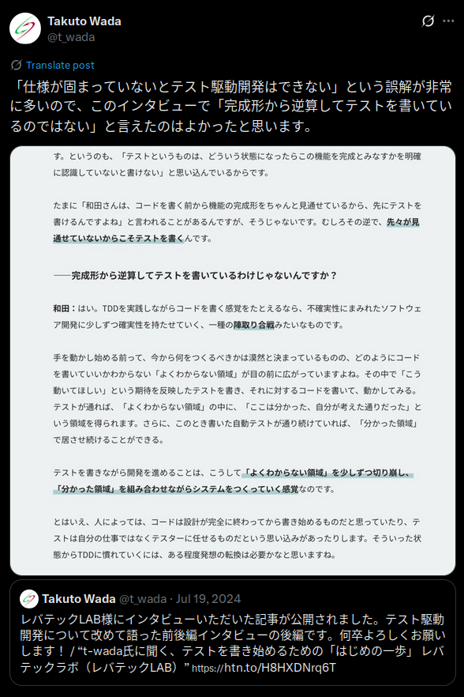

# rubygem開発で鍛える設計力

##### joker1007 (Repro株式会社チーフアーキテクト)

---

# 自己紹介

- 橋立友宏 (@joker1007)
- Repro株式会社 チーフアーキテクト
- 元々はRailsエンジニアだったが、最近はJavaばかり書いている
- 日本酒とクラフトビールが好き
- Oxygen Not Included を再開して生活が終わりつつある (今およそ1100サイクル)

---

# そもそもITシステムの設計って何？
(あくまで私の捉え方であり、共通見解としてのメンタルモデルではありません)

---

# ITシステムとは

**情報(データ)を受け取って、加工し、現実世界もしくは別のシステムと相互作用をするもの**

銀行の口座管理でも、個人の会計管理でも、動画配信サイトでも、マーケティング支援でも、それは変わらない。

ユーザーが居て何らかの情報と共にリクエストを投げる、予定時刻が到来する等の情報と事実を受け取って、それを既存の情報と組み合わせて加工し、新しい情報を保存したり外界に信号を出したりを行う。

つまり、極端に言えば**データ入出力の集合体**こそがITシステムだと言える。
(異論はあると思う)

---

# システム設計とは

入力と出力を理解し、入力から出力に至るまでの地図を描く。

入力 = ユーザーのインタラクションやバッチの起動など。
出力 = 最終的にユーザーが得る体験、知見や別システムの入力となる加工済みのデータ

何を入力して何を得たいのか、これらを明確にすることが要件定義であり、その実現方法と辿るべき加工のルートを明確にすることが設計だと考える。

---

# しかし現実は単純ではない

機械化して楽をしたいこと、というのは複雑で面倒臭いからそうしたいのである。

大抵の場合、一つの結果を得るために入力が必要な情報は多数存在するし、
一つの業務システムやWebサービスの出力から獲得したいものも多数存在する。

ある目的で出力したものは、当初の目的とは異なる用途で再利用されることもある。

ある瞬間の単一の目的のために地図を描いても常に変わり続ける景色には対応できない。

---

# 人間は欲しいものが分かっていない

大抵の場合、人間は自分が欲しいものをちゃんと理解していない。
今の延長で物事を考えてしまうし、表象に見えてるもので動きを捉えてしまう。

価値の中心を見極めて、動きの詳細をデザインするには訓練が必要。
(今のところ、この能力はそう簡単にAIに代替されなさそうなので、これがちゃんとやれればしばらくは生き残れる)

---

# パターン認識と抽象化
複数の機能の中で同様の動きをする箇所を見つけだす。

共通して表現可能な語彙と概念で同じ動きをする箇所を表現する。

例えば、*スマートフォンにPush通知を送る機能と、メールマガジンを送信する機能、どちらもサーバー側から送信用のエントリポイントにリクエストして、テキストと画像を含むコンテンツを配信する機能と表現できる。*

具体的な機能の情報をいくつも収集し、構造に潜んでいるパターンを認識し、複数の機能をバランス良く表現できる共通の語彙に置き換える。
これが抽象化であり、システム設計において非常に重要な考え方。

---

# 抽象と具体の行き来

パターンを見出して、抽象段階を上げた概念を見つけたら、具体的な機能に戻って考えることも必要。

なぜなら具体的な機能同士の中で**変数**になるところを見つける必要があるから。

抽象的な機能表現だけでは複数の個別機能は実現できない。機能ごとにどこを変更すれば二つが表現できるかを探す。

個別の機能ごとの変数が少なくて、そして変更が容易であるほど、抽象的な概念の抽出が上手くいっていると言える。

---

# 訓練としてのrubygem開発

こういった能力を鍛えるには、実際に目的が何かを理解し、実現方法を考えるという経験を積む必要がある。

ベンチャーの黎明期などの人が少ない会社に入ると経験が積み易いが、人生にそれなりに影響を与えてしまうので気軽にやれることではない。

なので、小さいスパンで刻んでいく方法として、普段からrubygem化を意識するということをオススメする。

---

# rubygem開発で鍛えられるもの
rubygemは開発を楽にするために作るもの。
なので、目的が自分の中で分かり易い。

そして、単一の目的ではなく似た様な問題をまとめて解決する、もしくは似た問題に悩む別の人の役に立つことを目的として作る。

**何を解決するために、いつ、どういう利用方法で活用するのか**、それを自分事として考えることができる。

目的を理解し、入力や振舞いと出力を定義し、そしてそれを汎用化する、経験が得られる。

---

# どういう時にgemを作るか

- 日々の面倒なことは、本当のところなぜ困ってるのか
- 過去に似た様な問題を見たことがあるか
- **開発しているサービスのドメインと直接関係していない、もしくは分離できる**
- それなりに複雑なことをやっている

---

# gemのパターン分類

- 純粋なライブラリ
	- **コーディングパターンの簡易化** (大規模にするとフレームワークに)
	- HTTPクライアント、シリアライザ、スレッドプール、ハッシュ関数などの実装
- CLIツール
	- **AWSの操作を楽にするCLIとか、YAMLを加工変換するとか**
	- Rubocopなどの開発支援ツールや、lramaなども含められる
	- **ゲームやグラフィック生成などの娯楽**
- **fluentdなどのプラグイン**

他にも色々あるけど書き切れない。(色付きは比較的gem化が簡単なもの)

---

# gem開発までの思考例 (その1)

- ecs_deploy: ECSのTaskDefinition更新とServiceの更新を行い状態が安定するまで待機するCLIツール(capistrano 拡張)
	- ECSの導入にあたって、デプロイプロセスを手動で試して理解を深めた
	- AWSのCLIで同種のことは出来るがエラーハンドリングや状態のpollingが面倒
	- RubyでAWSのAPIをラップしたCLIツールにまとめることで、典型的な処理を簡単に行える様に
	- 何度も実施する処理なので1回1回の実行に手間がかからないことを重視

---

# gem開発までの思考例 (その2)

- yaml_vault: YAMLファイル中の特定箇所をkmsの鍵によって暗号化・複合化を可能にする
	- サービスのコンテナ化を推進していく中で、秘匿情報の管理が面倒に
	- リポジトリに含めていないと更新が漏れるが、リポジトリに含めると業務委託メンバーなどを含めた細かい権限管理がしづらい
	- IAMによる権限管理を利用して暗号化と複合化が出来ればかなり楽になりそう
	- Ruby/Railsでは設定ファイルによくYAMLを利用するので、YAMLを対象に任意の形状でそれが実現できれば、大半の設定ファイルに応用できそう

---

# gem開発までの思考例 (その3)

- crono_trigger: ActiveRecordモデルを利用して登録可能なバッチ処理スケジューラーを作る
	- 指定時刻が来たら何かを実行する、という要求は世の中にめちゃくちゃ一杯ある
	- サービスの運用基盤としてのツールは一杯あるが、Railsサービスの中でスケジューラーの実行時間をユーザーに登録可能にさせるツールは余り無かった
	- 基本的なバッチスケジューラーの構造と要素技術を活かしつつ、Railsサービスの特性を活かしてgem化すれば、似た様な問題に複数対処できる。

---

# プログラミングの訓練としてのgem開発

---

# gem化のメリットを活かすために重要なこと

gem化をする上で非常に重要なのがテストコード。

gem化することで自ずと責任範囲が限定されるのでテストを書き易くなる。
gemの中で細かいパターンも含めたテストを書いておくことで、利用する側のサービスのテストなどを簡潔にできる。

---

# gem開発とTDD

開発の初期からテストコードを書き実行することを念頭においていると、ユースケースを意識したテスタビリティの高いコードを書き易くなるのがTDDの利点。

テストしやすいコードは入力と結果が想像しやすく結果が非決定的ではない、という点で読んで利用する側から見ても良いコードである可能性が高い。

gemの中でテストコードを書く方が、Rails上でRDBやKVSなどが要求されないので、環境管理もシンプルにしやすいし、実行速度も高速にしやすい。

テストが書き易いしテストコードの重要度も高いので、TDDの訓練としてもオススメできる。

---

# TDD余談

TDDは仕様や完成形から逆算してテストを書く訳ではないし、自分は必ずしもテストファーストでなくても良いと考えている。

動作確認のサイクルにおいて、確認したいことの明確化と繰り返し実行の省力化ができる。
先程の様にテストしやすくユースケースを意識したコードを書くフォースが働くので、結果的に良いコードに繋がるという設計技法がTDD。

その辺はライオンのスタンド使いであるt_wadaさんのツイートを参照。

https://x.com/t_wada/status/1814109605800370287

---

# プライベートgem活用のススメ

アプリケーション内にあるコードはどうしても事業ドメインに関するものと、一般的な問題への対処が混じってしまう。
場当たり的な対処では、事業ドメイン以上に余計な複雑さが増していく。

そういったものに抗うフォースとして、プライベートgemは有効な手段になる。最近はGitHub Packageにより割と簡単にプライベートgemが配布可能になっている。
Bundlerのプライベートリポジトリ指定でも良いが、権限の最小化とバージョニングのやり易さを考えるとプライベートパッケージにはメリットがある。

---

# お手軽プライベートgem

例えば以下の様なものが挙げられる。

- リポジトリを跨いだ基本設定の共通化
- JSON SchemaやGraphQLやProtocol Bufferのスキーマ定義と生成モデルの配布
- 外部プロセスとして利用するシングルバイナリのツール
- 社内でよく使うGemの典型的なパターンをwrapする

gemに含めるのはRubyコードだけではなく、ファイルならなんでも含められる。
ファイルパスを返すメソッドをgemのエントリポイントに定義しておくと便利。

社内ではよく見るパターンなんだけど、どうしても社内事情を外せない、みたいなものでもプライベートgemなら気軽にできる。
プライベートgemから更に汎用的な目的に活かせることが分かれば、publicにリリースすれば良い。

---

# よりよいコードを目指して

ITシステムの設計には、構造のパターン認識と抽象化能力、抽象と具体の差分を認識する能力がとても重要である。

gem開発はプログラマーとして身近な問題からその実践にトライできる良い機会になる。

作ったgemから更に抽象化・汎用化を考えることでOSS活動に繋げることもできる。

Rubyのパッケージシステムは非常によく出来ているので、最初の一歩はとても簡単。
普段からよく見る職場のコードの面倒臭さを無視しないことから始めていこう。
