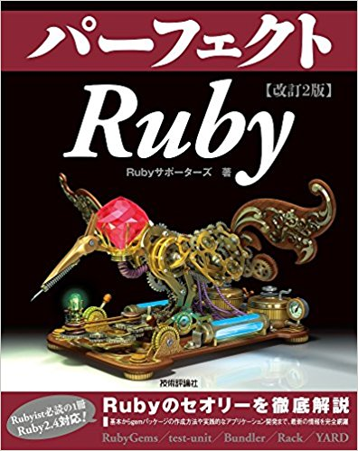

<!-- $theme: gaia -->
<!-- template: invert -->

# Rubygem開発の流儀
#### @joker1007

---

# self.inspect
- @joker1007
- Repro inc. CTO (要は色々やる人)
  - Ruby/Rails
  - fluentd/embulk
  - Docker/ECS
  - Bigquery/EMR/Hive/Presto

---


# Reproのサービス
- モバイルアプリケーションの行動トラッキング
- 分析結果の提供と、それと連動したマーケティングの提供
  - Pushメッセージ送ったり、アプリ内でプロモーション表示
- 大体Ruby・RailsでほぼAWS上で稼動している
- Dockerやterraform等も活用している

会社規模の割にデータ量が多い。
プッシュ送るのマジ大変なので、助けてくれ。

---

## Repro inc.は
## エンジニアを募集しております

- JSがとくいなフレンズ (特に人手不足)
- テストやQAがとくいなフレンズ (特に人手不足)
- Railsがとくいなフレンズ
- HadoopやPrestoがとくいなフレンズ

---

## ちなみに私は
## おそらく地域Ruby会議で
## 最も登壇した男です

---

## 関西Ruby会議は登壇3回目
#### 関西出身として光栄の至りです

---

# 本題のRubygemについて

---

## Rubygemについておさらい
- Rubyで利用するパッケージシステム
- Ruby本体にバンドルされている
- ライブラリに限らずアプリケーションの配布にも
- rubygems.org

---

## ライブラリパッケージとしての特徴
- 作成、リリースが簡単
- Gemfileを使って必要なものを簡単にインストール
- Gemfile.lockによるバージョン固定も簡単
- GitHubにホストされているものも直接利用可

つまりBundler凄いし、超便利。

---

#### Rubygemの作り方の詳細についてはこちら
パーフェクトRuby 第二版が絶賛発売中です
http://gihyo.jp/book/2017/978-4-7741-8977-2


---

# Rubygem作ってますか？
#### 実際にリリースしてメンテしてる(いた)人

---

# ちなみに私の場合

- Total Gems: 39
- Total Downloads: 714460

(資料作成時調べ)

---

# Rubygemは簡単に作れる
# -> 本当か？

---

### 工程自体は簡単でも
### gemを作ってリリースするには
### 別のハードルがある

- 何を作っていいか分からない
- ゴールが想像できない
- 汎用化・抽象化のコツが掴めない

---

# 結局難しいのは何か
- アイデアを生み出す
- ゴールに向かって工程や解決策を具体化する
- 多様な環境で使える様に調整する

何か自分で考えて作り上げるという行為自体が難しい
しかし、これが出来る様になると仕事に超役立つ

---

# とりあえずヒントを求めて
# gemをもうちょっと深く知る

---

## 世の中にはどんなgemがあるのか
## gemをざっくり分類してみる
##### (独断と雰囲気による適当な分類です)

---

## 開発支援系
ほとんどのgemはこれに含まれる。
また他の系統のものも大半はこのタイプとの複合。
- 複雑な定型処理をラップする
- テストコードのためのDSLを提供する
- ログを取り易くする
- ベンチマーカー、プロファイラー
- etc...

ex. concurrent-ruby, rspec, **activerecord-cause**

---

## クライアント系
自分のアプリケーションの外との通信を支援する。
サービス事業者の公式SDKや、それをラップしたものが多い。
その他、プロトコルの実装等のパターンも。
- DB等の外部コンポーネントと接続する
- APIクライアントSDK
- SDKをラップした使い易くしたもの
- 複数のサービスのI/Fを統一したクライアント

ex. redis, aws-sdk, koala, fog, **github-commit-status-updater** 

---

## フレームワーク/ミドルウェア系
書き方のルールを定めたり、アプリケーション自体を支える基盤になるもの。大掛かりなものが多い。
個人で書いてそれなりの完成度まで持っていくのは比較的難しい。
- rails, sinatra, hanami, padrino ...
- fluentd
- unicorn, puma ...
- rack
- **rukawa**

---

## プラグイン系
プラグイン機構を持つgemを拡張するもの。
書き方のルールがある程度決まっている。
- Rails拡張
- RSpec formatter
- fluentd/embulkプラグイン
- Redmineプラグイン
- etc...

ex. kaminari, **fluent-plugin-bigquery**, omniauth-\*

---

## 既存gem改造系
明確なプラグイン機構のないgemを改造する。
モンキーパッチや内部実装に踏み込んだ改造等もある。

- activerecord拡張
- rspec拡張
- capistrano拡張

ex. **rspec-storage**, **activemodel-associations**

---

## 業務特化系
仕事で書くコードの共通処理をまとめたり、ある業種に特化した便利機能等。
クローズドソースなgemも多い。

- 社内の認証基盤へのアクセス
- 社内共通のフレームワーク
- ゲーム系に特化したテストデータ生成

ex. takarabako

---

## 便利ツール系
単体で動作する便利ツールとしてのgem。
多言語メインの環境でも利用される場合がある。
- 運用自動化
- 外部サービスの情報を取得して、整形して表示
- Lintツール
- bot

ex. capistrano, rubocop, itamae, ruboty, **yaml_vault**

---

## パフォーマンス向上系
高いパフォーマンスが求められるため、既存の処理を更に高速な実装に置き換えるもの。
C拡張によって実装されることが多い。

- ハッシュ関数の実装
- 文字列処理の高速化
- 通信プロトコルの高速化

ex. hiredis, fast_blank, **curl_escape**

---

## 私の場合
- 既存gemの改造や、プラグイン系が多い
  - 作り易いし、ゴールが分かり易い
- たまにツールや少し大掛かりな仕組みも書く
  - 大体、新しい環境に移った時の環境の不満から
  - 汎用化の限度を決めるのが難しい (後述する)
- 業務に特化したgemは余り作らない
  - 特徴のある業界や大きな会社に余り居たことがない
  - 入口としてはやり易い

---

### 色々なgemを参考にネタを探す
- 公式のAPIクライアントが使い辛い
  - 良く使う処理をまとめて特化すれば簡単になるかも
- 秘匿情報の管理が面倒臭い
  - 暗号化と複合化をIAMで管理できれば楽かも
- Railsのビューをもう少し早くしたい
  - プロファイラによるとescapeが無駄に時間かかってるから何とかしたい

とにかく日々のイライラや不満を言語化し、
色々なgemのパターンと突き合わせる。

---

## Gemを作り始める前にやること
- 困っていることを正確に把握する
  - 何のせいで不便になっているのか
  - 何が得られれば改善できるのか
- 解決策のコストを評価する

---

## gem開発のコストとは
- 開発のコストが低い方が良い
  - 実装難易度が低い
  - 書くコードの量が少ない
  - 調査するコードの量が少ない
  - 外部のミドルウェア等に依存しない
  - 依存するgemが少ない
- 運用のコストが低い方が良い
  - 状況が多少変わっても弄らなくて済む
  - 別の方法が見つかったらすぐ止められる

---

## activerecord-causeの場合
1. 課題の認識 クソクエリがパフォーマンスを圧迫していて辛い
1. 改善阻害要因 ARがどこでクエリを発行しているか分かり辛いので、場所を特定するのが面倒
1. 解決策の検討
  - SQLが実際に発行された場所がログに出ればいい
  - 場所とは？ -> スタック上の自分の書いたコード部分
  - 自動で判別できる？ -> なんか難しそう、ざっくり指定できればいい

---

## 実装前に調査
- コールスタックって簡単に取れたっけ？
  - 例外の時にやってるんだから取れるだろ
  - callerとかで調べたら`caller_locations`があった
- ARのログってどうやって出してんだっけ？
  - Railsのコードを読んだら、LogSubscriberというものがあった
  - こいつはARにどうやって差し込まれてるんだ？
  - ARはイベントを吐き、各Subscriberはイベント名にアタッチする

---

# これはいけそうだ、作ろう

---

## Gemを作る時に考えておくこと
- 目的を少なく保ち、完璧を目指さない
  - 機能は少ない方が良い
- 最初から他人を意識しない まず自分を便利に
- 汎用化は無理のない範囲で
  - Railsの複数バージョン対応とか
  - 記録用ストレージを差し替えられるとか
- しかし可能な限り行儀の良いコードを書くこと

---

## 行儀の良さとは
gemの外の世界を壊さないこと。
外の世界の変化に追従できること。

- プライベートなメソッドを呼ばない
- モンキーパッチを使わない
- 組み込みのグローバルな動作を弄らない
- どうしても必要な場合は最小の利用で済むポイントを探す
- メタプロは可読性を損うので局所化する

黒魔法には代償を伴う。

---

## rspec-storageの場合
- 余計なオプションをRSpecに追加したくない
  - 本体のCLIを弄るのは面倒
  - 元々ファイルパスを指定して保存できる
- 流石にS3以外にもGCSぐらいは対応したい
  - 自分も将来使う可能性が高い
  - ストア方法の実装を選択可能にする必要がある 
  -> Strategyパターンっぽい

URIならストア先の実装とストア先のパス情報を一度に表現できる。
URIを解釈して出力方法を差し替えられれば。

---

### rspecに必要な拡張機構が無い
- 行儀の悪さを局所化するためのフック箇所を探す
  - どんなルートでも呼ばれるメソッドを探す
    - I/F設計がちゃんとしていれば、処理フローの入口と出口がはっきりしていることが多い
    - IOをラップする系なら`open`/`close`とか
    - ネットワーク通信なら`connect`/`disconnect`とか
    - rspecならFormatterとかReporterの基底クラスが怪しい
  - ファイルパスからデータを書き込むならパスを元にIOを作ってるはず

---

### 以下の二箇所だけ弄れば可能であることが想像できる

- IOオブジェクト生成している箇所をフックして別のオブジェクトに差し替える
- IOオブジェクトを閉じる箇所をフックして任意のストレージにフラッシュする

この様な思考の順番は前後することも多い。

---

### 良くない例 activemodel-associationsの場合
モンキーパッチで非公開API弄りまくり

```ruby
module AssociationScopeExtension
  if ActiveRecord.version >= Gem::Version.new("5.0.0.beta")
    def add_constraints(scope, owner, association_klass, refl, chain_head, chain_tail)
      if refl.options[:active_model]
        target_ids = refl.options[:target_ids]
        return scope.where(id: owner[target_ids])
      end

      super
    end
  else
    # for 4.2.x
  end
end
```

---

非公開なAPI使いまくり

```ruby
def belongs_to(name, scope = nil, options = {})
  reflection = ActiveRecord::Associations::Builder::BelongsTo.build(self, name, scope, options)
  ActiveRecord::Reflection.add_reflection self, name, reflection
end
```

ARのバージョンが上がる度にぶっ壊れる
-> メンテ辛い……

---

## 汎用化の暗部
多機能化や過剰な汎用化はコードベースの強烈な複雑化を招く。
例えばdeviseやrails_adminのコードが簡単に読めますか？
メンテに苦労するだけじゃなく、利用者の使い勝手が良くなっているとも限らない。
コードベースが把握し切れないgemを利用するとハマった時に時間を浪費する。
細かいカスタムが難しくなり結果的に取り回しが悪くなることも。

自分が一般ユーザーとしてそのgemを使う時に簡単にコードが読めるのかを常に考える。

---

# 作った後のOSS活動

---

## 機能追加要求について
基本的に「Welcome your PR」で良いと思っている。
ナイスだ、それは俺も便利だと思う、って時は作る。
そうでもない時は以下の点を考慮する。

- 当初の目的・ユースケースから外れていない
- コードベースを大きく壊さない実装目処がある
- 暇がある

後は、気に食わなければforkしてくれー！

---

## Welcome PR なんだけど……
機能追加系の対応にはポリシーが必要

- 世に出てしまった機能を消すのはとても辛い
- 外部に公開される名前が適切か？
- 今後の変更を圧迫しない実装になってるか?
- ユースケースを必ず把握すること
  - 簡単な代替手段があるかも
  - ある種のユーザーサポート的なことも必要

fluent-plugin-bigqueryには消したい設定項目が色々と……。

---

## 実装せずに済ます強い心の例

#### yaml_vaultの場合
ディレクトリ内のファイルをまとめて暗号化できると嬉しい
-> シェルスクリプトで良くね？

#### fluent-plugin-bigqueryの場合

レコードの値からテーブル名を動的に指定したい
-> fluentd-0.12で実装するのが辛過ぎるし、0.14なら対応できてるからバージョン上げてくれ。

---

## そうは言っても
## ちゃんとユースケースが妥当で
## 実装の目処が立つなら作る
##### やっぱり色々と意見もらったり
##### 使ってくれるのは嬉しい

---

# まとめ

---

# gem開発において大切なこと

---

## 日常の怒りや不満を言語化すること
## 何が辛いのかを説明できて、初めてそれを改善することができる
## 各々の怒りや不満を大事にしよう

---

## できそうと思うには引き出しが必要
- Rubyのリファレンスマニュアルだけでも定期的に復習する価値がある
- 汎用化、抽象化にはやっぱりデザパタの知識は役に立つ
- 日頃から色々なgemのコードを読んで実装テクを把握しておく

頭のインデックスに引っかかれば検索できる。

---

## より良い実装のために
- 容赦なくパクる (ライセンスは確認しつつ)
- 世の中にあるgemは実装パターンの宝庫であり参考書

---

## gem開発は簡単だけど、何かを自分で考えて作るのは簡単じゃない
## でもやってみれば仕事も楽になるしレベルも上がる
## 無理にでも手を出せばいつの間にか身についていく
## そしてOSSとRubyエコシステムの世界へ！

---
