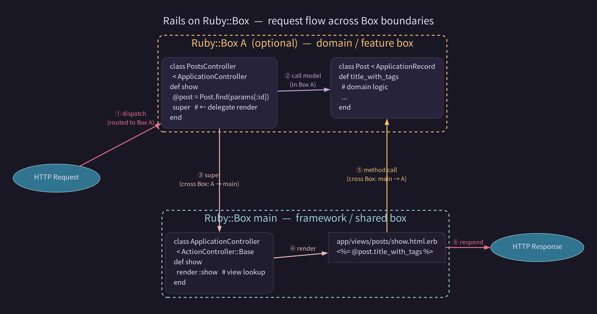

<style scoped>
h1, h2, h3 {
  color: white;
}
</style>
# Ruby::Boxにできること、Refinementsにできること

### joker1007 (Repro株式会社)
### 松江Ruby会議 12

---

# self.inspect

- 橋立友宏 (@joker1007)
- Repro inc.
- Chief Architect
- RefinementsとTracePointが好き

---

# 松江は10回ぐらい来てると思う

日本酒と熱燗にハマった人間としては、世界的に重要な街です。

---

# 本題

この話はshugoさん、モリスさんへのファンレターみたいなもんだと思ってくださいw

---

# RubyKaigi 2026のLTにて

Do Ruby::Box dream of Modular Monolith? という発表をした。

RailsのURL毎にRuby::Boxによってオブジェクト空間を分けるデモ。

これについて、もうちょっと丁寧に解説しておこうと思う。

---

# Ruby::Boxについておさらい

Namespaceと言われていた機能だが、Rubyの世界ではNamespaceという用語はmoduleで区切られた定数スコープを指す言葉として利用されていたので、新しくRuby::Boxという名前が付けられた。

Ruby::Boxは、クラスやメソッドの定義を隔離するための機能。

Boxの中でRubyのコードを評価することで、そこで定義されたクラスやメソッドはそれぞれ独立した場所に定義される。

---

# Ruby::Boxで何が嬉しいのか

同一の名前のクラスやメソッドを複数個持てる様になる。

開発当初から想定されていたユースケースとして、同一gemの複数バージョンを1つのプロセスで動かしたりできる様になる。

例えば、Javaの世界ではクラスローダーを分けることで同一のライブラリの複数のバージョンを読み込むことが出来る。(これはこれで問題になることも多いが)

---

# 隔離 = 破壊防止

クラスやメソッドの定義が隔離されているということは、あるBoxで上書きした動作はそのBoxにしか影響を与えないということ。

モンキーパッチやDSLのために生やしたメソッドなどを、特定のBoxの中に閉じ込められる。

---

# モジュラーモノリスへの応用可能性

例えば、同じUserというActiveRecordのモデルでもコンテキストに依って必要なメソッドは変わる。

モジュールやファイルの分割で意図を分けたとしても、参照可能であるなら意図しない使い方をされる可能性はある。コンテキスト境界を明確に意識するのは大規模な開発プロジェクトでは重要。

そもそもメソッドもクラスも見えない、という状況なら境界を越えるのに明確な意志を要求できるし、意図しない変更範囲の波及も防止できるかもしれない。

---

# Update From RubyKaigi 2026

ruby-headでデモが出来る様になった！
ありがとうモリスさん！

(結構安定する様になったのでRails::Engineも行けそうだなーと思ったんですが、趣味開発が忙しくてまだ試せていない……。)

---

# 動作の仕組み (再掲)

Boxで読み込むためのモジュールを二つ用意する。
```ruby
module BoxA
  def foo
    puts "BoxA" + Ruby::Box.current.inspect
    super
  end
end
```

```ruby
module BoxB
  def foo = puts "BoxB" + Ruby::Box.current.inspect
end
```

---

```ruby
# Boxで定義されたモジュールをinclude/prependする
A = Ruby::Box.new; A.require_relative "box_a"
B = Ruby::Box.new; A.require_relative "box_a"
class Foo
  prepend A::BoxA
  include B::BoxB
  def foo
    puts "Main" + Ruby::Box.current.inspect
    super
  end
end

Foo.new.foo # =>
```
```
returns:
BoxA#<Ruby::Box:3,user,optional>
Main#<Ruby::Box:2,user,main>
BoxB#<Ruby::Box:4,user,optional>
```

---

# メソッド探索チェインの中にBoxを組込むことで、superの呼び出しや特定のメソッドの呼び出しのみを別Boxに切り替えることが出来る。

---



---

# ところで、Rubyにはメソッド定義を特定の領域に閉じ込める機能が他にもある。

---

# 皆大好きなRefinements

---

# 使ったことない人のための例

```ruby
module StringRefinement
  refine String do
    def foo
      "#foo: " + self
    end
  end
end

using StringRefinement
puts "hoge".foo # => "#foo: hoge"
```

---

# Ruby::BoxとRefinementsの違い

実装方法も大分異なっているが、利用者から見て大きな違いは**局所性**, **組込みクラスの扱い**, **自由度**にある。

---

# Refinementsにおける組込みクラス

```ruby
module RefineA
  refine String do
    def |(other)
      self + other
    end
  end
end
```

```ruby
require_relative "./refine_a"

using RefineA
puts "Hello, " | "world!"
```

```
"Hello, world!"
```

---

# Boxにおける組込みクラス

```ruby
class String
  def |(other)
    self + other
  end
end
```

```ruby
BoxA = Ruby::Box.new
BoxA.require_relative "./box_a"

a = BoxA::String.new
a << "Hello, "
puts a | "world!"
```

```
どうなるでしょうか?
```

---

# Boxにおける組込みクラス(正解)

```ruby
class String
  def |(other)
    self + other
  end
end
```

```ruby
BoxA = Ruby::Box.new
BoxA.require_relative "./box_a"

a = BoxA::String.new
a << "Hello, "
puts a | "world!"
```

```
NoMethodError
```

---

# Boxは組込みクラスが特別扱いされている。

# 結構ややこしくて、組込みクラスに関してはどこで作られたかに関わらず評価時のBoxで見えるメソッドが決まる。
# その他のクラスはインスタンス自体が見えるメソッドを認識している。

---

# これなら大丈夫


```ruby
# ...さっきのStringの定義...
class Foo
  def foo
    "Hello, " | "foo!"
  end
end
```

```ruby
BoxA = Ruby::Box.new
BoxA.require_relative "./box_a"

a = BoxA::Foo.new
puts a.foo
```

```
"Hello, foo!"
```

---

# Refinementsの影響範囲

```ruby
# refine_b.rb
require_relative './bar'

module RefineB
  refine String do
    def |(other)
      self + other
    end
  end
  refine Foo do
    def foo(other)
      "foo_refine: " | other
    end
    def foo2
      Bar.new.bar(self)
    end
  end
end
```

---

```ruby
# bar.rb
class Bar
  def bar(foo)
    foo.foo("bar")
  end
end
```

---

```ruby
# main.rb
class Foo
end

require_relative './refine_b'
using RefineB

p Foo.new.foo("refine_b")
p Foo.new.foo2
```

```
"foo_refine: refine_b"
/home/joker/ghq/github.com/joker1007/slides/matsue_rubykaigi/bar.rb:3:in
'Bar#bar': undefined method 'foo' for an instance of Foo (NoMethodError)

    foo.foo("bar")
       ^^^^
        from /home/joker/ghq/github.com/joker1007/slides/matsue_rubykaigi/refine_b.rb:16:in 'foo2'
        from main_refine_b.rb:8:in '<main>'
```

---

# Refinementsはファイルスコープというちょっと変わったスコープに制限されている。
# refineされたメソッドの中で呼ぼうがusingしている場所から呼ぼうが、別ファイル上で評価されたらrefineされたメソッドは見つからない。

---

# 一方Ruby::Boxは

```ruby
require_relative './bar'

class String
  def |(other)
    self + other
  end
end

class Foo < Ruby::Box.main::Foo
  def foo(other)
    "foo_box:" + other
  end

  def foo2
    Bar.new.bar(self)
  end
end
```

---

# 普通に呼べる

```ruby
class Foo
end

BoxB = Ruby::Box.new
BoxB.require_relative './box_b'

p BoxB::Foo.new.foo("box_b")
p BoxB::Foo.new.foo2
```

```
"foo_box:box_b"
"foo_box:bar"
```

---

# Refinementsの自由度

usingはトップレベルか、class/module定義の中でしか呼べない。

有効化に対してかなり厳しい制限が入っている。

---

# これはいける

```ruby
module RefineC
  refine String do
    def |(other)
      self + other
    end
  end
end
class A
  using RefineC
  def fuga
    p "fuga" | "piyo"
  end
end

A.new.fuga # => "fugapiyo"
p "hoge" | "bar" # => NoMethodError
```

---

# これはダメ

```ruby
module RefineC
  refine String do
    def |(other)
      self + other
    end
  end
end

def fuga
  using RefineC
  p "fuga" | "piyo"
end

fuga # => main.using is permitted only at toplevel
```

---

# RefinementsとBoxは結構動きが違う

Boxは一旦その世界で評価され出したら、明示的に他のBoxで作成したオブジェクトに対するメソッド呼び出しを行わない限り、ずっとそのBoxの中で評価される。

一方で、Refinementsはclass/module内でusingしたら、そのclass定義を抜けたら他には一切影響を与えない。refineされたメソッドを呼び出しても本当にそのrefineメソッドを定義したりusingしている箇所以外では一切影響を与えない。

---

# これはどっちが良いというものでもない。

# 自分の感覚では、組込みクラスを上書きしてDSLを作ったりする用途ではRefinementsの方が嬉しいことが多い。

---

# Refinementsが良いケース

rspec-parameterizedの例

```ruby
describe "plus" do
  using RSpec::Parameterized::TableSyntax
  where(:a, :b, :answer) do
    1 | 2 | 3
    5 | 8 | 13
    0 | 0 | 0
  end
  with_them do
    it "should do additions" do
      expect(a + b).to eq answer
    end
  end
end
```

---

# 何故Boxだと厳しいのか

`it`の中身はproductionコードを評価する。なのでここからの呼び出し先には影響して欲しくない。

パラメーターの保持のために、DSL評価はRSpecのExampleGroupの中で行いたい。

しかし、RSpecの呼び出しフローの中でExampleGroupとして動的にクラス定義される処理を特定のBoxに行わせるのは困難。

---

# Boxの良い点

- 参照の自由度が高い
  - あるBoxに所属しているインスタンスからのメソッド呼び出しが出来ればそれで良い
- 一旦切り替わったら明示的に他のBoxのメソッドを呼ばない限りは基本的にその世界のまま
  - 自分が紹介したみたいに継承チェーンにぶち込むと暗黙的に切り替えたりできるけど。
- クラスレベルの変数も影響範囲を限定できる

---

# Boxが嬉しいケース

(まだ現実として試せていないので、あくまで妄想)

- モジュラーモノリスの様にURLごとに世界を分ける
- プラグインシステムの依存関係を閉じ込める
- Feature ToggleやCanary ReleaseをBoxの切り替えで行う
- 動的なSandbox実装

---

# まとめ

- BoxとRefinementsは実は適用できる範囲が結構違う
- 特にRefinementsの局所性は、そう簡単にBoxで代替できない
- Refinementsは本当にワンシチュエーションの書き換えだが、Boxは世界の分離というイメージ

つまり、Refinementsは必要だしProcレベルのRefinementsがあるともっと嬉しい！
そして、妄想ベースだがBoxは構成パターンが上手く見出せれば、実用的に便利な機能になる可能性があると思う。

---

# 以降、余談というか形にならなかったアイデア・妄想。

---

# 余談その1

ふと思い立って、BoxAで作ったインスタンスをmarshalして、BoxBでloadするとかできたら、オーバーヘッドはあるけどインスタンスのBox変換が出来るんじゃね？と思ったんですが、そもそも現時点ではBoxを有効化した時点でMarshal自体がぶっ壊れるという事が分かった。

惜しい……。

(バグ報告済み)

---

# 余談その2

別のBoxで作ったprocを持ち回れば、任意のタイミングでそのBoxに処理を切り替えることができる。
但し、定義場所が分離されてしまうし、事前定義になるのでコード的には余りカッコ良くない。
後、このインスタンスはどっちだ？みたいなのが非常に分かりにくくなる。
何が嬉しいは分からんw

---

# 余談その3

BoxAに定義されているクラスに対して、BoxBで実行中の処理の中でclass_evalやdefine_methodを使ってメソッドを定義すると、BoxAに定義されているクラスにBoxBで実行されるメソッドを混在させられる。
つまり、あるメソッドからは見えるけど、あるメソッドからは見えない、みたいな状況を作れる。
原理的にはinclude/prependと一緒だが、もっと細かい粒度でできる。
何が嬉しいかは分からんw

---

# 余談その4

そもそも、Delegator(Decorator)を使ってwrapしてしまえばもっと分かり易い気がする。
decorator自身に定義されているメソッドからしか見えない・外部に影響を与えない・名前が衝突できるヘルパーとか作れる気がする。
割と使えるパターンかもしれない。

---

# 余談その5

TracePointのbindingを使えば、どのBoxに対する呼び出しが行われているかや、どのBoxで定義されたクラスかを収集できる。
何が嬉しいかは分からんw

---

# おわり

---
