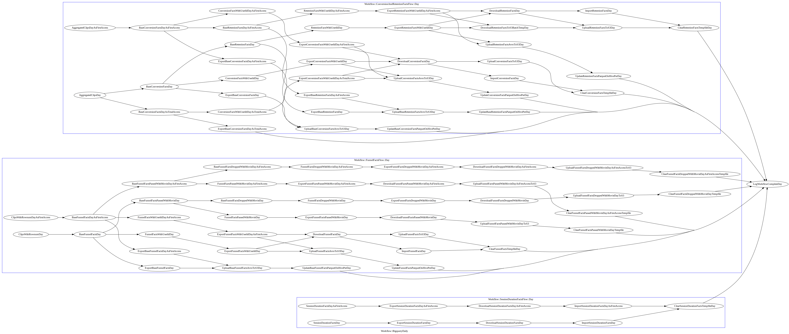

<!-- $theme: gaia -->
<!-- template: invert -->

## Fight with growing data on rails
##### Tomohiro Hashidate (@joker1007)

###### 名古屋Ruby会議03

---

# self.inspect
- @joker1007
- Repro inc. CTO
- Ruby/Rails
- fluentd/embulk
- Docker/ECS
- Bigquery/EMR/Hive/Presto

---

# なんちゃらRuby会議歴
- 東京Ruby会議スピーカー
- 関西Ruby会議スピーカー x2
- TokyuRuby会議 LT王
- RubyKaigi日本酒スーパーバイザー
- 東京Ruby会議日本酒仕入れ
- RubyKaigi LT x3
#### -----越えられない壁-----
- RubyKaigi登壇経験なし

---

# [弊社の]CTO業
- アプリケーションエンジニア
- インフラエンジニア
- データ分析基盤構築
- 障害対応
- コードレビューと設計相談

これらを兼任した様なことをやっている :sweat:

---

# Reproは
# エンジニア募集中です

---

# Reproのサービス
- モバイルアプリケーションの行動トラッキング
- 分析結果の提供と、それと連動したマーケティングの提供
- 大体Ruby、Rails

会社規模の割にデータ量が非常に多い。
1年間で扱うデータ量が100倍ぐらい増えてる。
別に専門家が居るわけではないので、私が色々と考えて構築してきた。

---

# データ分析におけるRuby
最低限の工夫はした上でRubyで無理をしないことが重要。
Rubyはジョブ制御とかクエリ構築に専念する。
向いていないことをやらせない。

---

### 最初に言っておきたいこと
# 中規模以上の
# データ分析をやるなら
# 今すぐActiveRecordを
# 投げ捨てろ

---


# Railsの問題点
Railsはデータ量マターの問題を解決するのに全く向いていない。
というか、ActiveRecordがものすごく辛い。

- 基本的にIDが連番でありDBで発行される
- 1レコード毎にオブジェクトが生成される
  - しかも生成コストとメモリコストが割と重い
- DBからまとめてデータをフェッチする
  - メモリを一気に消費する
- バルクインサートのI/Fが無い

---

## 成長途中でもやってはいけないこと
- ActiveRecordで無茶な集計クエリを構築するな
  - 可読性が劇的に落ちる
  - どういうインデックスが効くのか全く分からなくなる
  - 移植しづらい

集計処理は、初期からできるだけ生SQLに近い形で書くこと。
クエリの再利用性など、幻想に過ぎない。

---

# Lv1. ActiveRecordを工夫する

---

# Plackを使う
基本的なことですが、
必要無い箇所でARのインスタンスを生成しない。

---

# 連番を止める
- キーから算出できるハッシュ値か値を連結した文字列をPKEYにする。
  - Railsでは複数キーが辛いので折衷案
- DB側で採番しなくても事前にIDが確定できて一貫している状態を作ることが目的
- これによりバルクインサートフレンドリーな状態を作る

Rails5以前なら、activerecord-mysql-awesomeが必須。
kamipo is awesome!! :sushi: :beer:

---

# バルクインサートを活用
- まとめて突っ込んで個別のインスタンスを要求しない
- MySQLなら、ON DUPLICATE KEY UPDATEも利用
- とにかくRuby側で判別させない
  - ユニーク制約、CHECK制約(MySQLェ…)で守る

activerecord-import, bulk_insert, rimporter等あるが、今は使っていない。
MySQLだけで使うには大袈裟過ぎるし、戻り値の扱いが合わなかった。

---

## 一度にデータを取得しない
mysql2 gemを直接利用して、stream fetchを使う。

```ruby
def stream_fetch(query)
  sql = query.is_a?(String) ? query : query.to_sql
  @config = ActiveRecord::Base.connection_pool.spec.config
  conn = Mysql2::Client.new(@config)
  Enumerator.new do |y|
    begin
      result = conn.query(sql, stream: true)
      result.each(cache_rows: false, as: :array) do |row|
        y << row
      end
    ensure
      conn.close
    end
  end
end
```

---

# 次の限界へ

---

# MySQLの問題点
MySQLは集計に向いていない。
集計軸が複雑化すると、インデックスの工夫ではどうにもならなくなってくる。
更に以下の点で、グルーピングを伴う集計に弱い。

- ウインドウ関数が無い
- 関数インデックスが無い

---

## Lv2. 集計用データストアを分ける

---

# Bigqueryの採用

---

# Bigqueryのpros
- イニシャルコストがほぼ0
- クエリパフォーマンス基準でのコスパが異常に良い
- 割とStandardなSQLが使える
  - クエリだけなら、そこそこ移植性がある

---

# Bigqueryのcons
- APIがしばしば落ちてる
  - Googleがイベントやってたりすると特に :cry:
- resourcesExceeded
  - 勘で直すしかない :weary:
- テーブルの更新上限とかexport上限が割とシビア (1000 per day)
- コストが読み辛い

---

# データストアを分けるために
既存の処理を残しつつ、
データを新しいデータストアにも流す

データの行き先に柔軟性を持たせるために
fluentdを利用する

---

# fluent-plugin-bigquery
- 自分がメンテしている
- loadとinsertに対応
- 現在v0.14系対応作業中
- 弊社ではfile bufferとloadモードで利用している

---

# データ投入後

---

# SQLベースの集計で必要なこと
- 一括で扱ってGROUP BYやCASEを活用して切り分けるイメージ
- ウインドウ関数の活用
- REPEATEDデータ型(配列)を活用してデータ量を削減する
- 中間テーブル

---

## GROUP BYとCASEの組み合わせ

```sql
SELECT
  COUNT(CASE WHEN first_access = 1 THEN 1 THEN NULL),
FROM
  access_logs
GROUP BY
  application_id
```

特定の条件にマッチする対象だけを集計したりSUMを出したりするのに活用。
レコード毎に分かれているものを一行に転置したりするのにも使える。

---

## ウインドウ関数

```sql
SELECT
  user_id
  AVG(conversion_count) OVER (
    PARTITION BY
      user_id, TIMESTAMP_TRUNC(converged_at, DAY)
    ORDER BY
      converged_at
    ROWS BETWEEN 7 PRECEDING AND CURRENT ROW)
FROM
  conversion_summaries
```

移動平均を出したり、レコード粒度を維持したまま集計したりするのに活用。
レコードに連番を振るのにも使える。

---

## REPEATED型(配列型)の活用

```sql
SELECT
  COUNT(DISTINCT user_id),
  ARRAY_AGG(DISTINCT user_id)
FROM
  conversions
```

個別にレコード化するとデータ量が激増する様なデータの保持に活用する
集計結果に関連するユーザーIDを保持する等
モダンなStandard SQLに対応している環境なら、大体利用できる
Bigquery, PostgreSQL, Presto, SparkSQL

---

## 中間テーブル
- クエリ自体の見易さを改善する
- 計算結果を再利用する

結果、クエリ同士の依存関係を管理する必要が出てくる

どこを並列で処理して、どれとどれを待って次を実行するのか

ワークフロー管理ツールの導入が必要になる

---

# Lv3. ワークフロー管理

---

# ワークフロー管理ツール
- Airflow
- Luigi
- Digdag
- Azkaban
- Kuroko2

ジョブをDAGとして表現し、依存関係を定義する
並列実行やノードを隔てた分散実行等をサポートしたり

---

# Rukawa
Rubyで書けるワークフロー管理ツールを自作した

- 単体で動作する
- 並列実行制御しやすいRakeみたいなもの
- 分散実行とかスケジューラとか無い
- DSLっぽさを極力排除
- 普通にRubyで同期処理を書くだけ

---

こんな感じ

```ruby
class Job1 < Rukawa::Job
  set_description "Job1 description body"
  after_run Notifier.new

  def run
    p variables unless variables.empty?
    sleep rand(10)
  end
end
```

---

```ruby
class SampleJobNet < Rukawa::JobNet
  class << self
    def dependencies
      {
        Job1 => [],
        Job2 => [Job1], Job3 => [Job1],
        Job4 => [Job2, Job3],
        InnerJobNet => [Job3],
        Job8 => [InnerJobNet],
        Job5 => [Job3],
        Job6 => [Job4, Job5],
        Job7 => [Job6],
        InnerJobNet2 => [Job4],
        InnerJobNet3 => [Job8, Job7],
        InnerJobNet4 => [InnerJobNet3],
      }
    end
  end
end
```

---

## 現在のバッチジョブの構成(一部)


---

# その他の考慮点

---

# ETL
集計基盤に送るのはfluentdで受け取るログだけではない
RDBからデータを加工して転送したり、
その他のストアのデータを集めてくる必要がある
特にデータの洗い替えを行える準備は重要。
弊社では主にembulkを採用。


---

## embulk-filter-ruby_proc
- JRuby製プラグイン
- 拙作
- Rubyの柔軟なProc表現でデータを加工
- パフォーマンスは落ちるが、自由度が高い

---

## embulk-parser(encoder)-avro
- Java製プラグイン
- 拙作
- AVROフォーマットを読み書きする
  - Hadoopクラスタで読み書きしやすい
  - スキーマが後から変更可能
  - Bigqueryが入出力に対応している

---

## 洗い替え、再投入
データの集計には時系列でのデータの蓄積が必要
また、RDBの様にトランザクションでデータ投入が難しいことも多い

最終的に辻褄を合わせられる様に、
幅のあるデータを入れ直せる準備をしておく

また、この様に作っておくと、
状態を管理しなくて良くなる範囲が増える
結果、処理しやすく羃等にしやすくなる

---

## バルク処理では羃等性が重要
バルク処理では逐次エラー処理等は困難、または不可能なことが多い
深く考えなくてもリトライすれば正しく実行できることが大事

しかし、処理時間が長くなることも多いので、
丸ごと全てをリトライしていては時間が足りない
一つ一つの羃等な処理を繋ぎ合わせ、リトライ可能ポイントを適宜設ける

---

## 将来に向けたスケーラビリティ
- 金を積めば何とかなる仕組みをベースにする
  - Hadoopクラスタ上でembulkを動かす
  - RedshiftやBigqueryを利用する
  - ノードを増やしやすくする

今はそれ程使わなくても
準備やノウハウは貯めておく。

必要になる時は急にやってくるし
そこから焦っても遅い。

---

# emrakul
以下の事を行うヘルパーgem

- EMRでHadoopクラスタを起動
- embulkのインストール
- Gemfileの転送とプラグインのインストール
- 設定のyamlファイルを転送し実行
- 終了を待ち受ける

---

# まとめ

---

## Rubyの柔軟さを活用する
Rubyを直接大量のデータの集計に使うのは、
現状余り有効ではない。
しかし、以下の様な点では有用性がある。

- 柔軟性が求められるデータ加工
- 処理フローの制御
- 一時的なクラスタの起動・管理
- 設定項目やデータの入出力先の管理

---

## Rubyに頼る所、そうでない所を明確に
アプリケーションの基盤がRubyでも、
剥がせる余地を残しておく

自分が抱えている課題のステージを見極め、
適切な道具を選ぶことが大事

Rubyの得意な部分を使って、
Ruby以外の部分をより便利に活かしていく
