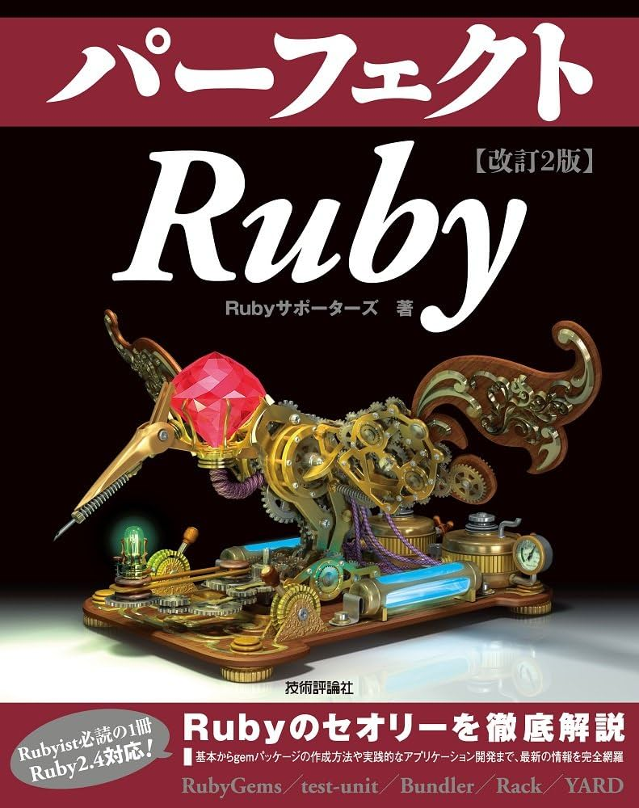

# Rustで作る
# tree-sitterパーサーのRubyバインディング

### @joker1007 (Repro inc.)

---

<!--
footer: 
-->

# 自己紹介

- 橋立友宏 (@joker1007)
- Repro inc. チーフアーキテクト
- 人生における大事なことは
ジョジョから学んだ
- 日本酒とクラフトビールが好き
- Asakusa.rb メンバー


---

# パーフェクトRuby著者の一人
C拡張の書き方のパートを書いた。



---

# 今のところ企画は無いんだけど、<br>パRubyを改訂する時にRustで書くRubyGemとか入れたいなあと思ってた。
# 多分、国内のRuby書籍でそれについてまとめた本は無かったと思う。

---

# ということで、開発方法をちゃんと身に付けておきたかった。
# また、Rustで実のあるコードを書いて勉強する機会にもなる。

---

# 今回ネタにしたtree-sitterについて

- Rustで書かれたパーサージェネレーター (皆大好きですよね)
- JSで記述するDSLによってパーサーのルールを記述する
- 色々な言語のパーサーと各言語から利用するためのライブラリがある
    - つまりユニバーサルパーサー
- neovimのシンタックスハイライトやアウトライナーに採用されている

より詳しくはこちらを！
see. [tree-sitter-rbsで作って学ぶRBSとパーサージェネレーター - Speaker Deck](https://speakerdeck.com/joker1007/tree-sitter-rbsdezuo-tutexue-burbstopasazienereta)

---

# tree-sitterのライブラリサポート状況について

C, Go, Node, Python, Rust, Swiftは公式でサポートされていて、tree-sitterの機能でベースとなるスケルトンが生成されるが、Rubyは公式サポートが無い。

Rustのライブラリがあるなら、短期間でそれなりのものが作れるかも、と思ったのでやってみた。

(実は、去年の時点で実用的なサードパーティ製のRubyバインディングがCで開発されてたので使いたい人はそっちを使う方がいいと思いますが……車輪の再発明上等ってことで)

---

# tree-sitterの各種パーサーが出力するもの

tree-sitterで定義されたparserが最終的に出力するものはCのソースコードとMakefileで、コンパイルをすると共有ライブラリが出来る。(.soとか.dyldとか)

つまり、どの言語からパーサーを利用するにせよ、Cからコンパイルされた共有ライブラリを利用する必要がある。そのため各言語のAPIライブラリはFFIを利用したCのラッパーになっている。

---

# まずはDEMOをお見せします

https://github.com/joker1007/tree_house

---

# 本題へ

---

# RustによるRubyGem開発の始め方

Bundlerが雛形の生成をサポートしているのでそれを使います。

```sh
bundle gem --ext=rust gem_name
```

---

# 雛形の特徴

- gemspecに`spec.extensions = ["ext/gem_name/Cargo.toml"]`
- プロジェクトルートにCargo.tomlがありworkspaceが指定されている
- workspaceとなるext/gem_nameにもCargo.tomlがあり、ここに依存ライブラリなどを記述する
- Rustをコンパイルするためにrb-sys gemがGemfileに追加される

---

# Cargo.toml in workspace

```toml
[package]
name = "gem_name"
version = "0.1.0"
edition = "2021"
authors = ["joker1007 <kakyoin.hierophant@gmail.com>"]
publish = false

[lib]
crate-type = ["cdylib"]

[dependencies]
magnus = { version = "0.6.2" } # 雛形は最新ではない場合があるので更新推奨
```

---

# magnusについて

RustでRuby APIとやりとりするための高機能ライブラリ。
rb-sysというより低レイヤなライブラリがあり、それに依存している。
magnusにはRustのオブジェクトをRubyのTypedDataとして扱うための便利なマクロや、Rubyのオブジェクトを定義・生成するための便利なAPIがある。

rb-sysはbindgenというライブラリを利用して、CのAPIから自動生成されたコードがベースになっている。
ほとんどCのAPIの直接的なインターフェースで、magnusの利用者は余り意識しなくても何とかなる。
利用する可能性が高いのは、rubygemとしてmkmfを拡張してる部分で、rustcのオプションなどを弄りたい時はそのAPIを調査する。

---

# magnusのエントリポイント

magnus::initというAttribute Macroを利用する。

```rust
#[magnus::init]
fn init(ruby: &Ruby) -> Result<(), Error> {
    let namespace = ruby.define_module("TreeHouse")?;
    namespace.define_singleton_method("register_lang", function!(register_lang, 2))?;
    namespace.define_singleton_method("available_langs", function!(available_langs, 0))?;

    // ...

    let point_class = namespace.define_class("Point", ruby.class_object())?;
    point_class.define_singleton_method("new", function!(data::Point::new, 2))?;
    point_class.define_method("hash", method!(<data::Point as typed_data::Hash>::hash, 0))?;
    point_class.define_method("==", method!(<data::Point as typed_data::IsEql>::is_eql, 1))?;
    point_class.define_method(
        "eql?",
        method!(<data::Point as typed_data::IsEql>::is_eql, 1),
    )?;
}
```
---

# magnus::init

Attribute Macroが対象になっている関数を`Init_<gem_name>`というC拡張のエントリポイントに変換してくれる。

C拡張を書いたことがあれば、ここでクラスやモジュールを定義して、メソッドに対応する関数を紐付ければ良いことが分かる。

---

# Rustの構造体をRubyのクラスとして利用する

```rust
#[derive(Debug, Clone, Copy, PartialEq, Eq, Hash, PartialOrd, Ord)]
#[magnus::wrap(class = "TreeHouse::Point", free_immediately)] // wrapマクロが構造体に必要な変換処理を自動実装する
pub struct Point {
    pub row: usize,
    pub column: usize,
}

impl Point {
    pub fn new(row: usize, column: usize) -> Self {
        Self { row, column }
    }

    pub fn inspect(&self) -> String {
        format!("#<Point({}, {})>", self.row, self.column)
    }

    pub fn to_s(&self) -> String {
        format!("({}, {})", self.row, self.column)
    }

    pub fn get_row(&self) -> usize {
        self.row
    }

    pub fn get_column(&self) -> usize {
        self.column
    }
}
```

---

# メソッドの割り当て

```rust
// hash, is_eqlはマクロが自動実装している
let point_class = namespace.define_class("Point", ruby.class_object())?;
point_class.define_singleton_method("new", function!(data::Point::new, 2))?;
point_class.define_method("hash", method!(<data::Point as typed_data::Hash>::hash, 0))?;
point_class.define_method("==", method!(<data::Point as typed_data::IsEql>::is_eql, 1))?;
point_class.define_method(
    "eql?",
    method!(<data::Point as typed_data::IsEql>::is_eql, 1),
)?;
point_class.define_method("row", method!(data::Point::get_row, 0))?;
point_class.define_method("column", method!(data::Point::get_column, 0))?;
```

`method!`マクロが、メソッドのシグネチャを見てRubyのValueとして変換可能であるかを検証し、define_methodの引数として適した形に変換してくれる。

---

# 基本的にはこれだけで良い
## 簡単そうに見える……が
## そんなに単純ではなかった

---

# Rustはメモリ安全に非常に配慮した言語なので、<br>他の言語では余り気にしなかった箇所を意識する必要がある。

# つまり所有権とライフタイムの概念、またいくつかの言語上の制約が、Rubyの世界とやり取りする時にどう関わってくるかを知る必要がある。

---

# メソッドシグネチャの基本ルールと所有権

GitHubのリポジトリに型変換のルールが書かれている。
表がスライドに収まらないので表自体は割愛するが、かなりのバリエーションがあるので基本的な規則を覚えた方が良い。

---

# RustがRubyから受け取れるもの
基本的にRust側で受け取れるのは以下の通り。

- 複製が容易な基本型(i32, u32, String etc.)
- TypedDataに変換可能な型(wrapマクロを付与したstruct)への**参照型**
    - 上記の型の**実体**を`typed_data::Obj`でラップしたもの、これはラップしている型自体がポインタになっているので全体としては参照を意味する
- RubyのValueをラップした型(RString, RArrayなど)
- 汎用Value型

ライブラリの観点から言うとTryConvertトレイトを実装している型

---

# RustがRubyに返せるもの

逆に基本的にRust側からRubyに返せるものは以下の通り。

- 複製が容易なプリミティブな型
- unit型(空タプル)
- TypedDataに変換可能な型(wrapマクロを付与したstruct)の**実体**
    - 上記の型の**実体**をOption, Resultでラップしたもの
- 汎用Value型

ライブラリの観点から言うとIntoValueトレイトを実装している型

---

# 考え方

基本的にmagnusにおいては、Rust側は参照を受け取って、Ruby側に所有権のある型を返す形になっている。

参照を返そうとしても、Rustは必要がなくなったらすぐに実体のメモリを開放してしまう。
そうなると、参照だけではオブジェクトを維持できないので、structの所有権そのものをRubyの世界に返さなければならない。

一方で、Rustの方で受け取るのはRubyの世界でメモリ管理されているオブジェクト情報であり、もし所有権そのものを受け取ってしまったら、Rust側でメソッドが終了時に別の値を返すとスタックから消えてしまって、オブジェクトが維持できなくなる。

---

# メソッドシグネチャのパターン 

上記を踏まえた上でメソッドシグネチャにはいくつかのパターンがある。

---

# オブジェクトの持ってるコピー可能なデータを返す場合

```rust
fn sample1(&self) -> usize {
    self.length
}
```

Rustの基本的なメソッド定義方法をそのまま使える。

---

# オブジェクト自体を返したり、RubyのAPIを使いたい

```rust
use magnus::typed_data::Obj;

fn sample2(ruby: &Ruby, rb_self: Obj<Self>) -> Obj<Self>
```

第一引数`&Ruby`型にして、第二引数をselfのRubyオブジェクト表現にすると、magnusで定義されているRuby API呼び出しのための参照が得られる。
`&Ruby`型を経由すると、新しいクラスを定義したり、メソッドがブロックを受け取っているか調べたりできる。

ObjはRTypeDataとして扱えるstructへのポインタを示す型。
メソッドの戻り値として使えて、更にDeRefトレイトによりstructそのものと同じ様にメソッドが呼べる様になっている。
また、funcallやivar_setなどRubyオブジェクトとして扱いたい時のためのメソッドも生えてて便利。

---

# エラーが発生する可能性がある

```rust
fn sample3(&self) -> Result<String, magnus::Error> {
```

Result型を利用してエラー時はmagnus::Error型を返せる様にしておく。

Ruby関係のAPIの多くが`Result<T, magnus::Error>`を返すので、`?` suffixが使えてエラーハンドリングがしやすくなる。

---

# メモリ安全のためのRustの制約と
# magnusの関係について

---

# Rubyクラスへの参照とRustのstatic変数

例えば、Rubyで定義されたクラスを、Rustの中で呼び出してインスタンスを作成したいとする。
magnusのAPIドキュメントのRClassの箇所を読むとこういう例がある。

```rust
use magnus::{eval, RClass};
assert!(RClass::from_value(eval("String").unwrap()).is_some());
```

この取得したものを、他の箇所から簡単に参照可能にできるかというと、Rustではそう簡単ではない。
static変数というものはあるが、基本的にRustのstatic変数は後から変更できない。
実行時に変更可能なstatic変数を扱おうとすると、unsafeになる。

---

# Rustのstatic変数の扱い方

もちろんRustでもそういう要件には対処しなければならない。Rustではこういう時にはonce_cellやlazy_static!マクロなどを使って実現していた様だ。

しかし、これにも制約があり、**SendとSyncトレイトを実装した型にしか利用できない**らしい。

RClassなどのmagnusが提供している構造体は、Rubyの構造体に対するポインタを含んでいて、Rubyの文脈以外で扱うと危険なので、**SendでもSyncでもない。**

流石に必要になる度に毎回`eval`で取得は辛過ぎる。

これは**unsafe**なstaticを使うしかないのか？

---

# magnus::value::Lazyを使う

magnusライブラリはそういう用途をちゃんと考慮している。
staticに割り当てておいて、必要になった時点でValueとして表現可能な構造体への参照に変換できる型が用意されている。

Lazyを利用するとさっきのコードはこうなる。

```rust
static STRING_CLASS: Lazy<RClass> = Lazy::new(|ruby| RClass::from_value(eval("String").unwrap()).unwrap());

#[magnus::init]
fn init(ruby: &Ruby) {
    Lazy::force(&STRING_CLASS, ruby); // requireされた時にRubyの情報が取れるので、その時にLazyの内容を確定させる
}

fn build_string(ruby: &Ruby, rb_self: Value) -> String {
    let string_class = STRING_CLASS.get_inner_with(ruby)
    string_class.new_instance(()).unwrap()
}
```

---

# この例の様に単純な例では分かりにくい落とし穴がいくつかある

APIドキュメントを良く読めば何とかなることは多いのだが、APIドキュメントは事例集や逆引きレシピの様なものではないため、分かっていない状態で必要な情報を探すのは難しい。

---

# ハマりポイント1： Enumeratorを返す方法

Rubyでeach系のメソッドを定義する場合は、ブロックを受け取ったらyieldし、ブロックが無ければEnumeratorを返すのが一般的。

しかし、Rustの型でそれを表現するには一工夫必要になり、これまでに説明したメソッド定義の方法の例外となる。

---

# Enumeratorのサンプル
```rust
pub fn children<'cursor>(
    ruby: &Ruby,
    rb_self: typed_data::Obj<Self>,
) -> Result<Yield<impl Iterator<Item = Node<'tree>>>, Error> {
    let mut cursor = rb_self.raw_node.walk();
    let nodes = rb_self.raw_node.children(&mut cursor);
    let array = ruby.ary_new_capa(nodes.len());
    for n in nodes {
        let node = Self {
            raw_tree: Arc::clone(&rb_self.raw_tree),
            raw_node: n,
        };
        array.push(node)?
    }
    array.freeze();

    if ruby.block_given() {
        Ok(Yield::Iter(array.into_iter()))
    } else {
        Ok(Yield::Enumerator(rb_self.enumeratorize("children", ())))
    }
}
```

---

# 遅延イテレーターを返すのが難しい

Rustで作ったIteratorの中に参照が残ってると、Ruby側に返した後に消えてしまうので、評価を後回しにしようとしてもそう簡単にはいかない。

そのため、前述のコードでは先に全部評価してRArrayに変換した後で、所有権ごと引き渡すIteratorに変換し`Yield::Iter`に包んでいる。

必要なものを全部まとめたIteratorを実装して最初にnextが呼ばれた時に内側を準備すればいけるか？

---

# ハマリポイント2: GCからの保護

```ruby

parser = TreeHouse::Parser.new.tap do |p|
  p.set_language("ruby")
end
node = parser.parse(source).root_node

node.child(0).child(0)

GC.start

node.child(0).child(0) # => die
```

最初に何も考えずに実装した時は、このコードはSegmentation Faultを起こした。
どうしてでしょうか？

---

# 何故SEGVが起きたか

`parser.parse(source)`はTreeオブジェクトを返すが、Rubyコード上では変数に割り当てられてないので参照が保持されていない。
よって、GCによってTreeオブジェクトが回収されて、Rustの世界でもTreeオブジェクトのメモリが開放される。

一方で、Nodeオブジェクトの実体はTreeの一部であって、Treeが保持していたNodeへのポインタなので、Nodeを触ろうとしても既に参照先のメモリは開放されており、SEGVとなる。

---

# 初期実装

```rust
pub struct Tree {
    raw_tree: tree_sitter::Tree,
}

pub struct Node<'tree> {
    pub raw_node: tree_sitter::Node<'tree>,
}
```

シンプルにRustライブラリが返すstructをwrapしていた。
Rustのライフタイム表現でNodeはTreeより長生きできないことが分かるが、それはRubyのGCの動きとは関係がない。
structから直接参照できる範囲にTreeが無いので、Rubyの世界ではオブジェクト同士の関係も分からない。

---

# 改修後

```rust
pub struct Tree {
    raw_tree: Arc<tree_sitter::Tree>,
}

pub struct Node<'tree> {
    pub raw_tree: Arc<tree_sitter::Tree>,
    pub raw_node: tree_sitter::Node<'tree>,
}
```

ArcはRustでAtomicなReference Countを実現するためのスマートポインタと呼ばれている型。
Arcを利用して、TreeオブジェクトからNodeの参照を取り出す時に、Nodeが全てGCされてReference Countが0にならない限り、参照先のTreeがメモリから開放されない様にした。
(ドキュメントにはBoxValueというGCからオブジェクトを保護するための型があったが、制約が色々あって利用できなかった)

---

# おまけ

---

# Rustでsoファイルを読み込む

libloading crateを利用するのが良さそう。
https://github.com/nagisa/rust_libloading/

---

```rust
use libloading::Library;

fn register_lang(lang: String, path: String) -> () {
    let func_name = String::from("tree_sitter_") + &lang;

    let libraries = LANG_LIBRARIES.get_or_init(|| Mutex::new(HashMap::new()));
    let languages = LANG_LANGUAGES.get_or_init(|| Mutex::new(HashMap::new()));

    unsafe {
        let mut libraries = libraries.lock().unwrap();
        let lib = libraries.entry(lang.to_string()).or_insert_with(|| {
            let loaded = Library::new(path).expect("Failed to load library");
            loaded
        });

        let func: libloading::Symbol<unsafe extern "C" fn() -> *const TSLanguage> =
            lib.get(func_name.as_bytes()).unwrap();

        language = tree_sitter::Language::from_raw(func());

        let mut languages = languages.lock().unwrap();
        languages.insert(lang.to_string(), language);
    };
}
```

---

# まとめ

- Rustで書いてみてRustの肝である所有権やライフタイムについて大分勉強になった
- Cと比較すると、メモリ安全のための制約で頭を悩ませることが多いが、文字列の扱いやクロージャやIteratorなどリッチな機能が使える点はとても便利
- Cargoで依存ライブラリが管理できるので、何らかのライブラリのバインディングを書く時にはソースコード管理に悩まなくて済む
- Cでも同じだが、GCによって何が開放されるのか理解してないと、SEGVに繋がる。パッと見動くので難しい

---

# RustでRubyGemを書く時の参考になれば幸いです
