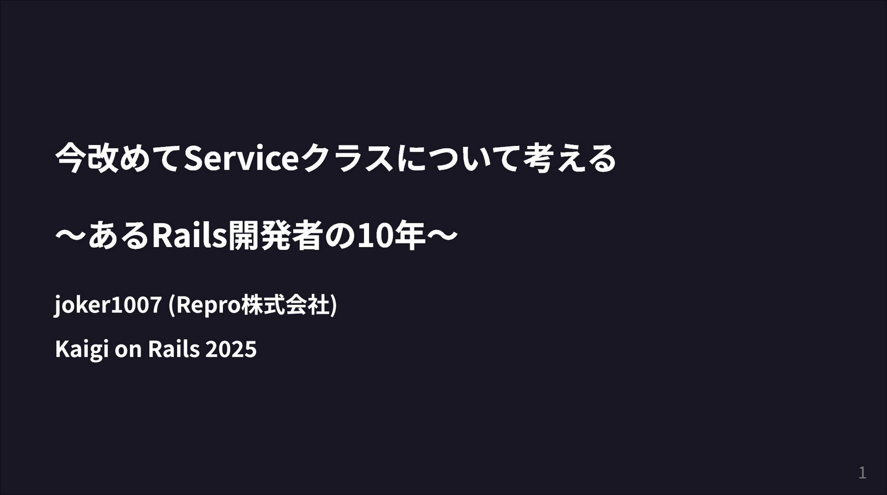
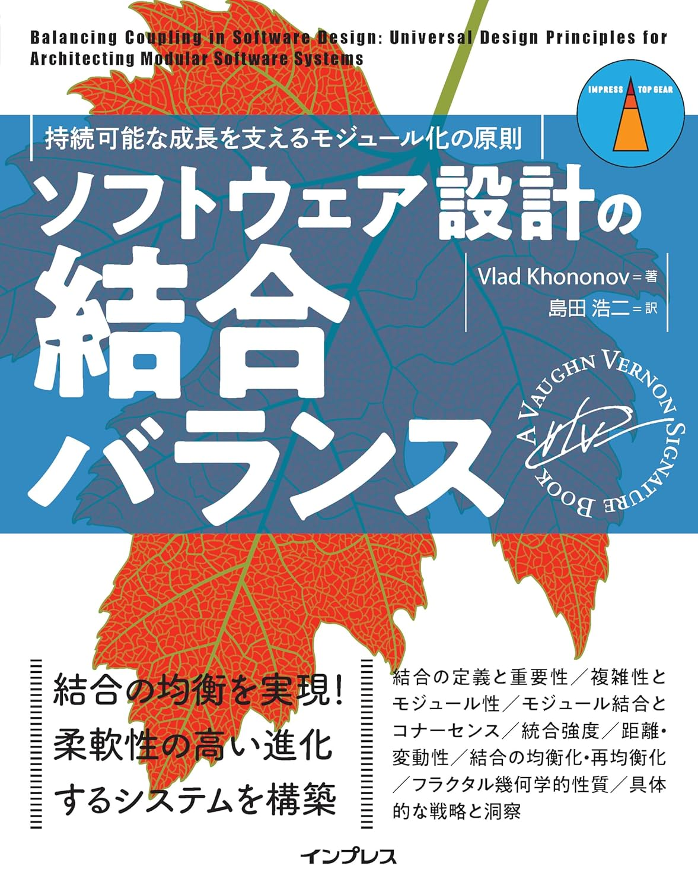
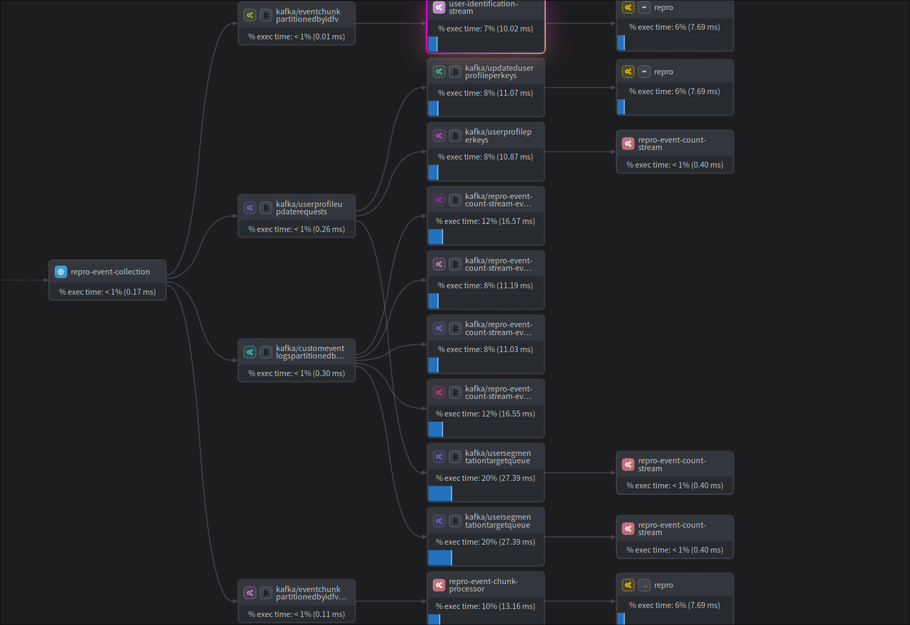

# マイクロサービスへの5年間
# ぶっちゃけ何をしてどうなったか

### joker1007 (Repro株式会社)
### Rails Tokyo 02

---

<!--
footer: 
-->

# 自己紹介

- 橋立友宏 (@joker1007)
- Repro株式会社 チーフアーキテクト
- 元々はRailsエンジニアだったが、最近はJavaばかり書いている
- 日本酒とクラフトビールが好き

---

# Asakusaから来ました

---

# Kaigi on Railsで登壇しました

https://speakerdeck.com/joker1007/jin-gai-meteservicekurasunituitekao-eru-arurailskai-fa-zhe-no10nian

今回はもうちょっと個別の事例の話をします。

---

# 最近の仕事

チーフアーキテクトとして、サービス全体の中長期的な技術選定、設計アドバイス、全体アーキテクチャのデザインなどをしている。

---

# Reproの事業
マーケティングオートメーションサービスを提供している。
マーケティングオートメーションとは、

- ユーザーの行動を分析・分類し
- 複数のチャネルで適切なキャンペーンを配信することで
- 顧客とエンドユーザーのコミュニケーションを支援する

SaaS事業だけでなく、サービスグロースの総合的な支援も提供しています。

---

# Reproでは大体5〜6年ぐらい前からマイクロサービス化に舵を切ってシステムを分割してきた。

# マイクロサービスが語られる様になってしばらく経ったが、やってみて実際どうだったのか？という話は余り無いと思うのでその辺りを話していきたいと思う。

余談だが、最近Twilioがマイクロサービス上手くいかなかったので止めた、という記事を書いていた。
https://www.twilio.com/en-us/blog/developers/best-practices/goodbye-microservices

かなり近い領域の話ではあるが、それはダメなんでは？と思うことも色々あった。

---

# 最初に結論から

ここ5年ぐらいの活動と現状を振り返ってみて、一定の成功を得たと認識している。

## 得たもの

- 複雑かつ重要度の高いコンポーネントの分離・安定化
- 開発速度の向上
- スケーラビリティの向上、必要な範囲の局所化
- パフォーマンスの向上

---

# そもそもの背景や成り立ちについて

### Excuse: 理屈としてはそうだけど現実は違ってた、という割と身も蓋もない話が含まれます。そのままでは参考にならないかもしれません 🙇

---

# 組織的な要請ではなくアーキテクチャが先

よく言われるやり方: 逆コンウェイ戦略によって、組織構造を先にデザインしてからアーキテクチャに疎結合化に至る様なフォースを与える。

自分の戦略: これと逆で**アーキテクチャから先に**作った。

---

# なぜこれで形に出来たのか

端的に言えば全体の8割ぐらいを自分が作って、自分と距離の近いチームで運用する箇所をじわじわ増やしていったから。

現在10を越えるマイクロサービスがあるが、その大半を自分一人で設計し初期構築している。
運用フェーズに入ってからも初期は自分一人で大半のオンコールを受けてた。
(段階的にキャッチアップしてもらって、今はその状況は脱却済み)

つまり個人の腕力でなんとかしたというのが現実。

---

# 事業ドメインとの相性

自分の中で事業ドメインとアーキテクチャの方向性を考えた時にある程度自信があった。

- エンドユーザーの行動ログを受け取って、出来る限り素早く集計・分類し、コンテンツ配信に繋げる
- 大抵の処理は非同期かつエンドユーザーに見えない形で行われる
- データ量が多く高いスケーラビリティが求められる
- 最終的なコンテンツは多様なチャネルによって配信される
- トランザクションで守る範囲は限定的

これらの特性を考慮すると、イベント駆動のストリームパイプライン構築が合理的だと考えた。

---

# イベント駆動マイクロサービスの利点

- システム間の独立性が高くサービス追加が容易 -> 配信チャネルごとのワーカー管理・新規開発の効率向上
- スケールアウトの親和性が高い -> 大量のデータ入力に対応
- 準リアルタイム処理への親和性が高い -> スピーディな集計と分類
- 非同期処理が基本 -> エンドユーザーにレスポンスを返す必要が無いケースと相性が良い

---

# 組織構造が後から変化

しばらくアーキテクチャ先行で分離とコンポーネントグループを構築して維持してきたことで、
最終的に組織構造がそちらに合う様に変化してきた。

現時点では組織構造とアーキテクチャはそこまで乖離していない形に落ち着いたと思う。

---

# ここまでのまとめ

- 事業ドメインへの理解を深め、アーキテクチャ転換に自信を得た
- ある程度の強権を発動して腕力でマイクロサービス化を推進
- 現実としてコンウェイの法則に影響は受けているが、逆コンウェイ戦略がそんなに有効かというと個人的には微妙な印象

---

# 道程の中で意識した理屈
全体の推進として理屈を無視しているところはあるが、システム分割を進める上で守っておかないとまずいと認識していたことは多い。

---

# 結合と変更範囲のコントロール

原則: あるサービスは他のサービスと独立して変更できなければならない

もちろん現実として無理な時はあるが、大抵の変更はこうでなければならない。
特に分離元のRailsアプリケーションの変更に影響を受ける訳にはいかない。

---

# 非常に参考になる本が登場

読んで改めて言語化して認識できたこと

- 重要なことは予期せぬ変更の波及をコントロールすること
- 結合強度 x 距離 x 変更頻度 の 次元によって安定度が評価できる
- モジュール間の結合のパターンと特性
- ソフトウェア設計の再帰的な性質

当時はこの本は無かったが意識していたことは概ね一致している。

---

# スキーマ管理の徹底

マイクロサービスは必然的にサービス間のやり取りをRESTやgRPCなどのAPIやメッセージに頼ることになる。

転送メッセージのスキーマが正しいなら正しく動くという規約を維持することが重要。
それ以上結合強度が上がると、別々のシステムを同時に変更しデプロイするという作業が頻発する可能性が上がる。
先の本の言葉を借りれば、コントラクト結合かモデル結合に結合強度を抑える。

そのために重要なのがスキーマ管理の仕組み。

---

# Schema Registryの活用

- 大半のスキーマは独立したリポジトリに配置し、特定のサービスに所属させない共通の基盤として扱う。
- Schema Registryサービスを立て、各サービスは自分が必要なスキーマをレジストリから取得可能にする。
- Schema Registryの機能で互換性のチェックを行い、後方互換性を壊す変更を拒否しスキーマの変更がサービスに与える影響を予測しやすくする。

各サービスにライブラリとして組込む場合もあるため、社内で利用している主要言語のパッケージも作ってある、

---

# コアドメインを先にやる

しばしば聞く話では認証基盤などを分割してマイクロサービスにしているケースはよくある。
これは事業戦略上の必要性もあると思うが、責務が明確なのでやり易さもある。

しかし、マイクロサービスアーキテクチャによって開発体験にインパクトを与えるなら、業務ドメインにおいて重要で価値が高い箇所に目を向けるべきだと思う。

難しいところが乗り越えられれば、後の分割作業は経験によって予測可能になる。

---

# 完全に乗せ替えるまで先に進まない

あるドメインを分離して別サービスとして立て直すことを決めたなら、それをやり切るまで可能な限り作業を止めない。

新・旧両方ある状態はほとんどの場合で旧バージョンだけより辛い。やり切るまでプラスの成果は来ないと覚悟する。

---

# 依存関係のコントロール

データの流れ、処理の流れを一つの方向にまとめる。

- イベントとユーザー情報の入力が起点なので、そこに起因する動きを逆戻りさせない。
  - 上流と下流が処理の中で入れ替わる様なことをしない。
- 複雑な処理は、終端から発生した完了イベントを再度入力することで実現する
  - 全体を大きなイベントループとして構成する

---

# オブザーバビリティの重要性

マイクロサービス化に伴ってシステムの全体像は確実に把握が難しくなる。
対抗する手段としてオブザーバビリティの重要性が高くなる。

構築当初からサービスが適切に動いているか、処理が遅延していないかを測定するメトリックは取っていて運用開始前にアラートモニタも整えた。

分散トレーシングはしばらく経ってから導入したが、きっちりトレースが繋がって全体像が把握できる様に作り込まないと効果が薄くなるので、ある程度時間を取って一気に導入を進めた。
OpenTelemetryが洗練されてきて分散トレーシングを取得するのは昔より容易になっている。
今後も確実に必要になるのでキャッチアップをオススメする。

---

# サービスマップの例

---

# 可能な限り非同期に

同期処理は結合強度を上げ、サービス間を跨ぐ時に変更を難しくする。
同期処理は出来る限り同一サービス(同一チームでデプロイ責任が取れる範囲)内に留めておく。

Reproの場合は重要なトラフィックの大半がユーザーへの応答を必要としないので、この辺りは相性が良かった。

---

# 一方で、今のところ諦めている理屈

もちろん上手くいっていないことも存在する。

---

# データベース分割できてない

- 各サービスが触るデータベースをきっちりインスタンスレベルで分けていない。
- 但し、書き込みの責任だけはシングルポイントになる様にきっちり守っている。
- 読み込みに関しては過渡期(もう5年経ってるが……)として許容している。
- 段階的にDebeziumを利用してこちらもイベント駆動のメッセージとして処理できる様に移行しつつあるが、まだ道半ば。

実際、大体の主要な開発案件の方針を自分が一旦レビューしてるのでなんとか守れているという現実がある。
(なので余り大丈夫ではない。多分目を離すと危ない。)

---

# 解消しきれていないトレードオフ

---

# 変更波及を抑え切れない

- 根本的に新しいことをやるなら、広い範囲に渡って複数のコンポーネントを修正しなければならないこともしばしば。
- なんとかデプロイ自体が余りブロック要因にならない程度には独立して作業出来ている
- しかし、各チーム間で協調してスケジュールを合わせなければならないし、進捗のボトルネックをコントロールしづらいことも多い → スケジュール遅延に繋がる

---

# 統合テストが非常に難しい

- Kafkaを中心にした分散ストレージ系のミドルウェア、AWSのコンポーネントに大きく依存しているので機械的にテストするのがとても難しい
- サービス境界自体を出来る限り明確にしてスキーマとメッセージの期待が満たされているかで判断し、各コンポーネントの中でテストされていると信じるしかない
  - サービス内部のテストはきっちり書く
- 後は手動で動作確認する受け入れテストに依存、但し問題が起きると工程が多いのでどこが原因か特定するのにコツや知識が要る

ただ、これでも以前よりはプラスになっている状況。

---

# 最後に

# Railsの世界でこれからモジュラーモノリスやマイクロサービスに向かっていこうとしている人に向けて
 自分は今そういうことをやってないが、これからやるならこうする

---

# コンポーネント境界のI/Fを定義する

packwerkでパッケージへの依存はチェックできるが、それとは別にモジュールの外からの呼び出しを受け付ける箇所を明確にする。
ただ依存関係をチェックするだけで設計が洗練される訳ではない。

外から触っていいのは基本的にコントローラー、サービス、ジョブ辺りだと思う。
モデルのメソッドを直接呼ぶのは警戒した方が良い。

外部との接点には型を書く。
I/Fの破壊に気付き易くなるし、ドキュメント・補完で利用方法をガイドできる。
コントローラー呼び出しを挟むならスキーマ管理機構は必須。

この辺り、モジュラーモノリスでもマイクサービスでもやる事は余り変わらない。

---

# デプロイ速度、CI速度の改善

マイクロサービスの大きな利点の一つは、開発の並列性の高さ。
モジュラーモノリスで同様に開発進捗の競合を起こしにくくするには、以下の様なこともやっておきたい。

- CI実行の高速化(範囲の限定やマージフローの改善なども)
    - 日常の開発ペースに直結する
    - エージェントコーディングで更に重要度が増してるかも
- デプロイの高速化
- フィーチャーフラグの活用

要は現代的な開発フローをちゃんと洗練させる。

---

# 所感と成功要因のまとめ

所感: 解消しきれていないトレードオフがあるとはいえ、割と上手くマイクロサービスやれているという実感はある。

成功要因:
- ビジネスドメインの親和性
- 自分の時間を投資させてもらえた
  - 時間をかけて安定性を向上させる活動
- 妥協の中でも守るべきことをちゃんと考えた
  - 変更の波及をコントロールするための結合のやり方を考えた
  - 初期構築時点で運用のために必要なものは作り込む

---

# そして、この本とても良いのでオススメ
今日の話の様なサービス分割の際に、考えるための軸や定量的な評価方法を示してくれる。

