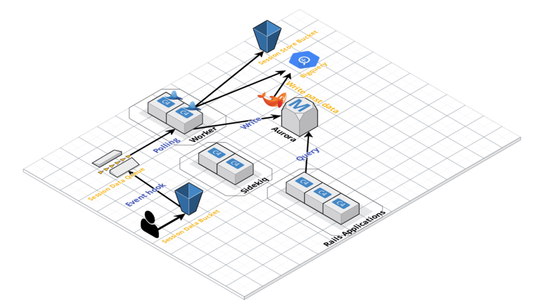
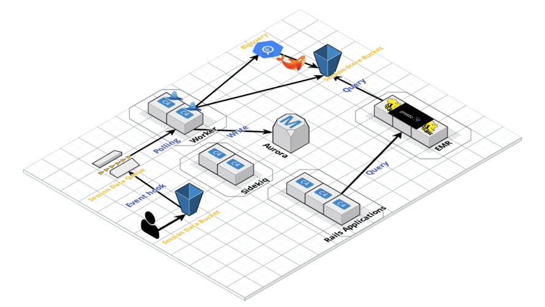
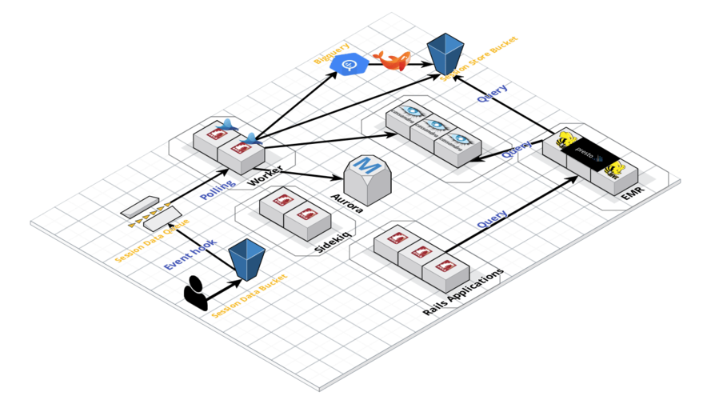

# Architecture Evolution in Repro

### @joker1007 (Repro inc. CTO)

---

# 自己紹介

- @joker1007
- Repro inc. CTO
- Asakusa.rb
- RubyKaigi 2019 Speaker
- 最近は主にデータエンジニアっぽい仕事

---

# Reproというサービス

- スマホアプリ・Webサービス向けのアナリティクス
- ユーザ属性や利用履歴を元にしたセグメンテーション
- セグメンテーション対象に対するダイレクトマーケティング
- セグメンテーション対象に対する広告出稿

こういった機能をサービスとして提供している。

---

# Retention Analytics


---

# Funnel Analytics


---

# User Segmentation


---

# サービスのスケール

- 総デバイス数 数億超
- 一度のプッシュ配信数が最大で1000万～2000万デバイス
- 月間で送信しているプッシュメッセージの数が約40億超

つまり、数千万のユーザの数日分の履歴やプロフィール情報を任意に組み合わせて、
必要とするユーザーの集合を短時間で抽出しなければならない。
それがReproのユーザーセグメンテーション。

---

# 過去に戻って2016年半ば

- 数万ユーザの集計とセグメンテーションの時代


---

# RDBの限界

MySQLでリクエスト時に集計して結果をRedisにキャッシュ。
自分が入った当時で既に初回表示に10秒以上かかるページがあった。

---

# 中間集計テーブルとバッチ化

とりあえず突貫でMySQL上に中間集計テーブルを作る。
一部の集計をバッチ化するが、データ構造上アプリ毎にループで実行していた。

---

# ナイーブなバッチの問題点
顧客が増えれば線形で実行時間が伸び即破綻する。
顧客が増えてもスケールでき、かつ顧客毎に集計更新に差が生じない様にする必要がある。
安易にバッチ化するとこうなりがち。

---

# fluentd & embulk & Bigquery

- Bigqueryの採用
- データ転送のためにfluentdとembulkを利用
  - それぞれのプラグインに何回かPR出してたらコミット権を獲得

---

# Bigqueryの採用理由

- スキーマ設計を頑張りたくない
  - 分散キーとかソートキーとか
- 異常なコストパフォーマンス
- まともなSQLに対応

---

# fluentd運用時の注意点

- データ転送量が多い時の注意点
  - ブロッキングで詰まらない様にflushスレッド数を調整する
  - 十分なファイルストレージを用意する
  - 特にBigqueryはAPIが良く死ぬ :disappointed_relieved:
- `require_ack_response`とsecondary outputは基本的に必須
  - でないとデータロストする
  - secondaryでエラーファイルをS3に書き出すのは割と大丈夫
- `<label @ERROR>`によるエラーハンドルを設定

どのレイヤーでどこまでデータが貯まって、
どこまでの到達が保証できるのかを認識しておく事が重要。

---

# Bigquery採用後の構造



---

# Bigqueryで解決できたこと

- 集計処理がめっちゃスケールする様になった
  - 当時から現在まででデータ量が数十倍ぐらいになったが、集計時間は大きく変化していない
- 全ての顧客に同時に集計結果を出せる様になった

ただ、SQL構築するのに、かなりの時間を費した。
特にFunnel Analyticsは超辛かった。
(ハードな集計SQLに興味がある人は後で直接質問を)

---

# Bigqueryでは辛いこと

- ユーザーが任意のタイミングで任意の条件でセグメンテーションし、短時間で結果を返すのが厳しい
  - 即時クエリの同時実行上限が存在する
  - クラウドとリージョンを跨ぐデータ転送
- Bigqueryはクエリ課金
  - 利用されればされる程、Repro側が損することになる
  - 当時は顧客毎にクエリ対象を分けられなかった
    - 現在はclustering keyで多少カバーできそう

しばらくは持つが、顧客の数が増えてくると破綻する。
(また同じ問題……。)

---

# Rukawaの開発

- Bigquery採用に伴いバッチの数が激増
  - 依存関係や並列実行可能かどうかを上手く調整する必要が出てきた
- ワークフローエンジン[rukawa](http://github.com/joker1007/rukawa)を開発
  - 以前の発表資料
    - [Ruby製のシンプルなワークフローエンジンRukawaの紹介](https://qiita.com/joker1007/items/02b334d1cca76fadaf2c)
    - [ワークフローエンジンRukawaと実装のサボり方](http://joker1007.github.io/slides/rukawa_implmentation/slides/index.html#/)

---

# ユーザーセグメンテーションの裏側

- 各条件をツリーとして表現し、Operatorノードで繋ぐ
- 各ツリーのノードはSQLとして解決可能になっている
- ツリーを再帰処理しながらOperatorがJOINやIN句を使ってクエリを結合する
- 最終的に出力されたクエリをクエリエンジンに投げる

これらはRailsのモデルとして表現されており、ERBを利用してSQLを構築している。
つまり、モデルの中にERBのテンプレートがある :innocent:

---

```sql
SELECT DISTINCT
  user_id
FROM filtered_custom_event_histories
WHERE
  <%= event_property_where_clause(and_properties, and_not_properties) %>
```

こんな感じに解決可能なものを組み合わせる。

---

# セグメンテーションツリーのイメージ


SQLに解決しながらJOINで折り畳んで、集合を組み合わせていく。

---

# この辺りで大半の実行基盤をコンテナ化
過去に喋ったり書いたりした記事があるのでそちらを参照。

- [production環境でRailsアプリをdockerコンテナとしてECSで運用するために考えたこと](https://qiita.com/joker1007/items/b8a932c1ae29705cef8d)
- [開発しやすいRails on Docker環境の作り方](https://qiita.com/joker1007/items/9f54e763ae640f757cfb)
- [サクっとAmazon ECSのクラスタを構築するためのterraformの設定](https://qiita.com/joker1007/items/711b22f8df01bcf68cb7)
- [Dockerコンテナ上でのassets precompileの扱い 2017](https://qiita.com/joker1007/items/79e719ca5a0fca6c1457)
- [RailsアプリをECSで本番運用するためのStep by Step](http://joker1007.github.io/slides/rails_on_ecs/slides/index.html#/)
- [Docker時代の分散RSpec環境の作り方](https://speakerdeck.com/joker1007/dockershi-dai-falsefen-san-rspechuan-jing-falsezuo-rifang)
- 記事には書いてないがEmbulk on Fargateとかも

(これも詳細は質問や懇親会で)

---

# Presto on EMRを採用

- クエリ数が増えてもコストが線形に増えない様に
  - 実際負荷が上がればコストは上がるけど
- AWSで完結する様にして、クエリレイテンシを下げ、アドホッククエリに対応する
- MySQLやAurora、その他のデータストアに接続できるので、それらを組み合わせることができる

---

# Prestoとは

Facebookが開発した分散SQLクエリエンジン。
Presto自体はデータストアを持っていない。
コーディネータがSQLを解釈し、様々なデータストアに対するコネクタがデータストアに合わせたリクエストに変換し並列でクエリを行う。
最も良く使うのはhive connectorで、Apache Hiveのメタデータを利用してHDFSやS3に並列でアクセスし高速にSQLを利用したSELECTが可能。
複数のデータストアのテーブルをJOINすることもできる。

---

# HiveとEmbulkによるデータ変換

- Bigqueryで集計したデータをEmbulkでS3に転送
- fluentdでS3に蓄積したデータと合わせてHiveでParquetに変換
- Prestoでクエリして柔軟な条件によるセグメンテーションを実現

---

# Apache Parquetとは

- カラムナー(列指向)フォーマットの一つ。
- GoogleがBigquery用に開発したDremelというフォーマットの論文を元にしている。
- 似たフォーマットとしてORCがある。

---

# カラムナーフォーマットのイメージ


From https://arrow.apache.org/

---

# なぜ列指向なのか
- 大量のデータを抽出したり集計したりする時は、行ではなく列単位でデータを持っていた方が効率的に扱える。
  - 圧縮効率とか、特定カラムを全取得する場合等に有効


---

# Presto採用後の構造



---

# Prestoでも解決できなかったこと

- Parquet変換にバッチが必要
  - 抽出条件に引っかかる様になるまでに時間がかかる
- 更新が発生するデータの扱いが面倒
  - 基本追記オンリーなので重複排除等が必要
- MySQLでは読み書きのスケーラビリティが厳しい
  - Prestoで大量にデータ取得するとクソ遅い

---

# Cassandraを採用する

DynamoDBの論文を参考にしているNoSQLで完全な非中央集権構造が特徴。

- Prestoで元々サポートしている
- 書き込みスケールしやすい
- 大量に読み込むのは得意ではない
  - 台数がある程度あればMySQLよりはマシ
  - 実験してみてしばらく持つだろうと判断

---

# Cassandra採用後の構造



---

# Presto & Cassandra & S3

- リアルタイムで更新したいデータをワーカーで直接Cassandraに書き込む
- 集計が必要なデータはBigqueryで集計, S3に転送しParquetに変換する
- PrestoでCassandraのデータとParquet on S3のデータを組み合わせる

ほとんどの規模の顧客のデータは1分以内で返答可能
数百万を越える規模のユーザ数でも数分以内に。

---

# Cassandraでも解決できなかったこと

- 余りにもデータ量が多いと読み込みクエリ負荷に耐えられない
  - そのため一部のデータはリアルタイムに反映したいが対応できていない
- 読み込み時のCPU負荷が高い
  - コストとスケールのバランスを見極める必要がある

---

# 未来のユーザーセグメンテーション

- Apache Kafkaを導入
- データ取得効率を上げるためのクエリ最適化
- Cassandra -> Apache Kudu?
  - [Apache Kudu](https://kudu.apache.org/)
  - 高速なデータの挿入・更新と列指向の参照を組み合わせた分散DB
  - 最近、Prestoも公式サポートした。熱い。

---

# 妄想上の構造


---

# その他の課題

- マイクロサービス化
- サービスディスカバリ
- スキーマ管理
- 秘匿情報管理V2

色々とやらねばならないことが。

---

# こういう仕事がしてみたいという方
# 絶賛募集中です！！
### https://www.wantedly.com/projects/102039
### https://www.wantedly.com/projects/44097
