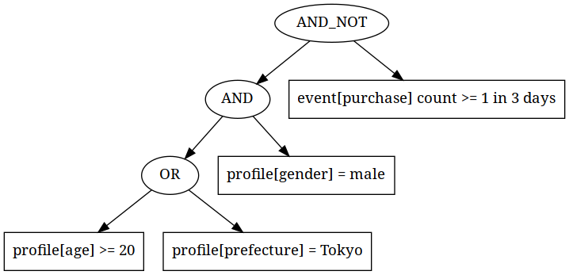

- 分散システムとRailsの組み合わせ
- スケールするデータパイプラインの作り方
- ユーザセグメンテーションを支える技術

# Architecture Evolution in Repro

### @joker1007 (Repro inc. CTO)

---

# Reproというサービス

- スマホアプリ・Webサービス向けのアナリティクス
- ユーザ属性や利用履歴を元にしたセグメンテーション
- セグメンテーション対象に対するダイレクトマーケティング
- セグメンテーション対象に対する広告出稿

こういった機能をサービスとして提供している。

---

# Retention Analytics

---

# Funnel Analytics

---

# User Segmentation

---

# サービスのスケール

- 総デバイス数 数億超
- 一度の配信数が最大で1000万～2000万デバイス
- 月間で送信しているプッシュメッセージの数が約40億超

つまり、数千万のユーザの数日分の履歴やプロフィール情報を任意に組み合わせて、
必要とするユーザーの集合を短時間で抽出しなければならない。
それがReproのユーザーセグメンテーション。

---

# 過去に戻って2016年半ば

- 数万ユーザの集計とセグメンテーションの時代

---

# RDBの限界

MySQLでリクエスト時に集計して結果をRedisにキャッシュ。
自分が入った当時で既に表示に10秒以上かかるページがあった。

---

# 中間集計テーブルとバッチ化

とりあえず突貫でMySQL上に中間集計テーブルを作る。
バッチ化するが、データ構造上アプリ毎にループで実行していた。

表示速度はある程度改善するが、顧客が増えれば即破綻する。
顧客が増えてもスケールでき、かつ顧客毎に集計更新に差が生じない様にする必要がある。

---

# fluentd & embulk & Bigquery

- Bigqueryの採用
- データ転送のためにfluentdとembulkを利用
  - それぞれのプラグインに何回かPR出してたらコミット権を獲得

---

# Bigquery採用後の構造

---

# Bigqueryで解決できたこと

- 集計処理がめっちゃスケールする様になった
  - 当時から現在まででデータ量が数十倍ぐらいになったが、集計時間は大きく変化していない
- 全ての顧客に同時に集計結果を出せる様になった

ただ、SQL構築するのに、かなりの時間を費した。
特にFunnel Analyticsは超辛かった。

---

# Bigqueryでは辛いこと

- ユーザーが任意のタイミングで任意の条件でセグメンテーションし、短時間で結果を返すのが厳しい
  - Bigqueryはクエリ課金
  - 利用されればされる程、Repro側が損することになる
  - 即時クエリは同時実行上限が50まで
  - クラウドを跨ぐデータ転送

しばらくは持つが、顧客の数が増えてくると辛くなる。
(また同じ問題が……。)

---

# Rukawaの開発

- Bigquery採用に伴いバッチの数が激増
  - 依存関係や並列実行可能かどうかを上手く調整する必要が出てきた
- ワークフローエンジン[rukawa](http://github.com/joker1007/rukawa)を開発
  - 以前の発表資料

---

# ユーザーセグメンテーションの裏側

- 各条件をツリーとして表現し、Operatorノードで繋ぐ
- 各ツリーのノードはSQLとして解釈可能になっている
- ツリーを再帰処理しながらOperatorがJOINやIN句を使ってクエリを結合する
- 最終的に出力されたクエリをクエリエンジンに投げる

これらはRailsのモデルとして表現されており、ERBを利用してSQLを構築している。

---

# セグメンテーションツリーのイメージ

---

# この辺りで大半の実行基盤をコンテナ化
過去に喋ったり書いたりした記事があるのでそちらを参照。

---

# Presto on EMRを採用

- クエリ数が増えてもコストが線形に増えない様に
  - 実際負荷が上がればコストは上がるけど
- AWSで完結する様にして、クエリレイテンシを下げる
- MySQLやAurora、その他のデータストアに接続できるので、それらを組み合わせるため

---

# Prestoとは

Facebookが開発した分散SQLクエリエンジン。
Presto自体はデータストアを持っていない。
コーディネータがSQLを解釈し、様々なデータストアに対するコネクタがデータストアに合わせたリクエストに変換し並列でクエリを行う。
最も良く使うのはhive connectorで、Apache Hiveのメタデータを利用してHDFSやS3に並列でアクセスし高速にSQLを利用したSELECTが可能。
複数のデータストアのテーブルをJOINすることもできる。

---

# HiveとEmbulkによるデータ変換

- Bigqueryで集計したデータをEmbulkでS3に転送
- fluentdでS3に蓄積したデータと合わせてHiveでParquetに変換
- Prestoでクエリして柔軟な条件によるセグメンテーションを実現

---

# Apache Parquetとは

- カラムナー(列指向)フォーマットの一つ。
- 大量のデータを抽出したり集計したりする時は、行ではなく列単位でデータを持っていた方が効率的に扱える。
  - 圧縮効率とか、特定カラムを全取得する場合等
- GoogleがBigquery用に開発したDremelというフォーマットの論文を元にしている。
- 似たフォーマットとしてORCがある。

---

# Presto採用後の構造

---

# Prestoでも解決できなかったこと

- Parquet変換にバッチが必要
  - 抽出条件に引っかかる様になるまでに時間がかかる
- MySQLでは読み書きのスケーラビリティが厳しい
  - Prestoで大量にデータ取得するとクソ遅い

---

# Cassandraを採用する

- Prestoで元々サポートしている
- 書き込みスケールしやすい
- 大量に読み込むのは得意ではない
  - 台数がある程度あればMySQLよりはマシ
  - 実験してみてしばらく持つだろうと判断

---

# Cassandra採用後の構造

---

# Presto & Cassandra & S3

- リアルタイムで更新したいデータをワーカーで直接Cassandraに書き込む
- 集計が必要なデータはBigqueryで集計, S3に転送しParquetに変換する
- PrestoでCassandraのデータとParquet on S3のデータを組み合わせる

ほとんどの規模の顧客のデータは1分以内で返答可能
数百万を越える規模のユーザ数でも数分以内に。

---

# Cassandraでも解決できなかったこと

- 余りにもデータ量が多いと読み込みクエリ負荷に耐えられない
  - そのため一部のデータはリアルタイムに反映したいが対応できていない
- 読み込み負荷が高い
  - コストとスケールのバランスを見極める必要がある

---

# 未来のユーザーセグメンテーション

- 

- Reproの画面紹介
- できること
- 要件について紹介

- 元々の機能レベルとアーキテクチャ

1. MySQLオンリー
2. 中間テーブル
3. fluentdとembulk導入
4. bigquery利用開始
5. funnel集計クエリ
6. ユーザーセグメンテーションの実装
7. hiveによるETLとprestoの導入
8. cassandraの導入

