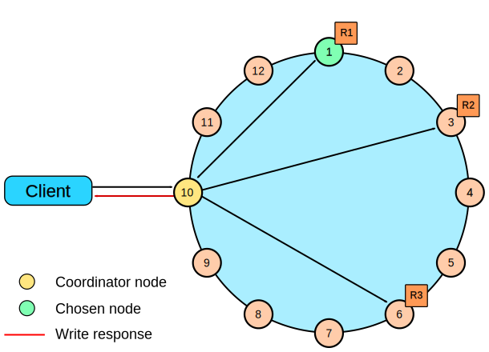
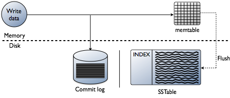
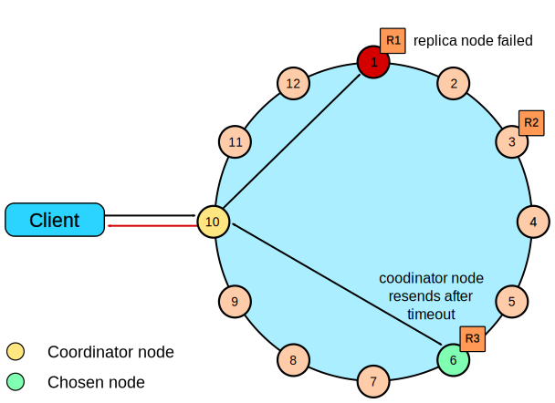

# Cassandraの活用事例とパフォーマンス特性

joker1007 (Repro inc. CTO)

---

# self.inspect

- @joker1007
- Ruby/Rails/fluentd/presto/infra
- 大体アーキテクト業
- 今はkafkaとkuduに興味がある

---

# 話すこと

- ReproでのCassandraの活用目的
- Cassandraの選定理由
- Cassandraのパフォーマンス特性と設計時の注意

# 話さないこと

- 運用時の細かな注意点

---

# 何のために

- 端末情報記録
- ユーザープロフィール情報
- イベント実行回数 / user

リアルタイムで更新される情報の保持がメイン

---

# 何故Cassandraを選択したか

- 書き込み回数が非常に多い
- かつ読み込み時に100万件単位で取得しJOINする必要がある
- 組み合わせる対象として、数十日分の行動ログを含む。

書き込みがスケールし、当時からセグメンテーションに利用していたprestoと連携が可能で、読み込みもある程度分散できるデータストアが必要。

→ Cassandraを採用。

---

# Cassandraのパフォーマンス特性

---

# 書き込みの概要

https://docs.datastax.com/ja/cassandra-jajp/3.0/cassandra/dml/dmlClientRequestsWrite.html

---

# 書き込みの概要

https://docs.datastax.com/ja/cassandra-jajp/3.0/cassandra/dml/dmlHowDataWritten.html

---

# 書き込みパフォーマンス特性

パーティション対象の決定とmemtable、transaction logが書ければOK。
最終的なテーブルファイルは不変なので、書き出しがシンプル。

- パーティションさえ均等なら割と簡単にスケールする
- 一件単位の書き込みは、ほぼ100マイクロ秒以下
- 現時点で20000/secぐらいの書き込みがある
- 整合性を保ってカウントアップする処理は重い
  - 複数ノードを跨いでCASやロックが必要になる

---

# 読み込みの概要

https://docs.datastax.com/ja/cassandra-jajp/3.0/cassandra/dml/dmlClientRequestsRead.html

---

# 読み込みの概要

https://docs.datastax.com/ja/cassandra-jajp/3.0/cassandra/dml/dmlAboutReads.html

---

# 読み込みパフォーマンス特性

- 一件単位の読み込みに向いている
- 多くのデータをまとめて取得するには不向き
  - 取得対象のパーティションとノード特定にCPUを使う
  - クラスタのノード間でデータの通信が多く発生する
    - パーティション毎のdigest要求
    - read repair

---

# prestoでの利用は本来は不向き
# パーティション数とノード数でバランスを取ることで何とか目的のパフォーマンスを維持

---

# テーブル設計の重要性

- 読み込みワークロードに合わせてテーブルを設計する、でないとまともにパフォーマンスが出ない。
- ユースケース毎にテーブルがあり、データの重複は覚悟する。
- とにかくパーティションキー以外を条件にクエリしないこと。

---

# まとめ

- 読み込みパターンに合わせたテーブル設計をすること
- 用途が適切ならかなりのパフォーマンスが出せる
- パーティション数とデータの分散度合いのコントロールが重要

---

# その他のTips

- CPU、ディスクI/O、ネットワークそれぞれかなり影響があるのでメトリックをちゃんと取得しておくこと
- ホットデータはオンメモリで読み書きするのでメモリは多く
- セカンダリインデックスは基本使えない
