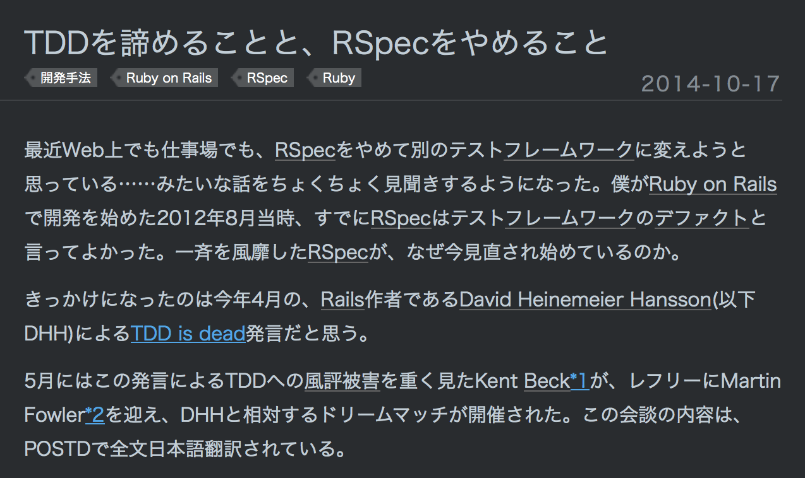

# 5分で
# 話せるだけ
# 話す
# RSpec Hacking Guide

@joker1007


## みんな大好きRSpec



## 中身知ってますか？


## 話の流れ

- 起動
- テストケース定義
- テスト実行
- マッチャ
- fail\_messageの表示


## 起動


rspecのコマンドエンドポイント
```ruby
#!/usr/bin/env ruby

require 'rspec/core'
RSpec::Core::Runner.invoke
```


```ruby
def self.invoke
  disable_autorun!
  status = run(ARGV, $stderr, $stdout).to_i
  exit(status) if status != 0
end
```

```ruby
def self.run(args, err=$stderr, out=$stdout)
  trap_interrupt
  options = ConfigurationOptions.new(args)

  if options.options[:drb]
    require 'rspec/core/drb'
    begin
      DRbRunner.new(options).run(err, out)
    rescue DRb::DRbConnError
      err.puts "No DRb server is running. Running in local process instead ..."
      new(options).run(err, out)
    end
  else
    new(options).run(err, out)
  end
end
```
- ConfigurationOptionsでコマンドラインオプションをパースする


```ruby
def initialize(options, configuration=RSpec.configuration, world=RSpec.world)
  @options       = options
  @configuration = configuration
  @world         = world
end
```

```ruby
def run(err, out)
  setup(err, out)
  run_specs(@world.ordered_example_groups)
end
```
- RSpec::Core::Worldはグローバルに情報を保持しておくための内部用の箱
- example\_groupsのリストやテストケース、フィルタ情報を持っている


```ruby
def setup(err, out)
  @configuration.error_stream = err
  @configuration.output_stream = out if @configuration.output_stream == $stdout
  @options.configure(@configuration)
  @configuration.load_spec_files
  @world.announce_filters
end
```
- RSpec::Core::Configurationに設定を保持する
- `load_spec_files`でスペックを読み込み
- コマンドラインオプションで渡された読み込みパターンに沿って読み込み対象のspecファイルをloadする
- この時点で定義されたテストケースがRSpec::Core::Worldに登録されている


```ruby
def run_specs(example_groups)
  @configuration.reporter.report(@world.example_count(example_groups)) do |reporter|
    begin
      hook_context = SuiteHookContext.new
      @configuration.hooks.run(:before, :suite, hook_context)
      example_groups.map { |g| g.run(reporter) }.all? ? 0 : @configuration.failure_exit_code
    ensure
      @configuration.hooks.run(:after, :suite, hook_context)
    end
  end
end
```
- suite全体のhookを起動して、`example_groups`全てをrunしていく
- `example_groups`は`RSpec.world`によってフィルタされ整列済みになっている


## テストケース定義
`RSpec::Core::Configuration`が`load_spec_files`を実行した時に各specファイルが実行され定義される


## `ExampleGroup`の定義
```ruby
# rspec/core/example_group.rb

def self.define_example_group_method(name, metadata={})
  define_singleton_method(name) do |*args, &example_group_block|
    # ...
      description = args.shift
      combined_metadata = metadata.dup
      combined_metadata.merge!(args.pop) if args.last.is_a? Hash
      args << combined_metadata

      subclass(self, description, args, &example_group_block).tap do |child|
        children << child
      end
    # ...

  RSpec::Core::DSL.expose_example_group_alias(name)
end
```
- クラスメソッドとして`ExampleGroup`を作るメソッドを定義する
- `describe`や`xdescribe`、`context`等、複数の名前で定義するためにメソッド化している
- テストケースの実体は`ExampleGroup`のsubclassを定義している


```ruby
# rspec/core/example_group.rb

def self.subclass(parent, description, args, &example_group_block)
  subclass = Class.new(parent)
  subclass.set_it_up(description, *args, &example_group_block)
  ExampleGroups.assign_const(subclass)
  subclass.module_exec(&example_group_block) if example_group_block

  # The LetDefinitions module must be included _after_ other modules
  # to ensure that it takes precedence when there are name collisions.
  # Thus, we delay including it until after the example group block
  # has been eval'd.
  MemoizedHelpers.define_helpers_on(subclass)

  subclass
end
```
- `set_it_up`メソッドでdescriptionやメタデータをクラス情報として組み込み、Worldに登録する
- `assign_const`で動的に生成したクラス名にサブクラスを割り当てる
- 最後に`let`や`subject`の定義場所になるモジュールをincludeさせる


## `describe`の内側は単なるクラス定義

Refinmentが使えるし、独自のモジュールをincludeすることも


## 各テストケースの定義
```ruby
# rspec/core/example_group.rb

def self.define_example_method(name, extra_options={})
  define_singleton_method(name) do |*all_args, &block|
    desc, *args = *all_args

    options = Metadata.build_hash_from(args)
    options.update(:skip => RSpec::Core::Pending::NOT_YET_IMPLEMENTED) unless block
    options.update(extra_options)

    examples << RSpec::Core::Example.new(self, desc, options, block)
    examples.last
  end
end
```

- `it`や`specify`の実体となるメソッド
- `describe`と同じく別名で複数登録するためメソッドでラップされている
- `ExampleGroup.examples`に`Example`のインスタンスを登録している
- 実はテストケースが実際に実行されるのは`Example`のコンテキストではない


## テスト実行
再掲
```ruby
# rspec/core/runner.rb

def run_specs(example_groups)
  @configuration.reporter.report(@world.example_count(example_groups)) do |reporter|
    begin
      hook_context = SuiteHookContext.new
      @configuration.hooks.run(:before, :suite, hook_context)
      example_groups.map { |g| g.run(reporter) }.all? ? 0 : @configuration.failure_exit_code
    ensure
      @configuration.hooks.run(:after, :suite, hook_context)
    end
  end
end
```

`example_groups.map { |g| g.run(reporter) }`


```ruby
# rspec/core/example_group.rb
def self.run(reporter)
  # ...
  reporter.example_group_started(self)

  begin
    instance = new('before(:context) hook')
    run_before_context_hooks(instance) # `ExampleGroup`をインスタンス化してbefore(:context)フックを実行
    result_for_this_group = run_examples(reporter) # 自身に登録されている各テストケースを実行していく
    results_for_descendants = ordering_strategy.order(children).map { |child| child.run(reporter) }.all? # 子`ExampleGroup`のテストケース実行
    result_for_this_group && results_for_descendants
    # ...
  ensure
    instance = new('after(:context) hook')
    run_after_context_hooks(instance) # 再度別のインスタンスを作りafter(:context)フックを実行
    before_context_ivars.clear
    reporter.example_group_finished(self)
  end
end
```


```ruby
# rspec/core/example_group.rb

def self.run_examples(reporter)
  ordering_strategy.order(filtered_examples).map do |example|
    next if RSpec.world.wants_to_quit
    instance = new(example.inspect_output) # テストケース実行のためのインスタンスを作る
    set_ivars(instance, before_context_ivars) # before(:context)で定義したインスタンス変数を動的に定義する
    succeeded = example.run(instance, reporter) # ExampleGroupのインスタンスを渡している
    RSpec.world.wants_to_quit = true if fail_fast? && !succeeded
    succeeded
  end.all?
end
```
- 何故インスタンス変数が引き回せるのかというと、`ExampleGroup`のクラスレベルでインスタンス変数を保存しているため
- `example.run(instance, reporter)`に`ExampleGroup`のインスタンスが渡されているのがポイント


```ruby
def run(example_group_instance, reporter)
  # ...
        begin
          run_before_example
          @example_group_instance.instance_exec(self, &@example_block)

          # ...
        rescue Exception => e
          set_exception(e)
        ensure
          run_after_example
        end
      end
    end
  # ...
end
```
- `@example_group_instance.instance_exec(self, &@example_block)`
- 評価コンテキストは`ExampleGroup`のインスタンス
- テストが実行されるとインスタンスはクリアされる
- 後から実行時の情報は取得できない


つまり`describe`のブロック内でインスタンスメソッド等を定義すると、

各テストケースで利用可能になる


## 動的にテストケースを定義する

ex. rspec-power\_assert
```ruby
def it_is_asserted_by(description = nil, &blk)
  file, lineno = blk.source_location
  cmd = description ? "it(description)" : "specify"
  eval %{#{cmd} do evaluate_example("#{__callee__}", &blk) end}, binding, file, lineno
end
```
- `eval`を使って`it`を呼ぶのが楽
- この時、file名と行数を指定しておくこと
- `Example`はインスタンス化された時のブロックの位置を保存しており、実行時の行指定フィルターに利用するため
- evalで行数をごまかさないと、行指定フィルターが上手く動作しなくなる


## マッチャ
rspec-expectationsによって定義される


## expect
```ruby
# rspec/expectations/syntax.rb
def enable_expect(syntax_host=::RSpec::Matchers)
  return if expect_enabled?(syntax_host)

  syntax_host.module_exec do
    def expect(value=::RSpec::Expectations::ExpectationTarget::UndefinedValue, &block)
      ::RSpec::Expectations::ExpectationTarget.for(value, block)
    end
  end
end
```

```ruby
# rspec/expectations/expectation_target.rb
def self.for(value, block)
  if UndefinedValue.equal?(value)
    unless block
      raise ArgumentError, "You must pass either an argument or a block to `expect`."
    end
    BlockExpectationTarget.new(block)
  elsif block
    raise ArgumentError, "You cannot pass both an argument and a block to `expect`."
  else
    new(value)
  end
end
```


## expect(foo).to
```ruby
def to(matcher=nil, message=nil, &block)
  prevent_operator_matchers(:to) unless matcher
  RSpec::Expectations::PositiveExpectationHandler.handle_matcher(@target, matcher, message, &block)
end
```


## RSpec::Expectations::PositiveExpectationHandler
```ruby
def self.handle_matcher(actual, initial_matcher, message=nil, &block)
  matcher = ExpectationHelper.setup(self, initial_matcher, message)

  return ::RSpec::Matchers::BuiltIn::PositiveOperatorMatcher.new(actual) unless initial_matcher
  matcher.matches?(actual, &block) || ExpectationHelper.handle_failure(matcher, message, :failure_message)
end
```
- ポイントは一番下の行
- マッチャインスタンスの`matches?`が`false`になる時、失敗メッセージの構築を行ってそれを返す


## マッチャの例
### rspec/matchars.rb
```ruby
def eq(expected)
  BuiltIn::Eq.new(expected)
end
alias_matcher :an_object_eq_to, :eq
alias_matcher :eq_to,           :eq
```


### rspec/matches/built\_in/eq.rb
```ruby
class Eq < BaseMatcher
  def failure_message
    "\nexpected: #{format_object(expected)}\n     got: #{format_object(actual)}\n\n(compared using ==)\n"
  end
  # ...

private

  def match(expected, actual)
    actual == expected
  end

  # ...
end
```


## マッチャ処理が失敗した時
### rspec/expectations/handler.rb
```ruby
module ExepectationHelper
  # ...
  def self.handle_failure(matcher, message, failure_message_method)
    message = message.call if message.respond_to?(:call) # カスタムメッセージが渡されていればそちらを優先
    message ||= matcher.__send__(failure_message_method) # マッチャから失敗時にメッセージを取得

    if matcher.respond_to?(:diffable?) && matcher.diffable?
      ::RSpec::Expectations.fail_with message, matcher.expected, matcher.actual
    else
      ::RSpec::Expectations.fail_with message
    end
  end
end
```


### rspec/expectations/fail\_with.rb
```ruby
module RSpec
  module Expectations
    class << self
      # ...
      def fail_with(message, expected=nil, actual=nil)
        unless message
          raise ArgumentError, "Failure message is nil. Does your matcher define the " \
                               "appropriate failure_message[_when_negated] method to return a string?"
        end

        diff = differ.diff(actual, expected)
        message = "#{message}\nDiff:#{diff}" unless diff.empty?

        # マッチャが失敗すると最終的にこの例外が呼ばれる
        raise RSpec::Expectations::ExpectationNotMetError, message
      end
    end
  end
end
```


## fail\_messageの表示
Repoter, Notification, Formatterがテスト失敗のメッセージを表示する


### rspec/core/example\_group.rb
```ruby
def self.run(reporter)
  # ...
  begin
    # ...
  rescue Exception => ex
    RSpec.world.wants_to_quit = true if fail_fast?
    for_filtered_examples(reporter) { |example| example.fail_with_exception(reporter, ex) }

  # ...
end
```

### rspec/core/example.rb
```ruby
def fail_with_exception(reporter, exception)
  start(reporter)
  set_exception(exception)
  finish(reporter)
end
```


### rspec/core/example.rb
```ruby
def finish(reporter)
  pending_message = execution_result.pending_message

  if @exception
    record_finished :failed
    execution_result.exception = @exception
    reporter.example_failed self
    false
  elsif pending_message
    record_finished :pending
    execution_result.pending_message = pending_message
    reporter.example_pending self
    true
  else
    record_finished :passed
    reporter.example_passed self
    true
  end
end
```


## Reporter
### rspec/core/repoter.rb
```ruby
def example_failed(example)
  @failed_examples << example
  notify :example_failed, Notifications::ExampleNotification.for(example)
end
```

```ruby
def notify(event, notification)
  registered_listeners(event).each do |formatter|
    formatter.__send__(event, notification)
  end
end
```
- Notificationはイベントに対応した情報やメッセージを格納している箱
- formatterはイベント名に対応したメソッドを実装しておく必要がある
- 各テストケースの情報はnotificationを経由して取得する


## Formatter
### rspec/core/formatters/documentation_formatter.rb
```ruby
module RSpec
  module Core
    module Formatters
      # @private
      class DocumentationFormatter < BaseTextFormatter
        Formatters.register self, :example_group_started, :example_group_finished,
                            :example_passed, :example_pending, :example_failed

```
```ruby
def example_passed(passed) # passedはNotificationのインスタンス
  output.puts passed_output(passed.example)
end
```
```ruby
def passed_output(example)
  ConsoleCodes.wrap("#{current_indentation}#{example.description.strip}", :success)
end
```
- `Formatters.register`を呼び出して、どのイベントを受け取るかを宣言する
- 各イベントに対応したメソッドは`Notification`のインスタンスから情報を得て、メッセージを出力したり情報を保存したりする


ex. rspec_junit_formatter
```ruby
def example_passed(notification)
  @example_notifications << notification
end

def example_pending(notification)
  @example_notifications << notification
end

def example_failed(notification)
  @example_notifications << notification
end
```


```ruby
def dump_summary(summary)
  xml.instruct!
  testsuite_options = {
    :name => 'rspec',
    :tests => summary.example_count,
    :failures => summary.failure_count,
    :errors => 0,
    :time => '%.6f' % summary.duration,
    :timestamp => @start.iso8601
  }
  xml.testsuite testsuite_options do
    xml.properties
    @example_notifications.each do |notification|
      send :"dump_summary_example_#{notification.example.execution_result[:status]}", notification
    end
  end
end
```


## カスタムFormatterを作る
- `RSpec::Core::Formatters::BaseFormatter`を継承したクラスを作る
- `RSpec::Formatters.register`を呼んで、対応するイベントを宣言する
- 各イベントに対応したメソッドを定義する


## まとめ


### 起動
- コマンドライン引数を元にテストケースを読み込んで`World`に登録


### テストケース定義
- `describe`の定義は`ExampleGroup`のサブクラスを定義することと同じ
- 各テストケースは`Example`という箱に情報を保持している
- 各テストケースのが実行される時は`ExampleGroup`のインスタンスにevalされる


### マッチャ
- アサーションは、`ExpectationTarget`に対してマッチャインスタンスの`matches?`を呼ぶ
- マッチしない時は`RSpec::Expectations::ExpectationNotMetError`例外が発生する


### メッセージの表示
- テスト実行の各工程で`Repoter`を通じて`Formatter`に`Notification`を送る
- 例えばテストが失敗した時は、`Formatter`がそのイベントを受け取り、`Notification`に格納された情報を元にfailure messageを表示する
