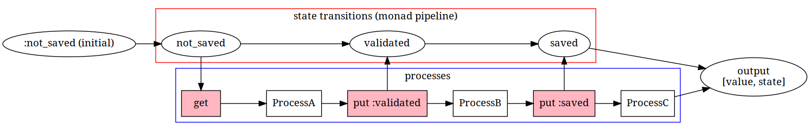

# Pragmatic Monadic Programming in Ruby
## @joker1007 (Repro inc.)
### RubyKaigi 2019

---

# self.inspect

- @joker1007
- Repro inc. CTO
- I familiar with ...
  - Ruby/Rails
  - Ruby Black Magic (TracePoint)
  - Bigquery
  - fluentd
  - Hive/Presto/Cassandra

---


We provide a service as ...
- Analytics of Mobile Apps, Web Apps.
- Marketing Automation.

---


I am a member of amazing Ruby community.

---

# In ruby-2.6, Proc is very interesting!!

---

# Compose proc by `Proc#>>`, `Proc#<<`

---

# RubyVM::AST.of can receive a Proc

```ruby
pr = proc { puts :foo }
ast = RubyVM::AbstractSyntaxTree.of(pr)
pp ast
```

```
(SCOPE@1:10-1:23
 tbl: []
 args: nil
 body: (FCALL@1:12-1:21 :puts (ARRAY@1:17-1:21 (LIT@1:17-1:21 :foo) nil)))
```

---

# TracePoing#enable can receive a Proc

```ruby
pr = proc do
  puts :foo
  puts :bar
end
trace = TracePoint.new(:line) do |tp|
  p tp.lineno
end
trace.enable(target: pr)
pr.call
```

```
2
foo
3
bar
```

---

# To begin with, What is "Proc"?

---

# "Proc" is object of Procedure
# In other words, Function object.

```ruby
pr = proc { puts :hello_proc }
p pr
```

```
#<Proc:0x00000000025fad50@/home/joker/slides/rubykaigi2019/proc.rb:1>
```

---

# "Proc" is closure.

```ruby
def counter
  x = 0

  proc { x += 1 }
end

c = counter
counter.call # => 1
counter.call # => 2
```

Proc keep the enviornment of the scope where it is created.

---

# Method can receive "Proc" as block

```ruby
def with_retry(exception, &block)
  block.call
rescue exception
  retry
end
```

---

# In fact, Ruby ...

- has function object as First-class object
- can receive functions as return value
- can pass functions as method arguments

In other words, Ruby has a factor of functional programming.

---

# Some FP languages have a very interesting feature.

---

# Monad

> In functional programming, a monad is a design pattern[1] that allows structuring programs generically while automating away boilerplate code needed by the program logic.
Monads achieve this by providing their own data type, which represents a specific form of computation, along with one procedure to wrap values of any basic type within the monad (yielding a monadic value) and another to compose functions that output monadic values (called monadic functions).

from Wikipedia https://en.wikipedia.org/wiki/Monad_(functional_programming).

---

<!-- class: larger invert -->

# 🤔 :question:
# It seems difficult!!

---

<!-- class: invert -->

# But, Monad is very simple and useful pattern actually.
# And syntax sugar is very important for monad.

---

# I think that Ruby may be able to implement Monad syntax sugar by black magics.
# If I can implement, I realize very useful and general abstraction in Ruby.

---

# Let's get down to the main topic.

---

# Agenda

- Functor in Ruby
- Applicative Functor in Ruby
- Monad in Ruby
- Syntax sugar for monad
- Implement monadic syntax in Ruby

Today, I will not explain mathmatics.
I will talk about only programming technique.

---

# Functor

Functor ...
- is a container having a context for specific purpose.
- is a object that can be mapped by any function.


Most popular functor in Ruby is "Array".

```ruby
[1,2,3].map { |i| i.to_s }
```

In Haskell, `map` for Functor is called `fmap`.

---

# Why Functor is useful

Without functor and map, a container needs to implement all methods for any object that it may contain.
Functor makes a container enable to collaborate any methods.

---

# Functor requires some laws

```ruby
functor.fmap(&:itself) == functor
```

```ruby
functor.fmap(&(proc_a >> proc_b)) == functor.fmap(&proc_a).fmap(&proc_b)
```

These laws ensure that behaviors of a functor is proper.

---

# Applicative Functor (1)

If you want to process with more than two functor objects,
But `fmap` cannot handle more than two functors.

```ruby
[1,2,3].map do |i|
  [5,6,7].map do |j|
    i + j
  end
end
```

This sample outputs nested array.
Of course, we can use `flat_map`.
But we have more functional approach.

---

# Applicative Functor (2)

Applicative Functor can contain functions.
And contained functions apply other objects contained by each functor.

```ruby
array_plus = [:+.to_proc]

array_plus.ap([2, 3], [4]) # => [6, 7]
array_plus.ap([2, 3], [5, 6, 7]) # => [7, 8, 9, 8, 9, 10]
array_plus.ap([2, 3], []) # => []
```

---

# Applicative Functor (3)

```ruby
def ap(*targets)
  curried = ->(*extracted) do
    fmap { |pr| pr.call(*extracted) }
  end.curry(targets.size)

  applied = targets.inject(pure(curried)) do |pured, t|
    pured.flat_map do |pr|
      t.fmap { |v| pr.call(v) }
    end
  end
  applied.flat_map(&:itself)
end
```

---

#  Applicative also requires some laws

But laws of Applicative Functor are more complicated than one of Functor.

Sorry, I omit explaining details.

---

# What is difference between Applicative and Monad

Applicative Functor can not express multiple dependent effects.

For example, a calculations that may fail depends on whether previous calculations succeeded or failed.

In such cases, Monad is useful.

---

# Monad

Monad is a container like Functor and Applicative.

In Haskell, Monad requires some implementations.

```haskell
class Monad m where
  (>>=)  :: m a -> (a -> m b) -> m b
  (>>)   :: m a ->  m b       -> m b
  return ::   a               -> m a
  fail   :: String -> m a
```

Especially, `(>>=)` is most important.
it is called "bind operator".

---

# What is >>= (bind operator) ?

In case of array,

`Array#bind` receives a function that receives item contained the array and outputs new array.

like following.

```ruby
["foo","bar"].bind { |s| s.split(//) }
# => ["f","o","o","b","a","r"]
```

In fact, it's `flat_map`

---

# Monad in Scala

Scala has syntax sugar for monad.

```scala
for {
  x <- Some(10)
  y <- functionMaybeFailed()
} yield x + y
// Return Some(10 + y) or None
```

Scala transforms this codes to `flat_map` style internally.
Like below.

```scala
Some(10).flatMap { x =>
  functionMaybeFailed().flatMap { y =>
    x + y
  }
}
```

---

# Syntax sugar for monad

Some functional languages have syntax sugar for monad.
Haskell has do-syntax, Scala has for-syntax.

Because the main purpose of monad is a chain of contextual computation,
and syntax sugar is very effective to use it more easily.

---

# Nested `flatMap` is not readable

```scala
Some(10).flatMap { x =>
  functionA(x).flatMap { y =>
    fuctionB.flatMap { z =>
      z.process
    }
  }
}
```

frequent appearance of `flatMap` is very noisy.
`{`, `}` is the same.
indent++.

---

# Scala is hybrid paradigm language
# Ruby is similar to Scala in a sense
# I copied code transformation from Scala

---

# Monad syntax in Ruby

```ruby
calc = ->(*val) do
  val.monadic_eval do |x|
    a = x.odd? ? x : x / 2
    y <<= [a + 14]
    z <<= [y, y + 1, y + 2]
  end
end

expect(calc.call(7, 8)).to \
  eq([21, 22, 23, 18, 19, 20])
```

This code is valid syntax!!
There is no warning.

---

# My idea is very simple.

- `a <<= <statement>` transform to `flat_map do |a| <statement>`

It's all.

 `<<=` is important discovery!!

---

# `<<=` is assignment with operator

`a <<= foo` equals `a = a << foo`

This is valid ruby code.
And Ruby treats `a` as assigned local variable!
Moreover, most ruby programmers have not written such codes.

In other words, I can take posession of the syntax!!
I can change the behavior freely!!

---

# Review code transformation

```ruby
[1,2,3].monadic_eval do |i|
  j <<= [i, i*2]
  j.select(&:odd?)
end
```

transform to

```ruby
[1,2,3].flat_map do |i|
  [i, i*2].flat_map do |j|
    j.select(&:odd?)
  end
end
```

---

# It is difficult to resolve nested do-end by method chain

# OK, AST Transformation!!
# We already have `RubyVM::AST.of`

# It is new feature of Ruby-2.6 and very useful for handling AST.

---

# Breakdown of implementation

- Extract AST from given block by `RubyVM::AST.of`
- Detect a pattern like `a <<= foo`
- Extract fragments of source code
- Reconstruct source code
- Wrap into new proc (to cache reconstructed code)
- Eval new source code

---

# Detect a pattern

```ruby
def __is_bind_statement?(node)
  (node.type == :DASGN || node.type == :DASGN_CURR) &&
    node.children[1].type == :CALL &&
    node.children[1].children[1] == :<<
end
```

---

# Extract fragments of source code

```ruby
# @param source [Array<String>] lines of source code
def extract_source(source, first_lineno, first_column, last_lineno, last_column)
  lines = source[(first_lineno - 1)..(last_lineno-1)]
  first_line = lines.shift
  last_line = lines.pop

  if last_line.nil?
    first_line[first_column..last_column]
  else
    first_line[first_column..-1] + lines.join + last_line[0..last_column]
  end
end
```

---

# Reconstruct source code

```ruby
def __transform_node(source, buf, node, last_stmt: false)
  if __is_bind_statement?(node)
    lvar = node.children[0]
    rhv = node.children[1].children[2]
    origin = Monad.extract_source(
      source,
      rhv.first_lineno,
      rhv.first_column,
      rhv.last_lineno,
      rhv.last_column).chomp
    buf[0].concat(
      "(#{origin}).flat_map do |#{lvar}|\n#{"pure(#{lvar})\n" if last_stmt}"
    )
    buf[1] += 1
  else
    buf[0].concat("(#{Monad.extract_source(
      source,
      node.first_lineno,
      node.first_column,
      node.last_lineno,
      node.last_column
    ).chomp})\n")
  end
end
```

---

# Wrap into new proc

```ruby
gen = "proc { |#{caller_local_variables.map(&:to_s).join(",")}|
  begin; " + buf[0] + "rescue => ex; rescue_in_monad(ex); end;
}\n"
pr = instance_eval(gen, caller_location.path, caller_location.lineno)
Monad.proc_cache["#{block_location[0]}:#{block_location[1]}"] = pr
```

`instance_eval` outputs a proc object which contains transformed process.
And I cached it in order to avoid source code transformation repeatedly.

---

# Handling local variables

Reconstructing source code lose local variables,
because environment contained by block is lost.

Binding is required to handle local variables.

---

# That is when TracePoint is effective!

# I found a technique to get Binding of given block

---

```ruby
proc_binding = nil
trace = TracePoint.new(:line) do |tp|
  # this block is called Just before evaluating proc's first line
  proc_binding = tp.binding
  throw :escape
end

catch(:escape) do
  # In Ruby-2.6, TracePoint limits tracking target.
  trace.enable(target: block)
  block.call
ensure
  trace.disable
end
```
---

# I got Binding of proc!!
# Binding has everything for black magic.

---

```ruby
ast = RubyVM::AbstractSyntaxTree.of(block); # SCOPE
args_tbl = ast.children[0]
args_node = ast.children[1]
caller_local_variables = proc_binding.local_variables - args_tbl
```

```ruby
gen = "proc { |#{caller_local_variables.map(&:to_s).join(",")}| ...."
```

I got local_variables and copy into generated proc.

---

At last, instance_exec generated proc with local variables of caller.

```ruby
instance_exec(
  *(caller_local_variables.map { |lvar| proc_binding.local_variable_get(lvar) }),
  &generated_pr
)
```

---

# Show powers of monad syntax by some examples.

- Maybe
- Either
- Future
- State
- ParserCombinator

---

# Maybe (Just)

```ruby
class Just
  include Monad
  include Monar::Maybe
  def initialize(value)
    @value = value; end

  def flat_map(&pr)
    pr.call(@value); end

  def monad_class
    Monar::Maybe; end
end
```

---

# Maybe (Nothing)

```ruby
class Nothing
  include Monad
  include Monar::Maybe
  def initialize(*value); end

  def flat_map(&pr)
    self; end

  def monad_class
    Monar::Maybe; end
end
```

---

# Maybe example

```ruby
key1 = "users/#{user.id}/posts/#{post.id}"
key2 = "posts/#{post.id}/comments"
# lookup_cache returns Maybe
lookup_cache(key1).monadic_eval do |cached_post|
  cached_comments <<= lookup_cache(key2)
  # If lookup_cache(key2) fails,
  # below processes are not executed
  post = Oj.load(cached_post)
  comments = Oj.load(cached_comments)
  post.comments = comments
  pure post
end # return Just(post) or Nothing
```

---

# Either (Right)

`Ritht` is the same as `Just`.

---

# Either (Left)

`Left` is the same as `Nothing`.
But `Left` has a exception.

---

# Either (helper function)

```ruby
def either(&pr)
  Monar::Either.right(pr.call)
rescue => ex
  Monar::Either.left.new(ex)
end
```

---

# Either example

```ruby
either { Balance.find_by!(user: user_a) }.monadic_eval do |balance_a|
  _         <<= balance_a.ensure_amount!(amount) # return Either
  balance_b <<= either { Balance.find_by!(user: user_b) }

  TransferMoneyService.new(from: user_a, to: user_b, amount: amount)
    .process # return Either
end # return Right(result) or Left(exception)
```

---

# Future (extend concurrent-ruby)

```ruby
Concurrent::Promises::Future.include(Monad)
class Concurrent::Promises::Future
  def flat_map(&pr)
    yield value!
  rescue => ex
    if rejected?
      self
    else
      Concurrent::Promises.rejected_future(ex)
    end
  end
end
```

---

# Future example

```ruby
Concurrent::Promises.make_future(5).monadic_eval do |x|
  a = x.odd? ? x : x / 2
  b = Concurrent::Promises.future { sleep 2; 11 }
  c = Concurrent::Promises.future { sleep 1; 3 }
  d <<= b # wait b
  e <<= c # wait c
  pure(a + d + e)
end # Return Future(19)
```

---

# State (constructor)

State has a proc that receives current state and outputs value and next state.

```ruby
class State
  include Monad
  # @param next_state [Proc (s -> [a, s])]
  def initialize(next_state)
    raise ArgumentError.new("need to respond to :call") unless next_state.respond_to?(:call)
    @next_state = next_state
  end
end
```

---

# State (flat_map)

```ruby
def flat_map(&pr0)
  self.class.new(
    proc do |s0|
      x, s1 = run_state(s0)
      new_state_monad = pr0.call(x)
      new_state_monad.next_state.call(s1)
    end
  )
end
```

run_state(s0) -> [a, s2] -> block.call(a) ->
new state monad -> run_state(s1)

Wrap these processes by new State class.

---

# State (helper function)

```ruby
def get
  State.new(proc { |s| [s, s] })
end

def put(st)
  State.new(proc { |_| [nil, st] })
end
```

---

# State example

```ruby
state = State.pure(5).monadic_eval do |n|
  status <<= get # Return initial state
  _ <<= if status != :saved
          result = n * 10
          put(:saved) # Update state
        else
          pure(nil)
        end
  pure(result)
end

val, st = state.run_state(:not_saved)
# val == 50, st == :saved

val, st = state.run_state(:saved)
# val == nil, st == :saved
```

---

# Mental model of State

State handles 2 pipelines.



---

# ParserCombinator

Parser also contains a proc.
that proc receives `String` and returns `[Object, String]`.
`Object` is result of parsing. `String` is remained characters.

`flat_map` expresses parser combination.
`|` expresses selective parser.

---

# `Parser#flat_map`

```ruby
def flat_map(&pr)
  self.class.new(
    proc do |str0|
      result0 = run_parser(str0)
      result0.flat_map do |consumed, remained|
        next_parser = pr.call(consumed)
        next_parser.run_parser(remained)
      end
    end
  )
end
```

Wrapping processes (belows) by `Proc`.

Get result -> given proc processes result ->
Get New Parser -> parse remained chars.


---

# `Parser#|`

```ruby
def |(other)
  self.class.new(
    proc do |str|
      result0 = run_parser(str)
      result1 = other.run_parser(str)
      result0.empty? ? result1 : result0
    end
  )
end
```

---

# Parser examples 1

```ruby
def anychar
  new(
    proc do |string|
      string == "" ? [] : [[string[0], string[1..-1]]]
    end
  )
end
```

```ruby
# @param cond [Proc (Char -> TrueClass | FalseClass)]
def satisfy(cond)
  anychar.flat_map do |char|
    if cond.call(char)
      new(proc { |string| [[char, string]] })
    else
      new(proc { |string| [] })
    end
  end
end
```

---

# Parser examples 2

```ruby
def string(str)
  return pure "" if str == ""

  c, tail = str[0], str[1..-1]
  char(c).monadic_eval do |c1|
    cs <<= self.class.string(tail)
    pure [c1, *cs].join
  end
end
```

---

# Parser examples 3

```ruby
def one_of(chars)
  satisfy(->(char) { chars.include?(char) })
end

def many(parser, level = 1)
  combined = parser | pure(nil)

  combined.monadic_eval do |result|
    result2 <<=
      if result.nil?
        pure(nil)
      else
        self.class.many(parser, level + 1)
      end

    pure([result, result2].compact.flatten(level))
  end
end
```

---

# DEMO (Arithmetic Parser)

---

# Conclusion

- Monad is not difficult, It's `flat_map`
- The abstraction of monad is very powerful
- Syntax is very important

By this implementation, I recognized the fun of monadic programming again.

---

# At last, I never recommend using this gem on production!!

If you are interested in TracePoint and AST,
Examples of the gem's code is helpful for you, maybe.

And, let's enjoy darkness programming!!
