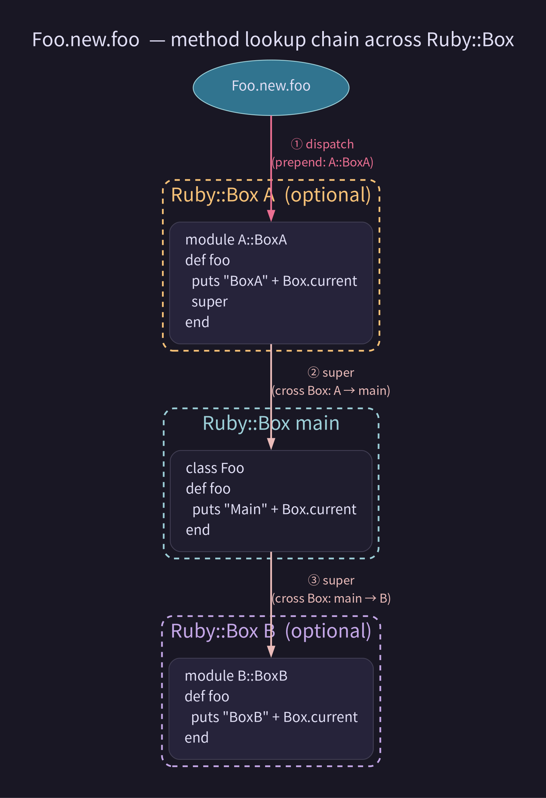

<style scoped>
h1, h2, h3 {
  color: white;
}
</style>
# Do Ruby::Box dream of Modular Monolith?

### joker1007 (Repro株式会社)
### Rubykaigi 2026 LT

---

<!--
footer: 
-->

# self.inspect

- 橋立友宏 (@joker1007)
- Repro inc.
- Chief Architect
- I love 🍺, 🍶, and Karaoke


---

# I come from Asakusa(.rb)


---

# Ruby::Box comes!!

It's very interesting feature!!

---

# Have you touched Ruby::Box?

---

# I tried to use Ruby::Box <br> on Ruby on Rails.

I want to separate the domain logic by Ruby::Box.
To achieve a fully independent modular monolith.

---

# And It works!! <br> (minimal and not practical)

However, it required a few workarounds.


---

# Demo time!!

---

# Yeah!! <br> The class space is separated for each URL!!


---

# Good parts (?) of Ruby::Box

- Ruby::Box instances can freely reference one another.
- In other words, a class in one box can be inherited by a class in another box.
- Of course, you can also prepend or include modules in another box.

see. [Ruby::Box ダイジェスト紹介（Ruby 4.0.0 新機能） - STORES Product Blog](https://product.st.inc/entry/2025/12/25/134453)

---

# How it works

There are 2 boxes.
```ruby
module BoxA
  def foo
    puts "BoxA" + Ruby::Box.current.inspect
    super
  end
end
```

```ruby
module BoxB
  def foo = puts "BoxB" + Ruby::Box.current.inspect
end
```

---

```ruby
A = Ruby::Box.new; A.require_relative "box_a"
B = Ruby::Box.new; A.require_relative "box_a"
class Foo
  prepend A::BoxA
  include B::BoxB
  def foo
    puts "Main" + Ruby::Box.current.inspect
    super
  end
end

Foo.new.foo # =>
```
```
returns:
BoxA#<Ruby::Box:3,user,optional>
Main#<Ruby::Box:2,user,main>
BoxB#<Ruby::Box:4,user,optional>
```

---

Just by calling `super` you can seamlessly switch between the Box.

**dangerous (interesting)!!** 😄



By the way, tagomoris-san said.


---

# Applying to Rails

- A controller within a box inherits `ApplicationController` in the main box.
- You can evaluate controller and model logic within the child box,
- And once the controller logic is complete, transparently transfer process to the controller running in the main box.
- Render views in the main box.
- Views invoke model method, the logic works on the child box.

---


---

# Thank you tagomoris-san!!
# Ruby::Box is fun!!

---

# What you need to get started

For now, we need to apply a patch to zeitwerk
we need to override `Ruby::Box#require` to work automatic module generation.
Otherwise, if you run it with `RUBY_BOX=1`, it can't load rails components.

This issue is related.
https://bugs.ruby-lang.org/issues/21830

---

# By the way, can't we use Ruby::Box with Rails::Engine?

---

# It crashes for now :cry:

`require` fails to execute in the first place.

---

# Actually, this demo app crashes with a SEGV quite often when it starts up.
# I recommend ruby-4.0.2 to run this sample.

---

# Things I want related to Ruby::Box

- `require` doesn't crash
- `Ruby::Box#name`: `Box#inspect` is confusing. I want to rename it to make it clearer.
- `Ruby::Box#fork`: I want to create a box while retaining the LOADED_FEATURE that has already been required in the base box.

---

# Difficulties

How to coordinate zeitwerk.
When you cross between boxes, it becomes unclear which box the `autoload` `require` is being executed in.

---

# Conclusion

Currently, it is possible to run Ruby::Box on Rails.
However, it’s very minimal and very experimental.
Still, the way Box works is really interesting!!
I can sense its potential!!

Let's try to use Ruby::Box and play around with it!!

---

# For more details

at the **松江Ruby会議**.
Stay Tuned!!
