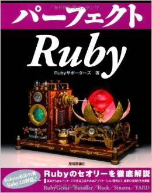
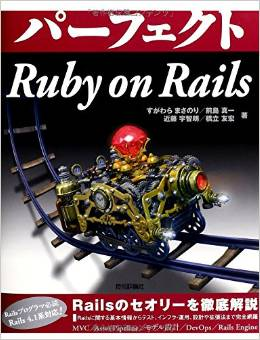

# 短気のススメ -憤怒駆動開発-

Tomohiro Hashidate
@joker1007

## 自己紹介
- @joker1007
- (株)ウサギィ -> フリーランス
- Ruby/Railsを中心にした何でも屋みたいな
- パーフェクトRuby, パーフェクトRuby on Rails著者
- vimmer

## よく居る場所
- Yokohama.rb
- Asakusa.rb
- Shibuya.rb

## 作ってるもの

http://pasokara.ngmen.com:10080/

## gemとか
https://github.com/joker1007/rspec-power_assert
https://github.com/joker1007/amanogawa

## 怒り駆動開発

## エンジニア三大美徳
- 怠惰
- 傲慢
- 短気

## 特に短気が重要

- 怠惰 こんなめんどい作業やってられるかクソが！
- 傲慢 こんなクソコードより俺の方が絶対マシや！

短気で我慢が足りないのですぐにキレる。

## エンジニアなら改善しなければ

カッとなって作った

- https://github.com/joker1007/activerecord-cause
- https://github.com/joker1007/rails_js_helper

カッとなってPRした

- https://github.com/joker1007/brancher

## 皆もっとキレていきましょう
