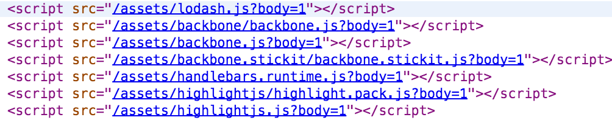
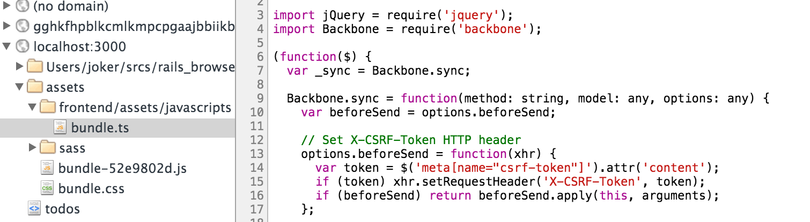
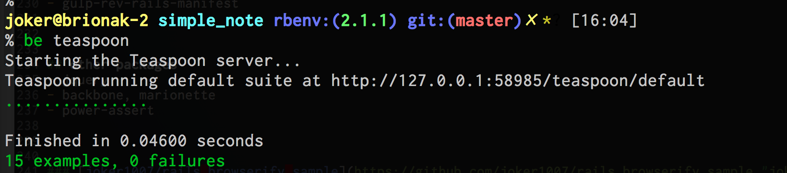
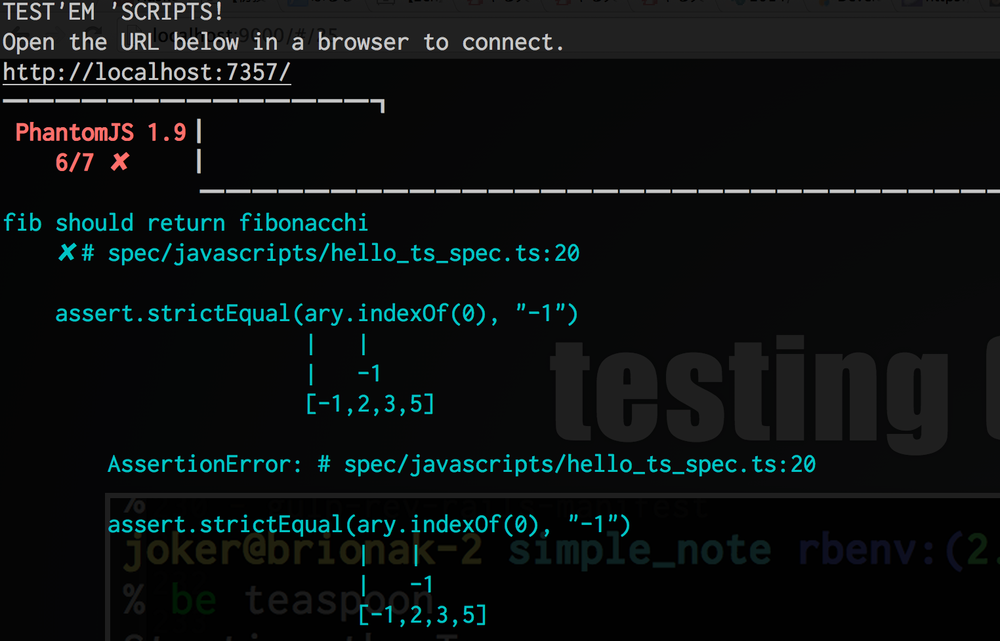

# Throw away
# Sprockets!!

Tomohiro Hashidate (joker1007)


in Japanese...

## Railsの片手間でJSを書く人のための
## JSビルドツール入門


##  Self Introduction


### Tomohiro Hashidate (joker1007)

### Ruby/Rails/JavaScript/Scala


##  Skill Ratio

-

### Ruby/Rails: 6

### JavaScript: 3

### Scala: 1


## Sprockets is not required now
## Let's use ecosystem of JavaScript


## Why JavaScript Ecosystem?
- Libraries version control
- alt-JS handling
- More general technique, Not specialized for Rails


## How do you update JS Libraries?


## Ruby way or manual
- \*-rails gem
- git submodule
- Or Manual ?


## JavaScript Package Manager
- npm
- bower


## rails-assets.org
convert from bower packages to rubygems


## alt-JS is increasing
- CoffeeScript
- TypeScript
- LiveScript
- scala.js
- PureScript
- etc ...


## \*-rails gem cannot fully follow them


## I want to learn technique not specialized for Rails.


## Sprockets features VS JS Ecosystem


## require directive (Sprockets)
```js
//= require jquery
//= require jquery_ujs
//= require lodash
//= require backbone
```


## browserify, webpack

enable CommonJS Style require.

----
Command
```sh
$ npm install browserify tsify jquery backbone
$ browserify -p tsify bundle.ts > bundle.js
```
JS
```js
var jQuery = require('jquery');
var Backbone = require('backbone');
```

TypeScript
```ts
import jQuery = require('jquery');
import Backbone = require('backbone');
```


## Embed JS libraries and define `require` function


## Compile alt-JS, Sass
## And minify assets (Sprockets)


## (gulp or grunt) and compiler and livereload
```sh
npm install coffee-script tsify gulp-ruby-sass gulp-uglify
```

```coffee
gulp.task 'browserify', ->
  browserify(entries: ["assets/ts/bundle.ts"])
    .plugin("tsify")
    .bundle()
    .pipe(source("bundle.js"))
    .pipe(streamify(uglify()))
    .pipe(gulp.dest("public/assets/bundle.js"))
```


```coffee
gulp.task 'sass', ['glyphicon'], ->
  gulp.src(['frontend/assets/stylesheets/**/*.scss', 'frontend/assets/stylesheets/**/*.sass'])
    .pipe(gulp.dest("public/assets/sass"))
    .pipe(plumber())
    .pipe(sass(
      sourcemap: true
      sourcemapPath: "./sass"
      compass: true
      bundleExec: true
      loadPath: [
        "./bower_components"
      ]
    )).pipe(gulp.dest("public/assets"))
```


## Debugging (sprockets)



## Use sourcemap

```coffee
browserify(entries: ["assets/ts/bundle.ts"], debug: true)
```




## digest asset (Sprocets)
```
application-1305b1f70b09d06be2d6e1a074f38a29.js
```


## gulp-rev and generate manifest.json
```coffee
rev = require("gulp-rev")
manifest = require("gulp-rev-rails-manifest")

browserify(....)
  .bundle()
  .pipe(streamify(rev()))
  .pipe(gulp.dest("public/assets"))
  .pipe(manifest())
  .pipe(gulp.dest("public/assets"))
```


### [joker1007/gulp-rev-rails-manifest](https://github.com/joker1007/gulp-rev-rails-manifest "joker1007/gulp-rev-rails-manifest")
Output manifest.json for Rails assets helper


## testing (Sprockets)



## Use Mocha, power-assert
`espowerify` enable power-assert on browserify.

```ts
/// <reference path="../../frontend/assets/typings/tsd.d.ts" />
/// <reference path="../../frontend/assets/typings/power-assert.d.ts" />

import assert = require('power-assert');
import Hello = require('../../frontend/assets/javascripts/hello');

var hello = Hello.hello;
var fib = Hello.fib;
```

```ts
describe('hello', () => {
  it('should return "Hello, name"', () => {
    assert(hello("Name") == "Hello, Name");
  })
});

describe('fib', () => {
  it('should return fibonacchi', () => {
    assert.deepEqual(fib(5), [1,2,3,5,8]);
    var ary = [-1,2,3,5];
    assert.strictEqual(ary.indexOf(0), "-1");
  })
});
```


## Use test runner
- testem
- karma





## I implemented sample application
- typescript
- browserify
- gulp
- gulp-sass
- gulp-rev
- gulp-rev-rails-manifest


- jquery
- backbone, marionette
- power-assert


### [joker1007/rails_browserify_sample](https://github.com/joker1007/rails_browserify_sample "joker1007/rails_browserify_sample")
