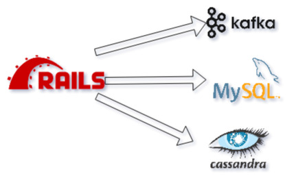

# 5分で分かった気になるDebezium

## joker1007

---

# 自己紹介

- joker1007
- Repro inc. チーフアーキテクト
- 日本酒とクラフトビールが好き
- Asakusa.rb メンバー

---

# 今、CDCが熱い！

---

# CDCって何？

Change Data Captureの略称。
データの変更という事象を記録し、それを別の場所に転送する機能を指す。

CDCはRDBをデータソースとすると決まっている訳ではないが、今回はRDBへの変更におけるCDCを中心に話をする。

---

# Debeziumとは
CDCを実現するためのミドルウェア。
メインターゲットはRDBだが、Cassandra, MongoDB, Spannerにも対応している。

CDCの実現方法はデータベースごとに異なる。
MySQLはレプリケーションと同様の仕組みでbinlogを読むことで行う。
PostgreSQLはlogical decodingという機能に基いている。

単体でも動作できるが、Kafka Connectプラグインとして動作させるのが一般的。

---

# DebeziumのCDCイベント例
ペイロードサンプルが大きいのでスライドからは割愛。
https://debezium.io/documentation/reference/2.1/connectors/mysql.html#mysql-create-events

---

# 何故CDCが必要なのか

---

# ユースケース1
# 複数のデータストアでデータを同期する

---

複数のデータストアにデータを書くケースは良くある。
RDBとKafkaとCassandraとElasticSearchに一緒に書きたいとか、Redisの各ノードに伝播させたいとか。
複雑なアプリケーションには必須と言っていい。

---
# つまりこういう状態

---

# 何が問題か

- アプリケーション側で複数のデータストアを扱うとエラーハンドリングが非常に複雑になる。
    - RDBに書いた後に通信エラーでCassandraへの書き込みが失敗したら、どこからリトライするか。
    - RDBのコミットをどのタイミングで確定させるか。
- 順序性の問題の考慮もかなり難しい。
    - 複数のノードに渡ってRDBに書いたのと同じ順序でCassandraに書いたと保証できるか

---

# Debeziumでこうなる

---

# 嬉しい点
- CDCを介することで、アプリケーション処理と各種データストアへの書き込み処理を分離できる。アプリケーションはRDBに書くだけ。
- パーティショニングキーの選択が正しければ順序もRDBのトランザクションの通りに確実に処理できる。
- Kafkaのレコードを受け取って書き込む簡単なアプリを書くだけ。エラーが起きたら1プロセス内の単純なリトライで済む。Kafka Connectで完結できるなら自分で何かを書く必要すら無い場合もある。

複雑な制御をアプリケーションで頑張るのではなく構造とミドルウェアでカバーする。

---

# その他の応用
BigQueryなどのDWHの場合はRDBと同時に即時書き込みをするのが合わないケースもある。
そういった場合に書き込みペースを容易にコントロールすることもできる。
Kafkaに貯めておいて、必要な時にまとめてloadすれば良い。

---

# ユースケース2
# マイクロサービスのトリガイベント

---

# CDCのイベントでサービスを起動する
CDCのイベントはイベント駆動マイクロサービスのトリガとして利用できる。
例えば受注ステータスの変更をRDBで更新するだけで、そのイベントを発送サービスが受け取るといったことができる。
DebeziumならKafkaに入るので、そのイベントは保存期間中は複数サービスで何度も再取得できる。

---

# 何が嬉しいのか
イベント駆動のマイクロサービスの利点は、疎結合に作り易いこと、そして複数のサービスをトリガしやすいこと。

Debeziumを介することで、アプリケーション側はRDBに書くという普通のWebアプリケーションと同じことをやるだけで、複数のサービスを協調して動かす基盤が出来る。

---

# 設計上の注意
こういうアーキテクチャを採用する際は、Fire and Forgetの原則とCQRSを意識できる様になると良い。

データの流れを大きなサイクルとして捉え、一方向にデータが流れる様に工夫すること。
書き込みの責任を負うのは原則一箇所のみ。

私見だが、読み書きの責任範囲が明確に分かっていれば、データストアを共有してもそれなりにマイクロサービスの制御は効くと思っている。

---

# CDCとイベントベースアーキテクチャの利点

- データの変更履歴を維持しやすいため、監査性が高いシステムが構築できる (保持し続けるのには一定のコストがかかるものの)
- RDBのトランザクションログがイベントソースになるため、Kafkaと組み合わせることでパフォーマンスと順序の整合性を両立できる。
- 分散トランザクションの問題を回避しつつ、スケーラブルな分散システムを構築する基盤になる
- ストリーム処理へのデータ投入を意識しなくて良くなり、リードタイムの短い集計基盤を作るための導入として最適

---

# Railsとの相性の良さ

RailsはRDBの扱いに非常に優れている。
RDBを触るだけなら正しく作れば非常にシンプルなコードになる。

アプリケーションが複雑化する要因として、ロジックとは直接関係がないデータ同期や非同期処理のトリガ・エラーハンドリングなどの要素が少なくない。
Debeziumと組み合わせることでRailsは得意なRDBの処理に集中でき、コードがシンプルになる。

アプリケーションエンジニアはActiveRecordを触っているだけで、分散ストリーム基盤へのデータ投入が可能になる。

---

# CDCとそれを実現するDebeziumの良さを
# 完全に理解しましたね

---

# CDCやKafkaを使ったデータ指向なアプリケーションを開発したくなりましたが？
# Reproという会社がエンジニアを募集しているらしいですよ！
